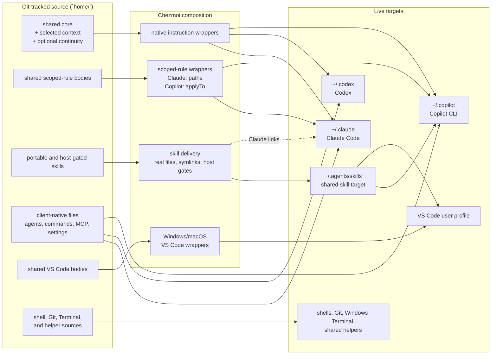

# Dotfiles

[English](README.md) · [繁體中文](README.zh-TW.md)

> **TL;DR:** This is a personal, cross-platform developer environment kit for AI-assisted
> development and developer settings, managed with [chezmoi](https://www.chezmoi.io). Git tracks
> the desired source under `home/`, and chezmoi renders it into native targets for the tools and
> applications in the kit. Current AI-client adapters target Claude Code, Codex, and GitHub
> Copilot; the repository also manages editor, shell, Git, terminal, and supporting developer
> configuration. The source and adapters can grow as new clients and dotfiles are added.

## Problems this repository solves

An AI-assisted developer environment spans many applications and platforms, so this kit uses Git
and chezmoi to keep user-level configuration reproducible. The table below summarizes recurring
problems across AI clients, application-owned settings, project continuity, parallel worktrees,
and machine setup. Native AI-client adapters currently cover Claude Code, Codex, and GitHub
Copilot; this is today’s integration boundary, not a limit on future clients, dotfiles, or
developer tools:

| Problem | Solution in this repository |
| --- | --- |
| Claude Code, Codex, and GitHub Copilot use different files, formats, discovery rules, and instruction scopes. Updating guidance in one client can leave another stale or expose client-specific behavior to the wrong host. | Track the repository-owned portion of user-level, cross-project AI configuration in Git: keep reusable instructions and portable skills in one shared source, while keeping client-exclusive commands, agents, hooks, deliberately managed settings, and adapters in their native client sources. Use chezmoi templates to conditionally and dynamically render those sources into each client’s native home-directory files; thin adapters, host gates, links, and pre-commit parity checks handle client-specific boundaries without duplicating shared content. |
| An interrupted or compacted AI session can lose the task’s objective, decisions, and next action; parallel Git worktrees can also lack the ignored local files needed to run the project. | Use project continuity—a private, Git-ignored handoff record for task context—one per working directory. It tracks the objective, decisions, blockers, and next action, not repository truth. Git remains the source of truth for the branch, `HEAD`, and working-tree state; park unfinished state in `.project-continuity/parked/` before switching tasks. The worktree workflow gives parallel tasks isolated directories, and the manifest skill gets approval for `.worktreeinclude` entries that `git wt-add` and `git wt-copy` can safely provision. |
| Developer tools own part of their preferences and runtime state. For example, Claude Code’s `/config` command can change the model, effort level, theme, or permissions, while Windows Terminal can change its own profiles and preferences; tracking whole settings files would overwrite those choices or force every application change to be reconciled into the source. Personal overrides and continuity state should stay local, while shared and durable repository-owned settings remain visible and trackable. | Git tracks only deliberate repository-owned settings, and chezmoi’s merge, create-once, and selective templates apply those settings without replacing the whole live file: manage Claude hooks, status line, environment, update channel, and selected durable terminal keys; leave model, effort, theme, permissions, and other application-owned choices local; use equivalent selective ownership for Codex and other tools. Use Git’s global excludes as a safety net for exact private files—for example, `CLAUDE.local.md`, `AGENTS.override.md`, `.claude/settings.local.json`, and `.project-continuity/`—while keeping shared `AGENTS.md`, `CLAUDE.md`, and repository instruction files trackable. |
| Restoring dotfiles alone does not create a usable development environment: a new machine may still lack command-line prerequisites, validation hooks, editor extensions, client plugins, or MCP server declarations, and some integrations cannot run until their client applications are installed. | Run the platform-specific `scripts/bootstrap/bootstrap-windows.ps1` or `scripts/bootstrap/bootstrap-macos.sh` helper to connect the checkout, enable validation, install or configure supporting tools, and apply the manifests. Run it again after installing the client applications so deferred plugin, extension, and MCP steps can complete. |

## Get started

This is a personal configuration repository. Read [the setup guide](./docs/setup.md) before
applying it, especially if the machine already has shell, editor, or AI-client settings.

### Empty machine

Use the one-line entry point only when no existing configuration needs to survive. Run it from
macOS or Git Bash after completing the [setup prerequisites](./docs/setup.md#common-prerequisites):

```bash
sh -c "$(curl -fsLS https://get.chezmoi.io)" -- init --apply sherrilla71940
```

This downloads and executes a remote installer. Review and trust the URL and script policy for
the machine before running it. Windows also needs [symbolic-link creation](./docs/setup.md#enable-windows-symlink-creation)
unless the setup uses a directory junction.

### Existing configuration

Initialize without applying, confirm that chezmoi points at this repository, and review the
rendered changes:

```bash
chezmoi init sherrilla71940
git -C "$(chezmoi source-path)" rev-parse --show-toplevel
chezmoi diff
```

The `git` command must report this checkout. Adopt the values you want to keep before applying;
the [existing-configuration guide](./docs/setup.md#existing-configuration) explains how to do
that for plain files and template-backed files. Replace `sherrilla71940` with a fork URL when
needed.

Either path is only the configuration step. The complete setup also installs and authenticates
the applications, runs the platform bootstrap, enables repository validation, and runs bootstrap
again after the application CLIs are available so plugin, extension, and MCP steps can complete.
Use the detailed [new-machine sequence](./docs/setup.md#new-machine-in-order).

The development checkout normally lives at `~/dotfiles`. The bootstrap connects chezmoi’s default
source location to that checkout with a macOS symlink or Windows directory junction. This keeps
repository scripts, decision records, and the source state in one Git working tree; see
[ADR-0006](./docs/decisions/0006-keep-the-working-tree-at-dotfiles.md) for the trade-off.

## Architecture: one source, native outputs

Chezmoi treats the files under `home/` as **source state**: the desired configuration that you
edit and commit. Files written into the home directory are **targets**: the files applications
actually read.

```text
home/dot_bashrc  ──chezmoi apply──▶  ~/.bashrc
```

The source filename also carries meaning. `dot_` becomes a leading `.`, `.tmpl` enables template
rendering, and prefixes such as `create_`, `modify_`, and `symlink_` control how chezmoi handles a
target. Read [the chezmoi workflow](./docs/chezmoi-workflow.md) before adding or renaming a source
file.

The following map shows the current AI-client adapters and the most important boundaries. It
shows Claude Code, Codex, and GitHub Copilot alongside VS Code user configuration; shells, Git,
Windows Terminal, and helper scripts use the same source-to-target principle without needing
AI-client wrappers.



Three details explain most of the structure:

- The shared core is inlined into each client’s native instruction file. Codex receives the
  always-on core, but this repository does not create a Codex equivalent for Claude and Copilot
  path-scoped rules.
- A portable skill is a real file under `home/dot_agents/skills/`. It renders to `~/.agents/skills`;
  Claude Code reaches the same file through an individual symlink under `~/.claude/skills`.
  A `.codex-only` marker and native metadata gate a workflow that must not be automatically used by
  Claude or Copilot.
- VS Code is the editor host, not a fourth copy of the Copilot CLI configuration. Its user
  settings, keybindings, and MCP files use OS-specific wrappers, while Copilot instructions,
  agents, and skills follow the locations their host supports.

### Why some content is shared and some is not

| Content | Representation |
| --- | --- |
| Always-on working agreement | One shared body included in Claude `CLAUDE.md`, Codex `AGENTS.md`, and Copilot instructions. |
| Path-scoped rules | One body and one glob in `home/.chezmoidata.yaml`, with thin Claude and Copilot frontmatter wrappers. Codex has no equivalent path-scoped output in this setup. |
| Portable skills | One real skill directory under `home/dot_agents/skills/`, with shared discovery targets and Claude symlinks. |
| Client-specific skills, agents, commands, and MCP files | Native files under the relevant client source directory. They are not rewritten into a misleading “tool-neutral” copy. |
| VS Code files | Shared bodies under `home/.chezmoitemplates/vscode/`, wrapped once for the Windows and macOS user-profile paths. |

The files under `home/.chezmoitemplates/` are reusable bodies, not direct targets. A body normally
needs its client or OS wrapper to render correctly. The [AI customization guide](./docs/customization-support.md)
shows which source path owns each customization.

## Machine-local profiles and session continuity

Two independent values in chezmoi’s machine-local configuration control the rendered AI profile:

```toml
[data]
ai_context = "company"        # personal or company
ai_continuity = "on"           # on or off
```

| Selector | Controls | Default and boundary |
| --- | --- | --- |
| `ai_context` | The personal or company context layer, its artifact-language default, and the default comment language for application and project repositories. | Missing means `personal`; any other value fails rendering. |
| `ai_continuity` | Whether continuity instructions and automatic lifecycle reporting/state maintenance are active. | Missing means `on`; any other value fails rendering. The continuity skill remains explicitly available when off. |

The composition is:

```text
shared baseline + personal OR company context + continuity when enabled
```

Selectors are machine-local, machine-wide, and never committed. A change affects newly rendered
configuration and newly started sessions; an already-running session keeps its startup context.
Repository and direct user instructions still take precedence. This repository’s root `AGENTS.md`
deliberately requires the effective `personal` context while work is performed here, even on a
machine selected as `company`.

The artifact-language default has a narrow scope. It affects supported commit description/body
text, worktree commit and request text, and managed VS Code Copilot commit-message guidance. It
does not translate branch names, paths, commands, user-level dotfiles, or this README. Explicit
`en` or `zhtw` arguments override the default.

### Project continuity

When enabled, project continuity keeps the handoff state in the current physical working tree:

- `.project-continuity/state.md` records the objective, phase, next action, blockers, assumptions,
  and verification state.
- Claude Code and Codex receive lifecycle reporting that identifies existing state and detects
  branch or `HEAD` drift. Copilot can use the shared state protocol, but this repository does not
  add an automatic Copilot lifecycle hook.
- Git remains authoritative for branch, `HEAD`, and working-tree reality. The continuity file
  supplies context; it does not replace Git history or the conversation transcript.
- The state is ignored by Git for privacy and convenience. It is a local handoff file, not an
  encrypted secret store.

Turning `ai_continuity` off removes the always-loaded continuity guidance and renders the shared
lifecycle helper as a no-op. Hook entries remain registered so the independent Claude worktree
launch check stays available, and Codex does not need a new hook-trust decision after a toggle.

### Isolated worktrees and parallel tasks

Project continuity belongs to one physical working tree. For a repository that permits worktrees,
the worktree workflow creates or enters an isolated worktree for each task, then continuity
records that task’s handoff there. Separate tasks can proceed in parallel without mixing state.
This dotfiles repository deliberately stays in its primary checkout because chezmoi source
resolution is tied to it.

If a new worktree needs ignored project-local files, the worktree manifest skill inspects
candidates, excludes credentials, caches, data, and continuity state, and asks the user to approve
eligible patterns before creating or extending `.worktreeinclude`. `git wt-add` and `git wt-copy`
then provision only the approved files. VS Code uses a separate user-level include setting, so the
repository manifest does not cover every worktree creation path. Read [the worktree provisioning
guide](./docs/worktree-provisioning.md) for the client-specific differences.

## What else is managed

| Surface | Representative contents |
| --- | --- |
| Claude Code | Shared `CLAUDE.md`, path-scoped rules, linked skills, Claude-only commands and skills, hooks, cross-platform status line and notifications, themes, and selected durable settings. |
| Codex | Shared `AGENTS.md`, lifecycle hooks, shared and host-gated skills, and create-once configuration defaults. |
| GitHub Copilot CLI | Shared instructions, Copilot-only agents and skills, settings, and user MCP declarations. |
| VS Code | Windows and macOS user settings, keybindings, MCP configuration, extension manifest, and supported Copilot customizations. |
| Shells and Git | Bash, Zsh, profile startup, Git identity and aliases, including the worktree commands. |
| Windows Terminal | Durable font and input behavior, actions, and keybindings while generated machine-specific profiles remain application-owned. |
| Repository tooling | Bootstrap scripts, Claude MCP installers, manifests, diagnostics, cross-platform helpers, regression suites, and architecture decision records. |

The included workflow library covers accessibility review, browser collaboration, document and
presentation generation, spreadsheets, PDFs, commit conventions, Traditional Chinese, prompt
optimization, technical writing, project continuity, and worktree provisioning. Copilot also has
focused repository-architecture, frontend-performance, and security-review agents. MCP and
extension manifests provide repeatable declarations, while authentication and downloaded caches
stay local.

This list is representative, not exhaustive. New application settings, dotfiles, integrations,
and AI-client adapters can follow the same source-to-native-target model as the kit grows.

## Ownership and privacy boundaries

The repository does not try to own every byte an application writes. It uses the narrowest useful
ownership model:

| Target | Repository owns | Application or user owns |
| --- | --- | --- |
| Claude `settings.json` | Durable environment, hooks, status line, and update-channel values, merged by a modify template. | Model, effort level, theme choice, permissions, plugin enablement, project state, and future keys. |
| Codex `config.toml` | Defaults for a machine where the file does not exist. | Existing trust, runtime, marketplace, session, and other mixed state. The `create_` source attribute prevents wholesale replacement. |
| Windows Terminal `settings.json` | Selected durable values plus the complete `actions` and `keybindings` arrays. | Generated profiles and other unnamed settings. A claimed array is replaced as a whole on apply. |
| VS Code user files | The tracked settings, keybindings, and MCP source files rendered through OS-specific wrappers. | Workspace storage, authentication, extension caches, and other runtime data. |
| Claude user MCP state | Non-secret declarations through a manifest and add-missing installer. | Authentication and the rest of `~/.claude.json`, which also contains application state. |

The global Git exclude file is wired through `core.excludesFile` and protects these exact local
surfaces:

```text
**/.claude/settings.local.json
**/CLAUDE.local.md
**/AGENTS.override.md
/.project-continuity/
```

Shared `AGENTS.md`, `CLAUDE.md`, `.github/copilot-instructions.md`, and other repository
instructions remain trackable. The ignore policy prevents accidental tracking; it does not copy
files into worktrees or make them encrypted.

Never commit credentials. MCP configuration contains endpoints and, where supported, prompt
placeholders such as `${input:figma-api-key}` or `${GITHUB_MCP_TOKEN}`, not their secret values.
Authenticate each client locally and keep sessions, logs, caches, installed plugins, and keys out
of `home/`.

## Daily maintenance

Edit source state, preview the render, apply only reviewed changes, and commit the source change:

```bash
chezmoi source-path                                        # identify the configured source
git -C "$(chezmoi source-path)" rev-parse --show-toplevel  # must be this checkout
chezmoi diff                                               # preview live-target changes
chezmoi apply -v                                           # apply the reviewed render
chezmoi status                                             # empty means no unapplied drift
git diff                                                   # review source changes
```

Editing a live target directly is not durable. First run `chezmoi source-path <target>` to find
its source; if the target is application-owned or partially managed, follow the ownership table
and use the application’s own command for its portion. Do not run `chezmoi add` on a target that is
already managed, especially a `create_` or `modify_` target.

From the repository root, `bash scripts/dotfiles doctor` reports the chezmoi source identity,
resolved profile, unapplied target drift, Claude shared-skill link health, and required tool
versions without changing a target.

This repository is also self-describing for coding assistants. The root [`AGENTS.md`](./AGENTS.md)
tells Codex and Copilot how to find the source of truth, preserve application-owned state, and
separate editing, applying, committing, and validation. The root [`CLAUDE.md`](./CLAUDE.md)
imports the same guidance for Claude Code. You can ask any supported assistant by outcome, for
example:

- “I changed the live `.bashrc`; help me preserve it in the source state.”
- “Add a rule shared by Claude Code and Copilot, and explain what Codex can support.”
- “Set a VS Code setting, show the diff, and apply only that reviewed change.”

## Validation and regression coverage

The pre-commit hook renders the staged source into a temporary directory and checks:

- chezmoi source identity and filename-attribute safety;
- skill file-count parity, Claude shared-skill links, and Codex host gates;
- identical shared rule bodies between Claude and Copilot;
- absence of YAML frontmatter in Codex’s rendered `AGENTS.md`;
- parity between the Bash and PowerShell status-line implementations when either changes; and
- Markdown links with `#fragment` anchors against the headings that actually exist.

The durable regression suites run manually when their protected behavior changes:

| Change | Test |
| --- | --- |
| Windows worktree implementation | `powershell.exe -NoProfile -ExecutionPolicy Bypass -File scripts/tests/test-git-worktree-provision.ps1` |
| macOS worktree implementation | `bash scripts/tests/test-git-worktree-provision.sh` |
| Shared worktree contract or safety boundary | Run both worktree provisioning suites. |
| Project-continuity lifecycle or recovery contract | `bash scripts/tests/test-project-continuity-hook.sh` |
| AI profile selectors, composition, language defaults, or continuity toggle | `bash scripts/tests/test-ai-configuration-profiles.sh` |

The pre-commit hook remains the fast source-render and structure gate; the regression suites
exercise disposable repositories and cross-platform behavior more deeply.

## Repository layout

```text
home/                              chezmoi source state
  .chezmoidata.yaml                shared rule globs
  .chezmoitemplates/               shared bodies and OS-neutral data
  dot_agents/skills/               portable and host-gated skills
  dot_claude/                      Claude Code files and adapters
  dot_codex/                       Codex files and create-once config
  dot_copilot/                     Copilot CLI files, agents, and skills
  AppData/ · Library/              Windows and macOS VS Code targets
  dot_bashrc · dot_zshrc.tmpl      shell startup files
  dot_gitconfig.tmpl               Git identity, aliases, and global excludes link
  dot_config/git/ignore             personal AI and continuity excludes

scripts/bootstrap/                 manual new-machine setup
scripts/install/                   Claude MCP installers
scripts/manifests/                 MCP and VS Code extension declarations
scripts/diagnostics/               doctor and Claude configuration reports
scripts/tests/                     profile, continuity, and worktree suites
scripts/git-hooks/                 pre-commit and Markdown-anchor validation
docs/                              setup, workflow, customization, and ADR guides
```

## Where to go next

| I want to… | Read |
| --- | --- |
| Set up a machine or identify what must be installed separately | [docs/setup.md](./docs/setup.md) |
| Add, change, or remove a general managed file | [docs/chezmoi-workflow.md](./docs/chezmoi-workflow.md) |
| Add an AI instruction, skill, agent, prompt, MCP server, or plugin | [docs/customization-support.md](./docs/customization-support.md) |
| Provision ignored local files in a Git worktree | [docs/worktree-provisioning.md](./docs/worktree-provisioning.md) |
| Understand why the repository uses this structure | [docs/decisions/README.md](./docs/decisions/README.md) |
| Understand why a rule exists before removing it | [docs/rule-rationale.md](./docs/rule-rationale.md) |
| Let a coding assistant work safely in this repository | [AGENTS.md](./AGENTS.md) |

Configuration discovery paths, frontmatter, hook payloads, and worktree behavior can change with
upstream releases. Verify version-sensitive details against the current [chezmoi documentation](https://www.chezmoi.io/reference/source-state-attributes/),
[Claude Code documentation](https://code.claude.com/docs/en/overview), [Codex documentation](https://learn.chatgpt.com/docs/agent-configuration/agents-md),
and [VS Code agent customization documentation](https://code.visualstudio.com/docs/agent-customization/overview)
before changing a client-specific path or key.
