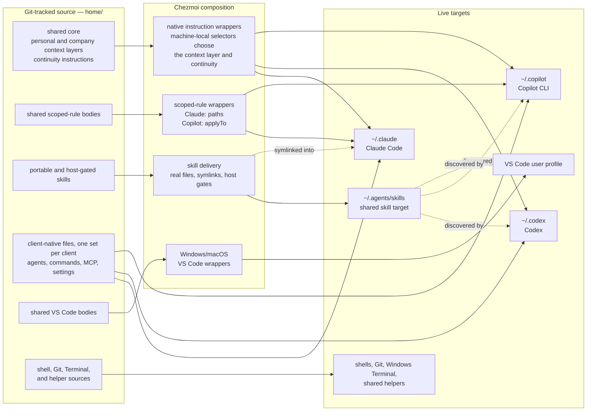
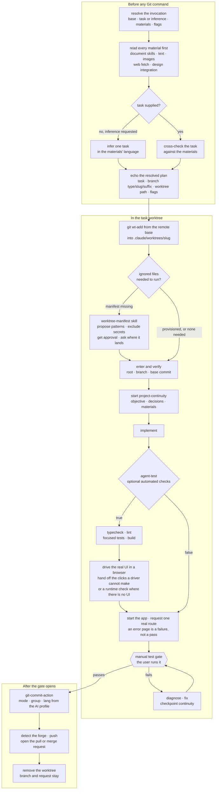
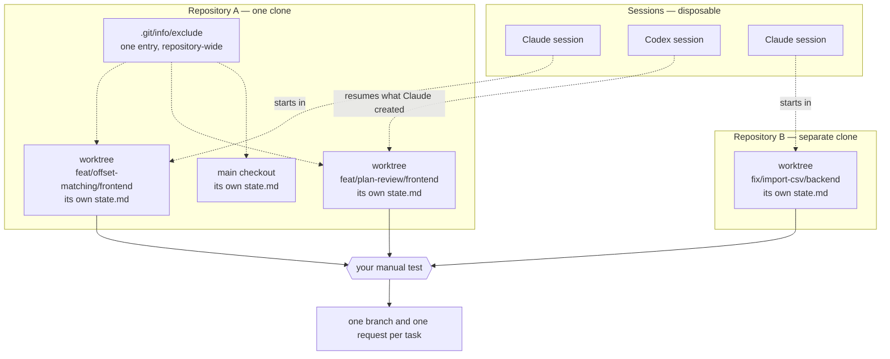

# Dotfiles

[English](README.md) · [繁體中文](README.zh-TW.md)

> **TL;DR:** A personal, cross-platform developer environment kit for AI-assisted development,
> managed with [chezmoi](https://www.chezmoi.io). One Git-tracked source renders into the native
> files that Claude Code, Codex, GitHub Copilot, VS Code, the shells, Git, and Windows Terminal
> actually read. It keeps one body per shared rule instead of three drifting copies, preserves
> per-worktree task state across sessions so parallel tasks stay isolated, and never overwrites a
> setting the application owns.

```text
home/dot_bashrc  ──chezmoi apply──▶  ~/.bashrc
```

Tracking dotfiles in Git is the easy part. What is worth reading about is where this repository
**stops**, and what holds it there: each boundary below is enforced by a mechanism — a chezmoi
merge, a Git exclude, a check that fails the commit — rather than by remembering to be careful.

## Why this exists

| The problem | How this repository answers it |
| --- | --- |
| [Three AI clients that agree on nothing](#three-ai-clients-that-agree-on-nothing). Different files, formats, and discovery rules, so guidance updated in one leaves the others stale. | One body per rule, composed conditionally by chezmoi templates — the machine's personal-or-company context layer, whether the session-handoff instructions are included, and the operating system — then wrapped in each client's own frontmatter: `paths:` for Claude, `applyTo:` for Copilot, neither for Codex. A pre-commit check compares the rendered Claude and Copilot bodies byte for byte. |
| [Applications own part of their own configuration](#applications-own-part-of-their-own-configuration). `/config`, Windows Terminal profiles, and Codex trust state all write to files you also want tracked. | Claim keys, not files. The repository owns Claude's hooks, status line, environment, and update channel; the model, effort level, theme, and permissions that `/config` writes stay yours. A modify template deep-merges only the owned keys, so every other key in `settings.json` survives untouched. |
| [A session can end in the middle of a task](#a-session-can-end-in-the-middle-of-a-task). Usage limits and compaction lose the objective, the decisions, and the next action. | One Git-ignored continuity file per working tree records the objective, decisions, blockers, and next action. Isolated worktrees give each task its own directory, branch, and state, so several run at once and any new session resumes one from where it stopped. |
| [The same setting lives somewhere different on every machine](#the-same-setting-lives-somewhere-different-on-every-machine). VS Code's user directory, the shell startup file, and Windows Terminal all sit at OS-specific paths. | One body per file, wrapped once per operating system. `home/.chezmoiignore` renders only the branch that matches the machine, so Windows gets the `AppData` tree and macOS the `Library` one from the same source, and the unused tree is never written rather than written and ignored. |
| [Restored dotfiles are not a working machine](#restored-dotfiles-are-not-a-working-machine). Prerequisites, validation hooks, extensions, plugins, and MCP servers are all still missing. | Platform bootstrap scripts link the checkout, enable the validation hook, install prerequisites, and apply the VS Code extension and Claude MCP manifests. Run them again once the client applications exist, so the plugin, extension, and MCP steps that need a working CLI can finish. |

### Three AI clients that agree on nothing

Claude Code reads `~/.claude/CLAUDE.md`. Codex reads `~/.codex/AGENTS.md` and renders YAML
frontmatter as visible text. Copilot reads `*.instructions.md` files and scopes them with
`applyTo`. Update a working agreement in one client and the other two go stale.

This repository keeps each shared rule body once, under `home/.chezmoitemplates/`, and renders it
into every client's native file through a thin wrapper. A rule that names one client's machinery
stays in that client's file; it is never paraphrased into a "tool-neutral" twin, because a
paraphrase living beside the original is the exact failure the structure prevents. Only the
wrapper differs between clients: the frontmatter that scopes the body, and nothing else.

### Applications own part of their own configuration

Claude Code's `/config` command writes the model, effort level, theme, and permissions into
`~/.claude/settings.json`. Windows Terminal regenerates its own profiles. Codex writes trust and
marketplace state into `config.toml`. Tracking any of those files whole would overwrite the
application's choices on every apply, or force every in-app change back into the source.

So the repository claims **keys, not files**, and picks a different chezmoi mechanism per target:
a modify template where both sides write the same file, a create-once source where the application
should own the file after its first run, and a whole-array claim where merging half an array would
be meaningless. [Ownership boundaries](#ownership-boundaries) lists exactly who owns what.

### A session can end in the middle of a task

Usage limits, compaction, or a closed terminal end an AI session with no chance to hand off. Git
knows what changed. Git does not know the objective, the decisions already made, or the next
action.

Project continuity records those in `.project-continuity/state.md`: one file per working tree,
ignored by Git, always written in English so a resuming session never has to translate before it
can work. Git stays authoritative for branch, `HEAD`, and working-tree reality; continuity
supplies only the context Git cannot hold.

### The same setting lives somewhere different on every machine

VS Code keeps user settings under `AppData` on Windows and `Library/Application Support` on macOS.
Bash reads `.bashrc` and zsh reads `.zshrc`. Windows Terminal exists on one platform only, and the
Git aliases that drive worktree provisioning call a PowerShell script on Windows and a Bash script
on macOS.

Copying files machine by machine lets each one drift on its own schedule. Here each body is
written once and wrapped per operating system. `home/.chezmoiignore` renders only the branch that
matches the machine, so the unused tree is never written at all.

### Restored dotfiles are not a working machine

A fresh checkout still lacks command-line prerequisites, validation hooks, editor extensions,
client plugins, and MCP server declarations, and some integrations cannot run until their client
application is installed and signed in.

The platform bootstrap scripts close that gap, and they are designed to be run twice: once to
connect the checkout and install prerequisites, and again after the client applications exist so
the deferred plugin, extension, and MCP steps can complete.

## Get started

This is a personal configuration repository. Read [the setup guide](./docs/setup.md) before
applying it, especially on a machine that already has shell, editor, or AI-client settings.

| Situation | Start here |
| --- | --- |
| Nothing to preserve | [Empty machine](./docs/setup.md#empty-machine) — prerequisites and what the one-liner below does |
| Existing configuration | [Existing configuration](./docs/setup.md#existing-configuration) — initialize, review `chezmoi diff`, adopt, then apply |
| Full machine build | [New machine, in order](./docs/setup.md#new-machine-in-order) — configuration, applications, bootstrap, validation |

On a machine with nothing to preserve, the whole configuration step is one command:

```bash
sh -c "$(curl -fsLS https://get.chezmoi.io)" -- init --apply sherrilla71940
```

That downloads and runs a remote installer, so review the URL and the machine's script policy
before running it, and replace `sherrilla71940` with your own fork. This line is only for a
machine with nothing to lose.

Applying configuration is only one step of a machine build. The complete sequence also installs
and authenticates the applications, runs the platform bootstrap, and enables repository
validation. Windows additionally needs
[symbolic-link creation](./docs/setup.md#enable-windows-symlink-creation) unless the setup uses a
directory junction.

The development checkout lives at `~/dotfiles`, and the bootstrap connects chezmoi's default
source location to it with a macOS symlink or a Windows directory junction. Scripts, decision
records, and source state therefore stay in one Git working tree; see
[ADR-0006](./docs/decisions/0006-keep-the-working-tree-at-dotfiles.md) for the trade-off.

## Architecture: one source, native outputs

Chezmoi treats the files under `home/` as **source state**: the desired configuration that you
edit and commit. The files written into the home directory are **targets**: what applications
actually read.

The repository root holds a `.chezmoiroot` file naming `home/` as that source state, which is why
every managed file sits under `home/` and why applying this repository creates no `~/home/`
directory.

The source filename carries meaning. `dot_` becomes a leading `.`, `.tmpl` enables template
rendering, and prefixes such as `create_`, `modify_`, and `symlink_` control how chezmoi treats a
target. Read [the chezmoi workflow](./docs/chezmoi-workflow.md) before adding or renaming a
source file.

**Figure: how each kind of tracked source reaches its live target.** Solid arrows mean "renders
into". Dotted arrows mean "reads the same file from another location", which is why no content is
duplicated to reach a second host.



Three details explain most of the structure:

- **The shared core is inlined, not imported.** Each client's native instruction file receives the
  same body. Codex receives the always-on core only, because Codex supports neither imports nor
  path-scoped instructions.
- **A portable skill is one real file.** It lives under `home/dot_agents/skills/` and renders to
  `~/.agents/skills`, where Codex, Copilot, and VS Code find it natively. Claude Code reads
  personal skills only from `~/.claude/skills`, so it reaches the same file through an individual
  symlink. A `.codex-only` marker stops the shared copy of a skill being auto-invoked by a host it
  was not written for; a client needing its own version carries a native one instead of a symlink.
- **VS Code is the editor host, not a fourth Copilot.** Its settings, keybindings, and MCP files
  use OS-specific wrappers, while Copilot instructions, agents, and skills stay in the locations
  their own host supports.

### Why some content is shared and some is not

| Content | Representation |
| --- | --- |
| Always-on working agreement | One shared body, inlined into Claude `CLAUDE.md`, Codex `AGENTS.md`, and Copilot instructions. The context layer and the continuity instructions are composed in or out by machine-local selectors, so one source yields a different agreement on a personal machine and a company one. |
| Path-scoped rules | One body and one glob in `home/.chezmoidata.yaml`, with thin Claude and Copilot frontmatter wrappers. Codex has no equivalent path-scoped output. |
| Portable skills | One real skill directory under `home/dot_agents/skills/`, rendered once to the shared discovery target and reached by Claude through a symlink. A `.codex-only` marker plus native metadata gates a Codex-targeted skill: Codex invokes it implicitly, Copilot discovers it but cannot invoke it automatically, and Claude gets no symlink because it carries its own adapter. |
| Client-specific skills, agents, commands, and MCP files | Native files under the relevant client source directory, never rewritten into a misleading "tool-neutral" copy. |
| VS Code files | Shared bodies under `home/.chezmoitemplates/vscode/`, wrapped once for the Windows and macOS user-profile paths. |

Files under `home/.chezmoitemplates/` are reusable bodies, not targets; a body normally needs its
client or OS wrapper to render. The [AI customization guide](./docs/customization-support.md)
maps every customization to the source path that owns it, and to the surfaces that read it.

## Machine-local profiles and continuity

Two independent values in chezmoi's machine-local configuration select the rendered AI profile.
Neither is ever committed:

```toml
[data]
ai_context = "company"        # personal or company
ai_continuity = "on"          # on or off
```

| Selector | Controls | Default and boundary |
| --- | --- | --- |
| `ai_context` | The personal or company context layer, its artifact-language default, and the default comment language for application and project repositories. | Missing means `personal`; any other value fails rendering. |
| `ai_continuity` | Whether continuity instructions and automatic lifecycle reporting are active. | Missing means `on`; any other value fails rendering. The continuity skill stays invokable when off. |

The composition is:

```text
shared baseline + personal OR company context + continuity when enabled
```

A selector change affects newly rendered configuration and newly started sessions; a running
session keeps its startup context. Repository and direct user instructions still take precedence,
and this repository's root `AGENTS.md` deliberately requires the effective `personal` context
while work happens here, even on a machine set to `company`.

The artifact-language default has a narrow scope. It reaches commit descriptions and bodies,
worktree commit and request text, and managed VS Code Copilot commit-message guidance. It does
not translate branch names, paths, commands, user-level dotfiles, or this README. Explicit `en`
or `zhtw` arguments override it.

### Project continuity

Continuity belongs to one physical working tree, and each tree holds at most one active state:

- `.project-continuity/state.md` records the objective, phase, next action, blockers, assumptions,
  and verification state — where the work stopped and why, not project documentation.
- Claude Code and Codex get lifecycle reporting that finds existing state and flags branch or
  `HEAD` drift. Copilot can follow the same protocol without an automatic hook.
- Git remains authoritative. Continuity is context and last-known state, never proof that
  something was finished.
- The state is Git-ignored for privacy and convenience. It is a local handoff file, not an
  encrypted store, which is why the workflow forbids putting credentials in it.
- Unfinished state is parked in `.project-continuity/parked/` before a different task starts, so
  one handoff never overwrites another.

Turning `ai_continuity` off removes the always-loaded guidance and renders the shared lifecycle
helper as a no-op. The hook entries stay registered, so the independent Claude worktree launch
check keeps working and Codex needs no new hook-trust decision after a toggle.

### Parallel tasks without losing state

Continuity is scoped to a directory, so isolation is what lets several tasks run at once. The
`worktree-task-workflow` skill drives one task through its whole lifecycle in a worktree of its
own.

**Figure: one task's lifecycle, Claude adapter.** The worktree path and the removal step are
Claude-specific; the Codex differences are noted after the properties below.



The diagram is only the skeleton. What makes the workflow worth invoking, rather than switching
branches in place, is what each step does without being asked:

- **Materials are read before anything exists.** Hand it a handoff note, a spec, a deck, a
  spreadsheet, a web page, or a Figma link, and each one is read through its matching document
  skill, web fetch, or design integration before a single Git command runs. An explicit task is
  cross-checked against them; with `--infer-task` the task is derived from them instead. Anything
  that cannot be read stops the run with nothing created, naming the missing capability rather
  than guessing. Fetched content is treated as data: a page that asks to change the task or the
  branch is reported, never obeyed.
- **Naming is derived, not invented.** The commit type comes from the shared
  `git-commit-reference` table, the slug from the task's meaning, and the branch from
  `type/slug/suffix`. The worktree lands under `.claude/worktrees/` because entering it there
  raises no approval prompt, and the base is a named remote branch, which no client's own worktree
  creation can express.
- **Every task gets its own directory, branch, and continuity file.** Run as many at once as the
  machine allows; no two tasks share an index, a `HEAD`, or a handoff record.
- **A session ending mid-task costs almost nothing.** Continuity is checkpointed inside the
  worktree and records every material — a path because it may live outside the worktree, a URL
  because a later session has to fetch it again — so a new session enters the same path and
  resumes from the recorded next action — including after the usage limit that ended
  the previous one.
- **A silent provisioning skip is surfaced, not swallowed.** `git wt-add` can succeed while
  copying nothing. The workflow settles whether that matters by building and running the app, and
  when a manifest is warranted it asks where `.worktreeinclude` should land instead of folding an
  unrelated root-level file into this task's request.
- **Automated verification reaches the browser, not just the build.** With `agent-test` on, the
  workflow runs typecheck, lint, focused tests and a build, and for visual work drives the real UI
  through the managed `chrome-devtools` MCP server. Where a driver cannot reach — canvas, map
  overlays, WebGL, drag gestures — the `browser-collab-testing` skill splits the interactions with
  you rather than skipping them. Nothing is reported as tested unless a tool actually drove it.
- **The manual-test gate is hard.** No commit, push, or request happens until you report that you
  tested it yourself. An approved plan, a reviewed diff, and green automated checks do not open
  that gate. Before handing the steps over, the workflow starts the app and requests one real
  route, so what you are given is known to run.
- **Publishing inherits the machine's profile.** The resolved `lang` defaults to the active
  context's artifact language, so commit messages and the request description come out in the
  right language, with `natural-zhtw` loaded before any Traditional Chinese text. The forge is
  detected from `origin`, and verification is attributed honestly: agent-run checks named as such,
  the manual test credited to you.
- **Cleanup removes the worktree, never the branch.** The task branch outlives its directory for
  review and CI, and every removal path that would delete a ref is deliberately unused.

Those properties compose. Nothing in the workflow is aware of any other task, so what limits how
many run at once is the machine and your own attention.

**Figure: several tasks at once, across worktrees and repositories.**



Three things in that picture are easy to miss. **Sessions are disposable; the task branch and its
state are not** — a session ending leaves the directory, the branch, and the state file exactly as
they were. The directory's own lifetime is client- and policy-dependent, which is why cleanup
never deletes the branch: archiving a Codex chat can remove the worktree it manages, and Claude's
periodic sweep has rules of its own. **The client is not part of a task's identity**: continuity state is client-neutral, so a worktree Claude
Code created can be resumed by Codex, and two clients can hold different worktrees of the same
clone at once. And **one `.git/info/exclude` entry covers every worktree of a clone**, because it
lives in the repository's common directory and the anchored pattern resolves against each working
tree's own root; worktrees created later are protected without a per-worktree step.

The manual-test gate is the part that does not parallelize. Agents fan out; verification converges
on you.

The skill has a Claude adapter and a Codex adapter, because neither client alone gives an isolated
session on a branch taken from an arbitrary remote base. Codex differs at both ends of the diagram:
it works in a detached sibling worktree, or in one the Codex app manages under
`$CODEX_HOME/worktrees`, and it never removes its own active worktree — you keep it for review or
dispose of it through the app. Neither choice deletes the task branch. [The worktree provisioning
guide](./docs/worktree-provisioning.md#claude-worktree-task-workflow) explains how each adapter
gets there and which safety boundaries apply.

The `worktree-manifest` skill is what authors that manifest: it inspects candidates, excludes
credentials, caches, data, and continuity state, and asks for approval before writing
`.worktreeinclude`. VS Code uses a separate user-level include setting, so the repository manifest
does not cover every way a worktree can be created.

This dotfiles repository is itself an exception: it stays in its primary checkout, because chezmoi
source resolution is tied to that one tree.

## What is managed

| Surface | Representative contents |
| --- | --- |
| Claude Code | Shared `CLAUDE.md`, path-scoped rules, linked skills, Claude-only skills and commands, hooks, theme definitions, a cross-platform status line and notifications, and selected durable settings. |
| Codex | Shared `AGENTS.md`, lifecycle hooks, shared and host-gated skills, and create-once configuration defaults. |
| GitHub Copilot CLI | Shared instructions, Copilot-only agents and skills, settings, and user MCP declarations. |
| VS Code | Windows and macOS user settings, keybindings, MCP configuration, an extension manifest, and supported Copilot customizations. |
| Shells and Git | Bash, Zsh, profile startup, lazy `nvm` loading, Git identity and aliases, and the `git wt-add` / `git wt-copy` worktree commands. |
| Windows Terminal | Durable font and input behavior plus the complete actions and keybindings arrays, while generated machine-specific profiles stay application-owned. |
| Repository tooling | Bootstrap scripts, Claude MCP installers, MCP and extension manifests, diagnostics, cross-platform helpers, regression suites, and architecture decision records. |

The portable skill library covers accessibility review, browser collaboration, Word, PowerPoint,
Excel and PDF handling, commit conventions and commit authoring, natural Traditional Chinese,
prompt optimization, technical writing, project continuity, worktree manifests, and the worktree
task workflow. Client-only skills sit beside them where a workflow depends on one client's
machinery. Copilot adds repository-architecture, frontend-performance, and security-review agents.

This list is representative. New applications, dotfiles, integrations, and AI-client adapters
follow the same source-to-native-target model.

The Claude status line deserves a specific mention, because it answers the question that ends
sessions:


It renders the model and effort level, the session name when one is set, the working directory,
the Git branch with ahead/behind and staged, modified, and untracked counts, the context window
used, and the **five-hour and seven-day rate-limit windows with their reset times**. Two
implementations, Bash and PowerShell, are kept in step by a pre-commit parity check, and both
measure CJK and emoji width so the layout collapses cleanly on a narrow terminal.

## Ownership boundaries

The repository does not try to own every byte an application writes. It uses the narrowest useful
ownership model:

| Target | Repository owns | Application or user owns |
| --- | --- | --- |
| Claude `settings.json` | Durable environment, hooks, status line, and update-channel values, deep-merged by a modify template. | Model, effort level, the selected theme, permissions, plugin enablement, project state, and future keys. |
| Codex `config.toml` | Defaults for a machine where the file does not yet exist. | Existing trust, runtime, marketplace, and session state. The `create_` attribute prevents wholesale replacement. |
| Windows Terminal `settings.json` | Selected durable values plus the complete `actions` and `keybindings` arrays. | Generated profiles and other unnamed settings. A claimed array is replaced whole on apply. |
| VS Code user files | Tracked settings, keybindings, and MCP sources rendered through OS-specific wrappers. | Workspace storage, authentication, extension caches, and runtime data. |
| Claude user MCP state | Non-secret declarations, through a manifest and an add-missing installer. | Authentication and the rest of `~/.claude.json`, which also holds application state. |

A second layer keeps private files from being committed by accident. The global Git exclude file
is wired through `core.excludesFile` and protects these exact surfaces in every repository:

```text
**/.claude/settings.local.json
**/CLAUDE.local.md
**/AGENTS.override.md
/.project-continuity/
```

Shared `AGENTS.md`, `CLAUDE.md`, `.github/copilot-instructions.md`, and other repository
instructions stay trackable. The ignore policy prevents accidental tracking; it does not copy
files into worktrees and does not encrypt anything.

That global file is one of two layers, which is why continuity appears in both. It covers every
repository on the machine. Inside a repository, the continuity skill also writes
`/.project-continuity/` into `.git/info/exclude`, and because that file lives in the common Git
directory the single entry covers the main checkout and every worktree, including ones created
later.

Never commit credentials. MCP configuration holds endpoints and, where supported, placeholders
such as `${input:figma-api-key}` or `${GITHUB_MCP_TOKEN}` — never their values. Authenticate each
client locally and keep sessions, logs, caches, installed plugins, and keys out of `home/`.

## Daily maintenance

Edit the source state, preview the render, apply only what you reviewed, then commit the source:

```bash
chezmoi source-path                                        # identify the configured source
git -C "$(chezmoi source-path)" rev-parse --show-toplevel  # must report this checkout
chezmoi diff                                               # preview live-target changes
chezmoi apply -v                                           # apply the reviewed render
chezmoi status                                             # empty means no unapplied drift
git diff                                                   # review the source change
```

The identity check is not ceremony. A plain chezmoi command uses its configured source directory
whatever the current directory is, so an unverified `apply` can render a different clone over this
machine's configuration.

Shell aliases shorten the common paths: `dotf` opens the source directory, `dotf-core` edits the
shared working agreement, `dotf-claude` edits the Claude-specific instructions, and `dotf-diff`
and `dotf-apply` wrap the two commands above.

Editing a live target directly is not durable. Run `chezmoi source-path <target>` to find its
source first; if the target is application-owned or partially managed, follow the ownership table
and use the application's own command for its portion. Do not run `chezmoi add` on a managed
target, especially a `create_` or `modify_` one.

From the repository root, `bash scripts/dotfiles doctor` reports the chezmoi source identity, the
resolved profile, unapplied target drift, Claude shared-skill link health, and required tool
versions without changing a target.

The repository is also self-describing for coding assistants. The root [`AGENTS.md`](./AGENTS.md)
tells Codex and Copilot how to find the source of truth, preserve application-owned state, and
keep editing, applying, committing, and validation separate; the root
[`CLAUDE.md`](./CLAUDE.md) imports the same guidance for Claude Code. Ask by outcome:

- "I changed the live `.bashrc`; help me preserve it in the source state."
- "Add a rule shared by Claude Code and Copilot, and explain what Codex can support."
- "Set a VS Code setting, show the diff, and apply only that reviewed change."

## Validation and regression coverage

The pre-commit hook renders the staged source into a temporary directory — never into the home
directory — and checks:

- the chezmoi source identity, so a commit cannot be made against a different clone;
- every path the commit will contain, because Git commits the index rather than the paths a
  session staged, and this folder's index is shared by every process working in it;
- filename-attribute safety and skill file-count parity, so chezmoi's filename transformations
  cannot silently drop a file;
- Claude shared-skill symlinks and Codex host gates for `.codex-only` skills;
- byte-identical shared rule bodies between Claude and Copilot;
- the absence of YAML frontmatter in Codex's rendered `AGENTS.md`;
- parity between the Bash and PowerShell status-line implementations when either changes; and
- every relative Markdown link: the file it names must exist, and a `#fragment` must match a real
  heading. Both fail silently, staying rendered until a reader clicks.

Durable suites run by hand when their protected behavior changes:

| Change | Test |
| --- | --- |
| Windows worktree implementation | `powershell.exe -NoProfile -ExecutionPolicy Bypass -File scripts/tests/test-git-worktree-provision.ps1` |
| macOS worktree implementation | `bash scripts/tests/test-git-worktree-provision.sh` |
| Shared worktree contract or safety boundary | Run both worktree provisioning suites. |
| Project-continuity lifecycle or recovery contract | `bash scripts/tests/test-project-continuity-hook.sh` |
| AI profile selectors, composition, language defaults, or continuity toggle | `bash scripts/tests/test-ai-configuration-profiles.sh` |

Instructions get tested too. `scripts/tests/continuity-fixtures/` holds paired prompts and
expected behavior for the cases continuity handling gets wrong — an unrelated question arriving
over live state, a substantive task switch, an explicit abandon, branch drift, a finished task,
and a cold start with nothing but a plan. Each fixture stages a throwaway repository through
`setup-case.sh`. The fabricated `state.md` files are deliberately indistinguishable from real
ones, so never act on a `state.md` found under that directory.

## Repository layout

```text
home/                              chezmoi source state
  .chezmoidata.yaml                shared rule globs
  .chezmoitemplates/               shared bodies and OS-neutral data
  dot_agents/skills/               portable and host-gated skills
  dot_claude/                      Claude Code files and adapters
  dot_codex/                       Codex files and create-once config
  dot_copilot/                     Copilot CLI files, agents, and skills
  AppData/ · Library/              Windows and macOS VS Code targets
  dot_bashrc · dot_zshrc.tmpl      shell startup files
  dot_gitconfig.tmpl               Git identity, aliases, and global excludes link
  dot_config/git/ignore            personal AI and continuity excludes
  dot_local/share/                 worktree provisioning and notification helpers

scripts/bootstrap/                 manual new-machine setup
scripts/install/                   Claude MCP installers
scripts/manifests/                 MCP and VS Code extension declarations
scripts/diagnostics/               doctor, config-usage, and settings-drift reports
scripts/tests/                     profile, continuity, and worktree suites
scripts/git-hooks/                 pre-commit and Markdown link validation
docs/                              setup, workflow, customization, and ADR guides
```

## Where to go next

| I want to… | Read |
| --- | --- |
| Set up a machine or identify what must be installed separately | [docs/setup.md](./docs/setup.md) |
| Add, change, or remove a general managed file | [docs/chezmoi-workflow.md](./docs/chezmoi-workflow.md) |
| Add an AI instruction, skill, agent, prompt, MCP server, or plugin | [docs/customization-support.md](./docs/customization-support.md) |
| Find out which client surface reads a given customization | [the support table](./docs/customization-support.md#what-the-support-table-answers) |
| Run an isolated task or provision ignored files in a worktree | [docs/worktree-provisioning.md](./docs/worktree-provisioning.md) |
| Understand why the repository uses this structure | [docs/decisions/README.md](./docs/decisions/README.md) |
| Understand why a rule exists before removing it | [docs/rule-rationale.md](./docs/rule-rationale.md) |
| Let a coding assistant work safely in this repository | [AGENTS.md](./AGENTS.md) |

Every structural choice here has a written reason. The decision records cover why procedures and
decisions live apart, why shared content uses thin wrappers, why Claude settings are merged by key
rather than replaced, why the working tree stays at `~/dotfiles`, why a Codex-targeted skill is
gated by host rather than by directory, and why the whole tree is normalized to LF. Each record
names the change that should trigger reconsideration, so a later session can tell a deliberate
constraint from accidental legacy.

Discovery paths, frontmatter keys, hook payloads, and worktree behavior all change with upstream
releases. Verify version-sensitive details against the current
[chezmoi](https://www.chezmoi.io/reference/source-state-attributes/),
[Claude Code](https://code.claude.com/docs/en/overview),
[Codex](https://learn.chatgpt.com/docs/agent-configuration/agents-md), and
[VS Code agent customization](https://code.visualstudio.com/docs/agent-customization/overview)
documentation before changing a client-specific path or key.
