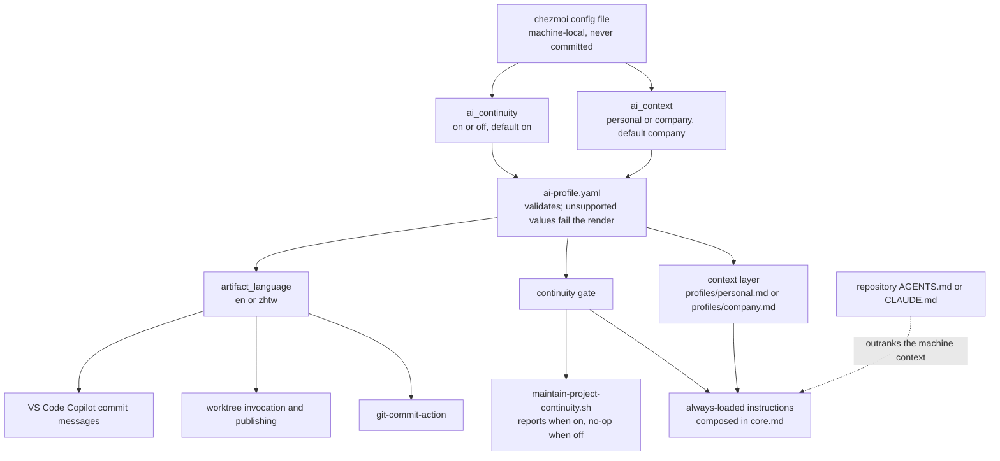
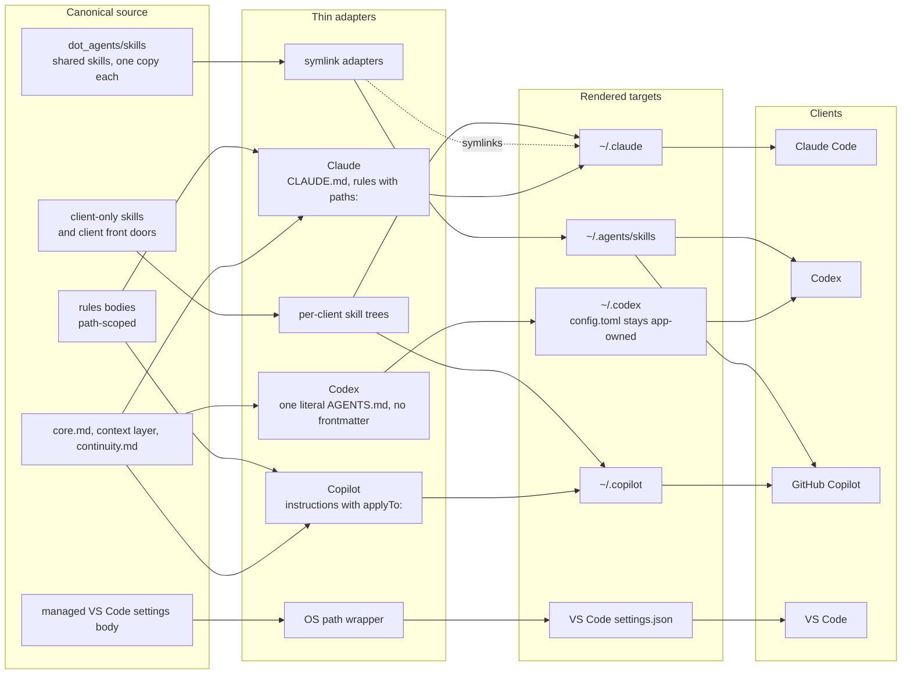

# Dotfiles

Personal cross-platform configuration for dotfiles and AI development tooling. The desired
state lives in Git; [chezmoi](https://www.chezmoi.io) renders it into the live files each
machine reads, resolving what is shared, what differs per operating system, and what belongs
to a single tool.

It solves three problems:

- **Configuration drifts between machines, and the same setting lives at a different path on
  each operating system.** Templates keep one managed configuration consistent across
  platforms. A new machine clones this repository and renders every managed file with a
  single chezmoi command; the tools those files configure are installed by their own scripts,
  kept out of the apply path so a routine apply never installs software.
- **Three AI tools need overlapping configuration, but each expects it in a different file and
  format.** Shared content is written once and rendered into the form each client accepts,
  while tool-specific content stays separate. `~/.claude/CLAUDE.md`, for example, combines the
  working agreement shared with Codex and Copilot with an additional Claude-only section at
  render time. Where the exact same file can serve multiple tools, as with shared skills, the
  repository uses symlinks instead of rendering copies.
- **Some managed files are also rewritten by the applications that consume them.** One settings
  file can hold both what should follow your machines and what the application records about
  itself, so writing it wholesale destroys the second. Take Claude Code's `settings.json`:
  the repository owns a handful of durable keys and merges them over whatever Claude wrote,
  leaving your model, effort and theme untouched.

None of that is taken on trust. A commit hook re-renders the staged source and fails if shared
rule bodies diverge between clients, a skill disappears because of a filename attribute,
Codex's file gains frontmatter, a cross-reference points to a missing heading, or the bash and
PowerShell status lines produce different output — one of the few pieces intentionally
maintained as two implementations.

## How it works

Chezmoi turns this repository into the live files your applications read. The files under
`home/` are the **source state**: the desired configuration, which is what you edit and
commit. What chezmoi writes into your home directory are **targets**.

```text
home/dot_bashrc  ──chezmoi apply──▶  ~/.bashrc
```

So you change a file here and run `chezmoi apply`, which makes the targets match the source
state. Editing a target directly is not durable — the next apply overwrites it. Filenames
carry meaning too: `dot_` becomes a leading dot, and a `.tmpl` file is rendered as a template,
which is how one source supports both Windows and macOS.
[docs/chezmoi-workflow.md](./docs/chezmoi-workflow.md) covers the day-to-day commands.

`chezmoi init` clones this repository for you, into a source directory of its own choosing.
Decide before that whether you want the working tree somewhere plain `git` and the repository's
scripts are convenient — this setup keeps it at `~/dotfiles`, which means cloning there yourself
first. [docs/setup.md](./docs/setup.md) has the ordering; the reason is in
[ADR-0006](./docs/decisions/0006-keep-the-working-tree-at-dotfiles.md).

## Shared AI configuration

Each tool receives a real file in **its own** format: a Claude rule carrying `paths:`, a
Copilot `.instructions.md` carrying `applyTo:`, and for Codex one literal file with no
frontmatter, because Codex can neither import another file nor path-scope at all. No single
shared file can serve all three, which is why the body is rendered rather than linked.

```
home/.chezmoitemplates/rules/javascript.md   <-- the body, written once
home/.chezmoidata.yaml                       <-- the glob, written once

  -> ~/.claude/rules/javascript.md                        paths: "**/*.{js,jsx,ts,tsx}"
  -> ~/.copilot/instructions/javascript.instructions.md   applyTo: "**/*.{js,jsx,ts,tsx}"
```

Portable skills go the other way, because their instructions do not differ per client. One real
copy lives in `~/.agents/skills`, which Codex and Copilot read directly; Claude Code looks only in
`~/.claude/skills`, so a symlink bridges it there. A Codex-targeted exception can also live in
`~/.agents/skills`, but repository host gates keep Claude and Copilot from invoking it as a shared
workflow.

A skill or instruction meant for one tool alone is a plain file in that tool's own folder —
`~/.copilot/skills`, for instance — with no templating and no link. Nothing is ever reworded
into a tool-neutral twin: a rule only one tool can follow either stays in that tool's file, or
says plainly which tool it applies to.

## AI client architecture

Two questions come up about this repository, and they need different pictures. The first diagram
answers "what does changing a selector actually change?". The second answers "how does one source
body reach four clients?".

### What a selector changes

Both selectors are machine-local and are never committed. The resolver validates them, then feeds
three separate things: which context layer is composed in, whether continuity guidance and
reporting are active, and which language the supported artifacts default to.



Three details in that picture are easy to get wrong:

- **Artifact language reaches skills and VS Code, not just the instruction files.** Those three
  leaves are the whole supported surface; an explicit `en` or `zhtw` argument still overrides them.
- **Continuity off changes instructions and helper behaviour, never hook wiring.** The hooks stay
  registered in both states, which keeps the independent worktree launch check active and keeps
  Codex's per-entry hook trust valid across a toggle.
- **Repository instructions outrank the machine context.** That is why this repository's own
  `AGENTS.md` pins the `personal` context for work performed here without touching the selector.

User-level configuration and customization comments stay English in both contexts, and continuity
state is written in English regardless of the conversation language.

### How one source reaches four clients

Skills are canonical in one place. The adapters add only the frontmatter or wrapper each client
understands, which is why a rule that names one tool's machinery never gets reworded into a
tool-neutral twin.



Note the edge that is deliberately missing: `rules` never reaches the Codex adapter. Codex has no
import mechanism and no path-scoping equivalent, so it receives the always-on core only, as one
literal file with no YAML frontmatter.

Skills come in three tiers, which is why the diagram has two skill sources:

- **Shared skills** live once in `home/dot_agents/skills` and render to `~/.agents/skills`. Codex
  and Copilot discover that directory directly; Claude reaches the same files through symlinks in
  `~/.claude/skills`, so there is still only one body to edit.
- **Client front doors** exist where one capability needs a different entry point per client.
  `worktree-task-workflow` has a Codex-gated `SKILL.md` under `dot_agents` and a Claude `SKILL.md`
  under `dot_claude`, but both pull the same reference bodies out of `.chezmoitemplates`, so the
  guidance cannot drift even though the front matter differs.
- **Client-only skills** belong to one client and are never shared: `claude-worktree-memory` for
  Claude Code, `remember` for Copilot. Copilot also carries its own `.agent.md` agents.

Worktree workflow and worktree manifest stay independently available in every combination; neither
is a profile toggle. Shared helper scripts render to `~/.local/share` so Claude Code and Codex can
run the same file.

## Choose the AI configuration profile

The rendered Claude Code, Codex, and managed VS Code Copilot configuration has two independent,
machine-local selectors in chezmoi's config file (`chezmoi edit-config`):

```toml
[data]
ai_context = "company"        # personal or company; default: company
ai_continuity = "on"           # on or off; default: on
```

The four supported combinations are personal + continuity on, personal + continuity off,
company + continuity on, and company + continuity off. Missing `ai_context` uses `company`;
missing `ai_continuity` uses `on`. Unsupported values fail during rendering;
they do not silently produce a partial profile. Selector values are not stored in this repository,
so each Windows or macOS machine can choose its own profile.

The active context supplies artifact-language defaults: personal uses English (`en`) and company
uses Traditional Chinese (`zh-TW`, represented as `zhtw` where a command accepts that value).
Explicit language arguments, repository instructions, and direct user requests take precedence.
User-level dotfiles and AI configuration remain English in both contexts. Worktree skills remain
installed and independently available in both contexts; they may use continuity when it is on but
are not profile toggles.

This dotfiles repository is the deliberate exception: its root `AGENTS.md` is a repository
instruction that forces the effective context to `personal`, so work here remains English even on
a machine whose default context is `company`.

After changing a selector, preview the result with `chezmoi diff`, apply only after reviewing that
preview, and start new client sessions. Already-running sessions retain their startup context.
The selectors are machine-wide in v1, so simultaneous sessions on one machine cannot safely use
different context or continuity values. There is no profile CLI yet. Broad Copilot integration
(discovery, repository instructions, and agent plugins) is also outside this version's scope.

## Choose a setup path

### Empty machine

Use this one-line setup only when no existing shell, editor, or AI-client configuration needs
to be preserved. On Windows, first enable Developer Mode or provide symbolic-link privileges as
described in [the setup prerequisites](./docs/setup.md#enable-windows-symlink-creation).

```bash
sh -c "$(curl -fsLS https://get.chezmoi.io)" -- init --apply sherrilla71940
```

### Existing configuration

If any settings should survive—or you are unsure—initialize without applying:

```bash
chezmoi init sherrilla71940
git -C "$(chezmoi source-path)" rev-parse --show-toplevel   # must be this repository
chezmoi diff
```

Do not apply until you have adopted — copied into the repository — the values you want to keep. The
[existing-configuration guide](./docs/setup.md#existing-configuration) explains how to
preserve a complete plain file or selected settings from a template-backed file. If you use
a fork, replace `sherrilla71940` with the fork's URL.

Either path is one step of seven. What remains — the bootstrap helper that links the source
directory and enables the validation hook, installing and signing in to the applications, then
**running bootstrap a second time** so its plugin, extension and MCP steps find the CLIs they
depend on — is in [docs/setup.md](./docs/setup.md). Stopping here leaves a machine with the
files but none of the tooling.

## After setup

You can do this from anywhere. Chezmoi uses its configured source directory whatever your
current folder is, so `chezmoi edit`, `chezmoi diff`, `chezmoi apply` and `chezmoi git` all
work without changing directory first. The repository root — `~/dotfiles` if you kept the
working tree there, or `chezmoi cd` to open a shell in it — is just where plain `git` and the
repository's own scripts are convenient.

### Changing your configuration

Edit the source, preview with `chezmoi diff`, run `chezmoi apply`, then commit.
`chezmoi status` is empty once the change has landed.

The exception is everything the repository does not manage, which is most of what an
application records about itself. Claude's `settings.json` is the clearest case: the repository
owns the keys that should be identical everywhere, and leaves the rest — your model, theme,
permissions and the like — on the machine. Change those from inside the client, with `/config`
or `/model` or `/plugin`, and there is nothing to apply or commit. Run
`scripts/claude-settings-drift.sh` for the current split;
[docs/chezmoi-workflow.md](./docs/chezmoi-workflow.md) covers the general procedure.

### Or describe what you want to an AI assistant

Describe the result you want to Claude Code, Codex, or VS Code with GitHub Copilot in ordinary
language; you do not need to know chezmoi's encoded source filenames or commands first. For
example:

- "Guide me through managing my dotfiles with this repository."
- "Add React instructions shared by Claude Code and Copilot, and explain what Codex can support."
- "Add this instruction only for Claude Code."
- "I edited my live `.bashrc`; help me preserve that change in the repository."
- "Set my VS Code font size to 14, commit the source change, and then safely apply it with chezmoi."

The repository-level [`AGENTS.md`](./AGENTS.md) tells each assistant how to translate the
request into a safe source-state change, explain what will happen, and distinguish editing,
applying, and committing. Claude receives it through [`CLAUDE.md`](./CLAUDE.md); Codex and
Copilot can read it directly.

Starting the session at the repository root is simplest, because each tool loads that guidance
on its own. It holds from anywhere else too: the shared core instructions this repository
installs tell every assistant to resolve a configuration file with `chezmoi source-path` before
changing it, and to read this repository's `AGENTS.md` before editing anything in it — so both
the source-versus-target rule and the structural constraints reach an assistant that has never
seen this repository.

## Copying only part of this repository

Lifting a single file out of `home/.chezmoitemplates/` will not work, because nothing there is
a target file — each one is a body that some wrapper renders. A VS Code body needs the
OS-specific wrapper under `home/AppData/` or `home/Library/`; a shared rule body deliberately
omits the frontmatter each client requires; the Claude durable-settings body does nothing
without `home/dot_claude/modify_settings.json` to merge it. Take the wrapper as well, or read
it to see what it supplies.

Skills under `home/dot_agents/skills/` are real files rather than bodies, so they copy directly.
Most are portable; a source-only `.codex-only` marker identifies the host-gated exceptions.
Check that distinction before dropping one into a single-client setup.

## Layout

```
home/                            chezmoi source state
  .chezmoidata.yaml              rule globs, one place
  .chezmoitemplates/             SHARED bodies (core.md, profiles/, rules/, vscode/, claude/)
  dot_claude/                    CLAUDE.md, rules, settings, hooks, commands, agents,
                                 skills (Claude-only ones, plus links to the shared set)
  dot_codex/                     AGENTS.md, config.toml  (skills come from dot_agents)
  dot_copilot/                   instructions, agents, skills (Copilot-only ones)
  dot_agents/skills/             portable and host-gated Codex skills -> ~/.agents/skills
  .README.md                     how to read this tree (repo-only, never deployed)
  dot_bashrc  dot_zshrc.tmpl  dot_bash_profile   shells
  AppData/ · Library/            VS Code, one per OS
scripts/bootstrap-*.{sh,ps1}     one-time new-machine setup: links the chezmoi source
                                 directory, enables the hook, installs the tools (run by hand)
scripts/install-claude-mcp.*     adds declared Model Context Protocol (MCP) servers to Claude
scripts/claude-user-mcp-servers.json  the MCP manifest those installers read
scripts/claude-settings-drift.sh lists Claude settings changed locally but not in the repo
scripts/claude-config-usage.sh   reads local session transcripts to report which managed
                                 skills and commands actually get invoked, and which never do
scripts/test-ai-configuration-profiles.sh
                                  renders and checks all four machine-local profile combinations
scripts/git-hooks/pre-commit     validates the source state before each commit
scripts/git-hooks/markdown-anchors.awk  resolves documentation cross-references
scripts/vscode-extensions.txt    extension manifest (installed by bootstrap, or on request)
docs/decisions/                  architecture decisions and reconsideration triggers
```

## Maintainer regression tests

The scripts below are durable regression suites. Keep each suite while the behavior it protects
remains supported; repeated passing runs do not make a regression test obsolete. Remove a suite
only when its feature is retired or equivalent coverage replaces it.

| Change | Run |
| --- | --- |
| Windows worktree provisioning implementation | `powershell.exe -NoProfile -ExecutionPolicy Bypass -File scripts/test-git-worktree-provision.ps1` |
| macOS worktree provisioning implementation | `bash scripts/test-git-worktree-provision.sh` |
| Shared worktree provisioning contract or safety boundary | Both worktree provisioning suites |
| Project-continuity lifecycle hooks or recovery contract | `bash scripts/test-project-continuity-hook.sh` |
| AI profile selectors, composition, language defaults, or continuity toggle | `bash scripts/test-ai-configuration-profiles.sh` |

These suites create disposable repositories and run manually when their implementation or
contract changes. The pre-commit hook remains focused on fast source rendering and structural
checks.

## Where to go next

| I want to… | Read |
| --- | --- |
| Set up a machine, or see which applications you install yourself | [docs/setup.md](./docs/setup.md) |
| Add, change, or remove a general managed file | [docs/chezmoi-workflow.md](./docs/chezmoi-workflow.md) |
| Add or change AI instructions, skills, agents, prompts, MCP servers, or plugins | [docs/customization-support.md](./docs/customization-support.md) |
| Understand how ignored local files reach new Git worktrees | [docs/worktree-provisioning.md](./docs/worktree-provisioning.md) |
| Understand why the repository is structured this way | [docs/decisions/README.md](./docs/decisions/README.md) |
| Know why a particular rule exists before trimming it | [docs/rule-rationale.md](./docs/rule-rationale.md) |
| Let a coding agent work in this repo | [AGENTS.md](./AGENTS.md) |

`AGENTS.md` is the one file here written for a machine rather than a person: Codex and the
Copilot command-line interface (CLI) load it automatically, and the root `CLAUDE.md` imports
it so Claude Code gets the same constraints. It stays deliberately short, since it costs
context in every agent session; procedures live in the task-specific guides instead.
