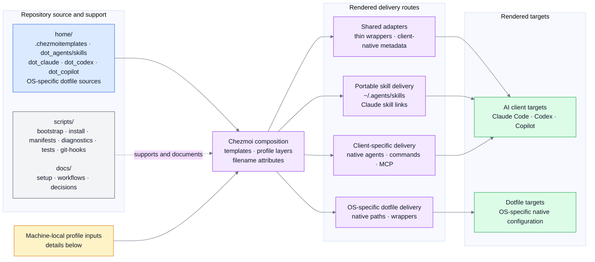
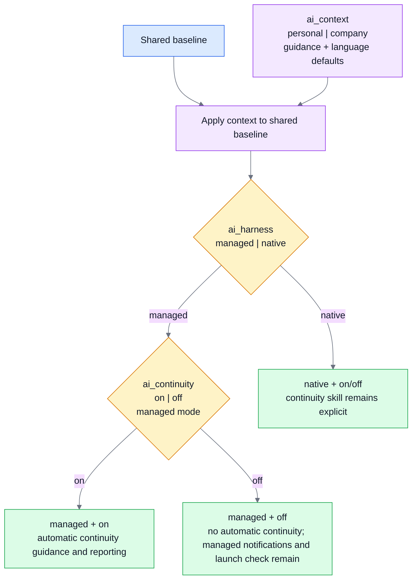
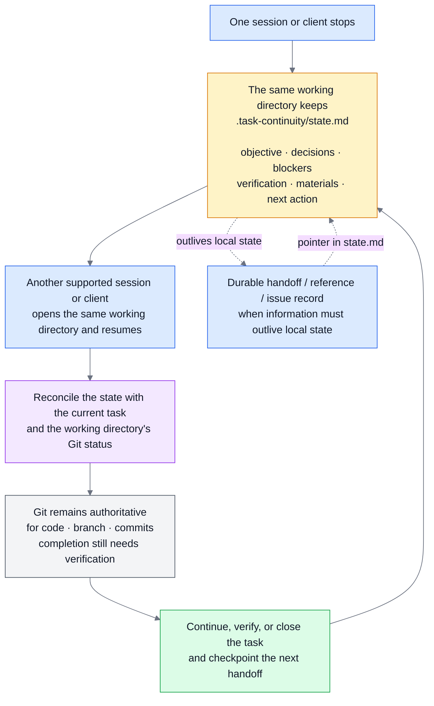
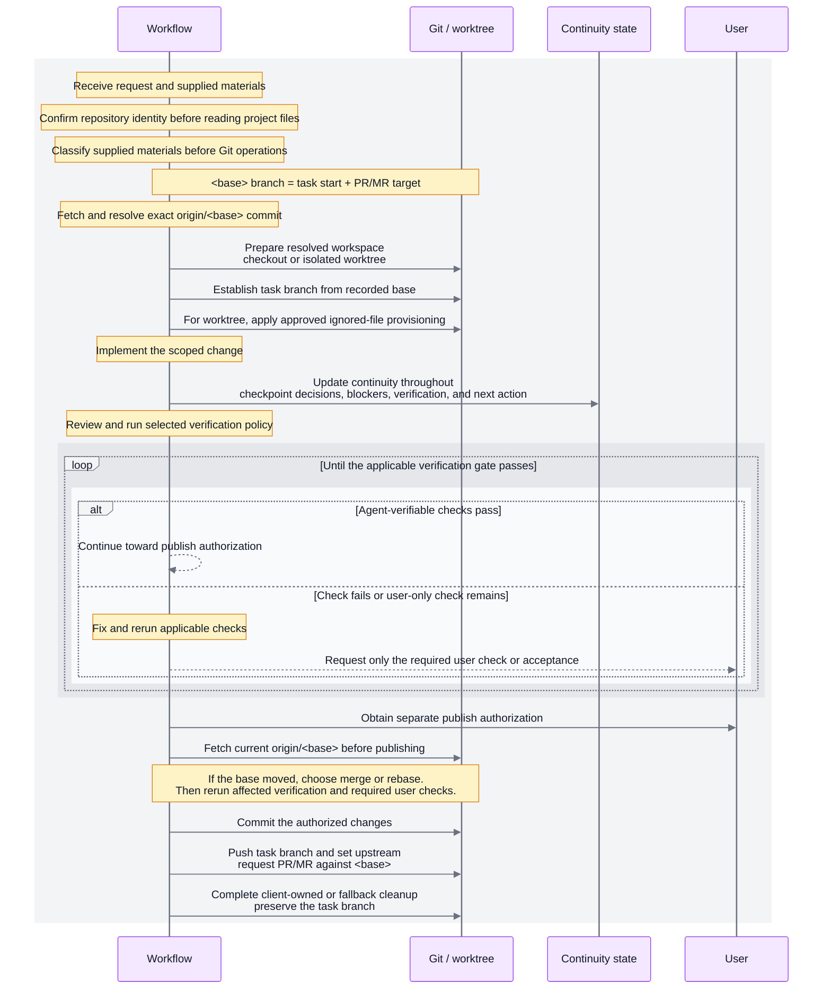

# Personal Cross-Platform Developer Environment for Agentic Workflows

[English](README.md) · [繁體中文](README.zh-TW.md)

I use this repository as the single source for my development environment, bringing my personal dotfiles and AI tooling together in one Git-tracked repository. [Chezmoi](https://www.chezmoi.io/) renders that managed source into the native files expected by each supported tool and operating system. Shared AI instructions and reusable workflows can therefore be defined once and delivered to Claude Code, Codex, and GitHub Copilot, while behavior that only belongs to one client can stay scoped there. This gives me fine-grained control without maintaining duplicate copies across AI clients and worrying about them drifting out of sync. The repository also manages only the durable settings I intentionally own, while volatile preferences, authentication, session state, and other application-owned data stay local.

Git’s built-in worktree support already provides strong source-code isolation, and AI clients such as Claude Code can build on it with native worktree creation and lifecycle support. However, several problems still appear when multiple AI-assisted tasks need to run reliably in parallel: a fresh worktree may be missing ignored local files, multiple app instances can compete for the same runtime port, and task context that Git does not capture can remain tied to a particular session or client.

My workflow fills those gaps by provisioning the approved local files each task needs, giving parallel worktrees separate runtime ports when the project provides the required runtime configuration, and keeping a per-working-directory continuity record. It deliberately separates code state from task state: Git remains authoritative for code, branches, and commits, while the continuity record preserves the story around that state — what the task is trying to accomplish, why decisions were made, what is blocked or verified, which relevant materials and references are part of the task, and what should happen next. Because that record belongs to the task rather than one conversation, another session or supported AI client can open the same working directory and resume with a simple “continue.” Policy-driven verification and explicit publish authorization provide separate gates before the branch is published for review.

**Jump to:**

* [What the workflow automates](#what-the-workflow-automates)
* [System at a glance](#system-at-a-glance)
* [Profiles and AI harness modes](#profiles-and-ai-harness-modes)
* [Task continuity](#task-continuity)
* [`run-task-end-to-end`](#run-task-end-to-end)
* [Ownership and privacy boundaries](#ownership-and-privacy-boundaries)
* [Validation and regression coverage](#validation-and-regression-coverage)
* [Where to go next](#where-to-go-next)

> ⚠️ **Personal configuration:** This repository contains my preferences, not a neutral default.
> On an existing machine, review `chezmoi diff` and apply only the targets you intend to change.
> Apply the repository broadly only where replacing these personal values is acceptable.

## What the workflow automates

| Without the workflow — I have to                                                                                                | With the workflow — the system will                                                                                                                                                                                                                                                                                                  |
| ------------------------------------------------------------------------------------------------------------------------------- | ------------------------------------------------------------------------------------------------------------------------------------------------------------------------------------------------------------------------------------------------------------------------------------------------------------------------------------ |
| Reconstruct or re-explain task context when resuming work in a new session                                                      | Preserve task context across sessions. Keep per-working-directory continuity state containing the objective, phase, decisions, assumptions, blockers, verification state, task identity, and next action, so another session or supported AI client can reconcile the state with the working directory and Git and continue the task |
| Track which specifications, screenshots, spreadsheets, test inputs, handoffs, and other materials relate to each task           | Organize and associate materials with tasks. Separate stable task materials, reusable test materials, and durable handoffs from transient task state while recording their paths and provenance                                                                                                                                      |
| Create and prepare a separate worktree and branch each time I want to work on another task from the same repository in parallel | Prepare isolated task workspaces. Resolve the base and task branch, create or select the workspace, provision approved ignored/local files into worktrees, and keep each task's branch, working directory, and continuity state independent                                                                                          |
| Choose and keep track of separate runtime ports so multiple task environments can run at the same time without port collisions  | Handle optional runtime isolation. With `workspace=worktree`, `runtime=auto`, and a valid project descriptor, allocate and health-check separate ports; if the descriptor is missing, guide its explicit interactive setup                                                                                         |
| Decide what the agent can verify itself, what still needs my checking, and what must be rerun after a failure                   | Coordinate verification. Apply the selected verification policy across feasible automated, runtime, browser, and interactive checks, loop through fix-and-retest when needed, and request only checks or acceptance that actually require me                                                                                         |
| Coordinate the path from completed implementation to reviewable work                                                            | Coordinate publication. Keep verification separate from publish authorization, refresh and reconcile the target base before publication, rerun affected verification when necessary, then commit, push, request review, and perform branch-preserving cleanup                                                                        |

## System at a glance

This diagram is a left-to-right topology of the configuration architecture and repository map.
`home/` is the chezmoi source state; `scripts/` supports setup, diagnostics, installers, and
validation; and `docs/` contains operating guides and decision records. Machine-local profile inputs
and repository sources feed Chezmoi composition, which branches into delivery routes and rendered
targets. The next diagram uses a decision tree to explain selector behavior. The [customization
support guide](./docs/customization-support.md) maps each source to the client surfaces that read it.


```mermaid
%%{init: {"theme": "base", "themeVariables": {"primaryTextColor": "#111827", "nodeTextColor": "#111827", "textColor": "#111827", "lineColor": "#6b7280"}, "flowchart": {"useMaxWidth": true}}}%%
flowchart LR

    subgraph repository["Repository source and support"]
        direction TB
        home["home/<br/>.chezmoitemplates · dot_agents/skills<br/>dot_claude · dot_codex · dot_copilot<br/>OS-specific dotfile sources"]:::source
        support["scripts/<br/>bootstrap · install · manifests · diagnostics · tests · git-hooks<br/><br/>docs/<br/>setup · workflows · decisions"]:::support
    end

    profile["Machine-local profile inputs<br/>details below"]:::choice
    compose["Chezmoi composition<br/>templates · profile layers<br/>filename attributes"]:::process

    subgraph routes["Rendered delivery routes"]
        direction TB
        sharedRoute["Shared adapters<br/>thin wrappers · client-native metadata"]:::process
        portableRoute["Portable skill delivery<br/>~/.agents/skills<br/>Claude skill links"]:::process
        clientRoute["Client-specific delivery<br/>native agents · commands · MCP"]:::process
        osRoute["OS-specific dotfile delivery<br/>native paths · wrappers"]:::process
    end

    subgraph targets["Rendered targets"]
        direction TB
        aiTargets["AI client targets<br/>Claude Code · Codex · Copilot"]:::target
        developerTargets["Dotfile targets<br/>OS-specific native configuration"]:::target
    end

    home --> compose
    profile --> compose
    support -. "supports and documents" .-> compose
    compose --> sharedRoute
    compose --> portableRoute
    compose --> clientRoute
    compose --> osRoute
    sharedRoute --> aiTargets
    portableRoute --> aiTargets
    clientRoute --> aiTargets
    osRoute --> developerTargets

    classDef source fill:#dbeafe,stroke:#2563eb,color:#111827
    classDef choice fill:#fef3c7,stroke:#d97706,color:#111827
    classDef process fill:#f3e8ff,stroke:#9333ea,color:#111827
    classDef target fill:#dcfce7,stroke:#16a34a,color:#111827
    classDef support fill:#f3f4f6,stroke:#4b5563,color:#111827
```

`home/` is source state, and the files rendered into the home directory are targets. It contains
plain chezmoi source files and templates. Reusable bodies in `.chezmoitemplates/` feed thin client
wrappers; portable skills remain a shared source and use links or symlinks when a client needs a
native discovery location; client-specific sources stay in their native directories. Preview a
managed change with `chezmoi diff` before applying it. The [chezmoi workflow guide](./docs/chezmoi-workflow.md)
covers source filenames and target ownership; the [customization support guide](./docs/customization-support.md)
covers the client delivery matrix.

## Profiles and AI harness modes

Three machine-local selectors shape the rendered client configuration. They are not committed. This
decision tree shows the important dependency: `ai_continuity` changes the managed branch, while
native mode keeps continuity explicit regardless of the stored `on` or `off` value.


```mermaid
%%{init: {"theme": "base", "themeVariables": {"primaryTextColor": "#111827", "nodeTextColor": "#111827", "textColor": "#111827", "lineColor": "#6b7280"}, "flowchart": {"useMaxWidth": true}}}%%
flowchart TB
    baseline["Shared baseline"]:::base
    context["ai_context<br/>personal | company<br/>guidance + language defaults"]:::choice
    profile["Apply context to shared baseline"]:::process
    harness{"ai_harness<br/>managed | native"}:::decision
    continuity{"ai_continuity<br/>on | off<br/>managed mode"}:::decision
    managedOn["managed + on<br/>automatic continuity guidance and reporting"]:::result
    managedOff["managed + off<br/>no automatic continuity; managed notifications and launch check remain"]:::result
    native["native + on/off<br/>continuity skill remains explicit"]:::result

    baseline --> profile
    context --> profile
    profile --> harness
    harness -->|"managed"| continuity
    continuity -->|"on"| managedOn
    continuity -->|"off"| managedOff
    harness -->|"native"| native

    classDef base fill:#dbeafe,stroke:#2563eb,color:#111827
    classDef choice fill:#f3e8ff,stroke:#9333ea,color:#111827
    classDef process fill:#f3e8ff,stroke:#9333ea,color:#111827
    classDef decision fill:#fef3c7,stroke:#d97706,color:#111827
    classDef check fill:#f3f4f6,stroke:#4b5563,color:#111827
    classDef result fill:#dcfce7,stroke:#16a34a,color:#111827
    class baseline base
    class context choice
    class profile process
    class harness,continuity decision
    class managedOn,managedOff,native result
    style baseline color:#111827
    style context color:#111827
    style profile color:#111827
    style harness color:#111827
    style continuity color:#111827
    style managedOn color:#111827
    style managedOff color:#111827
    style native color:#111827
```

| Selector | Role | Default and boundary |
| --- | --- | --- |
| `ai_context` | Selects personal or company guidance and language defaults. | Missing means `personal`; other values fail rendering. |
| `ai_continuity` | Sets the managed-mode continuity preference. | Missing means `on`; `off` removes automatic continuity guidance and reporting. Task-level `continuity=on|off` can override it. |
| `ai_harness` | Selects the managed or native AI harness. | Missing means `managed`; `ai_workflow` remains a legacy alias only when `ai_harness` is absent. |

An **AI harness** is the instruction, skill, lifecycle, and delivery layer around an AI client. Managed
mode adds repository-owned lifecycle guidance and reporting. Native mode keeps shared content and
client-native delivery while leaving lifecycle actions explicit. Profile changes affect newly rendered
configuration and newly started sessions.

Profile applicability (`baseline`, `personal`, or `company`) is independent of client reach (`portable`
or client-specific): the profile controls where guidance applies, while client reach controls which
clients can discover it. See the [profile applicability and client reach guide](./docs/customization-support.md#separate-profile-applicability-from-client-reach).

Read the [AI profile section of the chezmoi workflow](./docs/chezmoi-workflow.md#machine-local-ai-profile-selectors)
and the [customization support guide](./docs/customization-support.md#ai-profile-dimensions) for the
full composition rules.

## Task continuity

Continuity belongs to one working directory, including the primary checkout and linked worktrees.
It is transient handoff state, not project documentation or proof that work is complete. Each working
directory has at most one active task and one `.task-continuity/state.md`; a new worktree starts without
another worktree's continuity state.


```mermaid
%%{init: {"theme": "base", "themeVariables": {"primaryTextColor": "#111827", "nodeTextColor": "#111827", "textColor": "#111827", "lineColor": "#6b7280"}, "flowchart": {"useMaxWidth": true}}}%%
flowchart TD
    stop["One session or client stops"]:::handoff
    persist["The same working directory keeps<br/>.task-continuity/state.md<br/><br/>objective · decisions · blockers<br/>verification · materials · next action"]:::state
    resume["Another supported session or client<br/>opens the same working directory and resumes"]:::handoff
    reconcile["Reconcile the state with the current task<br/>and the working directory's Git status"]:::check
    git["Git remains authoritative<br/>for code · branch · commits<br/>completion still needs verification"]:::authority
    continue["Continue, verify, or close the task<br/>and checkpoint the next handoff"]:::work
    durable["Durable handoff / reference / issue record<br/>when information must outlive local state"]:::handoff

    stop --> persist --> resume --> reconcile --> git --> continue --> persist
    persist -. "outlives local state" .-> durable
    durable -. "pointer in state.md" .-> persist

    classDef handoff fill:#dbeafe,stroke:#2563eb,color:#111827
    classDef state fill:#fef3c7,stroke:#d97706,color:#111827
    classDef check fill:#f3e8ff,stroke:#9333ea,color:#111827
    classDef authority fill:#f3f4f6,stroke:#4b5563,color:#111827
    classDef work fill:#dcfce7,stroke:#16a34a,color:#111827
    style stop color:#111827
    style persist color:#111827
    style resume color:#111827
    style reconcile color:#111827
    style git color:#111827
    style continue color:#111827
    style durable color:#111827
```

Continuity records the current objective, phase, decisions, blockers, verification status, next action,
and pointers to durable materials. Git remains authoritative for code, branches, commits, and test
results. Stable reference inputs belong in `task-materials`, reusable test inputs in `test-materials`,
and durable updateable coordination records in `handoffs`; `.task-continuity` keeps only the transient
task state and pointers to those records.

An unfinished task must be finished, parked, or abandoned before a different task uses the same
working directory. The workflow never silently overwrites active state. A completed active state may
move to `.task-continuity/parked/` with its identity preserved, allowing a fresh active state without
deletion confirmation or a `continuity=off` override; deleting parked state remains a separate,
confirmation-gated action.

New records retain task and Git identity, including the task branch, base branch, immutable base commit,
and compatibility `Started from` commit. The [task-continuity skill](./home/dot_agents/skills/task-continuity/SKILL.md)
owns migration, parking, branch-aware discovery, reconciliation, and cleanup rules. The
[worktree provisioning guide](./docs/worktree-provisioning.md#how-each-worktree-receives-ignored-files)
covers the worktree boundary. State remains Git-ignored, is not encrypted, and must not contain credentials.

## `run-task-end-to-end`

The [`run-task-end-to-end`](./home/dot_agents/skills/run-task-end-to-end/SKILL.md) skill is the lifecycle
coordinator for a managed task. It combines workspace selection and preparation, task continuity,
approved local-file provisioning, optional runtime isolation, policy-driven verification, publish
authorization, and final branch handoff into one explicit workflow. Supporting skills and project
descriptors own their focused concerns; `run-task-end-to-end` coordinates their order and the shared
task state.

Use `workspace=checkout` for a sequential task that can safely use the current physical checkout, and
`workspace=worktree` whenever two tasks need independent uncommitted changes, branches, runtime ports,
or processes. Workspace selection must be explicit or clearly stated in the prompt; otherwise the
workflow asks before execution and reports the resolution source.

Both workspace modes share the same lifecycle: resolve the base and policies, prepare the workspace,
establish the task branch, implement, review, verify/fix/retest, obtain separate publish
authorization, refresh and reconcile the base, then commit/push/request and hand off or clean up.
Only the worktree mode provisions ignored files. Separate runtime isolation is optional: select
`runtime=auto` with a valid consuming-project descriptor. If the descriptor is missing or invalid,
the workflow offers to inspect candidates, build a complete descriptor interactively, and show it
for confirmation before writing it to the consuming project. If setup is declined or incomplete,
the runtime phase stops or the user explicitly chooses `runtime=off`; the workflow never silently
uses a fixed port or claims isolated browser/runtime results.


```mermaid
%%{init: {"theme": "base", "themeVariables": {"primaryTextColor": "#111827", "textColor": "#111827", "lineColor": "#6b7280", "actorBkg": "#f3e8ff", "actorBorder": "#9333ea", "actorTextColor": "#111827", "actorLineColor": "#6b7280", "signalColor": "#6b7280", "signalTextColor": "#111827", "labelBoxBkgColor": "#f3f4f6", "labelBoxBorderColor": "#6b7280", "labelTextColor": "#111827", "loopTextColor": "#111827", "noteBkgColor": "#fef3c7", "noteBorderColor": "#d97706", "noteTextColor": "#111827"}}}%%
sequenceDiagram
    rect rgb(243, 244, 246)
    participant W as Workflow
    participant G as Git / worktree
    participant C as Continuity state
    participant U as User

    Note over W: Receive request and supplied materials
    Note over W: Confirm repository identity before reading project files
    Note over W: Classify supplied materials before Git operations
    Note over W,G: <base> branch = task start + PR/MR target
    Note over W: Fetch and resolve exact origin/<base> commit
    W->>G: Prepare resolved workspace<br/>checkout or isolated worktree
    W->>G: Establish task branch from recorded base
    W->>G: For worktree, apply approved ignored-file provisioning
    Note over W: Implement the scoped change
    W->>C: Update continuity throughout<br/>checkpoint decisions, blockers, verification, and next action
    Note over W: Review and run selected verification policy
    rect rgb(229, 231, 235)
    loop Until the applicable verification gate passes
        rect rgb(249, 250, 251)
        alt Agent-verifiable checks pass
            W-->>W: Continue toward publish authorization
        else Check fails or user-only check remains
            Note over W: Fix and rerun applicable checks
            W-->>U: Request only the required user check or acceptance
        end
        end
    end
    end
    W->>U: Obtain separate publish authorization
    W->>G: Fetch current origin/<base> before publishing
    Note over W,G: If the base moved, choose merge or rebase.<br/>Then rerun affected verification and required user checks.
    W->>G: Commit the authorized changes
    W->>G: Push task branch and set upstream<br/>request PR/MR against <base>
    W->>G: Complete client-owned or fallback cleanup<br/>preserve the task branch
    end
```

The focused [worktree provisioning guide](./docs/worktree-provisioning.md#workflow-sequence) expands
the provisioning checks, native client paths, runtime isolation, verification, publication, and
cleanup contract. Both workspace modes pin the task to the selected base and establish a task branch;
the checkout workspace stays in the current physical checkout, while only worktrees receive approved
ignored-file provisioning and optional runtime isolation. Separate tasks keep their workspaces,
branches, and continuity state independent, while a client handoff reopens the same working directory.

### Invocation styles

Use `/run-task-end-to-end` in Claude Code and Codex. The workflow supports three invocation styles:

- **Guided:** invoke it without arguments. The workflow asks for the task, workspace, base,
  verification policy, continuity policy, and any context-specific required input. The defaults
  are `verification=agent` and `continuity=auto`.
- **Prompted:** append a natural-language request, such as `/run-task-end-to-end Use a worktree
  from feature/example and implement the attached specification.` The workflow parses only clear
  values and asks for unresolved choices.
- **Explicit:** provide structured arguments for deterministic operation, such as
  `/run-task-end-to-end workspace=worktree base=feature/example task="Implement the example feature"`.

Partial structured input is also supported. For example,
`/run-task-end-to-end workspace=worktree task="Implement the example feature"` keeps the explicit
workspace and task, then asks only for the remaining base. Prompt-derived values are marked as
`prompt`; confirmed values are marked as `confirmation` in the resolved echo.

Repository-specific policies can require additional task or branch metadata. The workflow asks for
required values explicitly instead of inferring them from branch names or task text. Declare any
project-specific exceptions in repository instructions. Compatibility aliases `task-workflow` and
`worktree-task-workflow` remain available for existing prompts and client history.


## Ownership and privacy boundaries

For application-owned configuration, the repository claims only deliberate durable keys or structures.
Preferences, authentication, history, caches, session/runtime state, and future application-owned values
remain local unless intentionally promoted into repository ownership. See the [setup guide](./docs/setup.md)
for the ownership and application procedures.

| Surface | Repository owns | Application or user owns |
| --- | --- | --- |
| Claude settings | Durable environment, hooks, status line, and update-channel values. | Model, permissions, plugins, project state, and future keys. |
| Codex config | Defaults only when the file does not exist. | Trust, runtime, marketplace, and session state. |
| Windows Terminal and VS Code | Selected durable settings, keybindings, and MCP sources. | Generated profiles, workspace storage, authentication, caches, and runtime data. |
| Claude user MCP state | Non-secret declarations. | Authentication and the rest of `~/.claude.json`. |

The global Git exclude file protects private client files and continuity state from accidental
tracking:

```text
**/.claude/settings.local.json
**/CLAUDE.local.md
**/AGENTS.override.md
/.task-continuity/
```

The ignore policy does not copy files into worktrees and does not encrypt them. MCP configuration
may contain placeholders such as `\${input:figma-api-key}` or `\${GITHUB_MCP_TOKEN}`, never their
values. Authenticate clients locally and keep credentials out of `home/`.

## Validation and regression coverage

The repository uses local automated suites under a policy-driven verification contract and a separate
publish-authorization gate. No repository CI workflow is configured, so a passing local suite does not
mean that CI ran. The [setup guide](./docs/setup.md) describes the full validation procedure.

The pre-commit hook renders staged source into a temporary directory and checks source identity,
filename safety, skill parity, client adapters, shared rule bodies, status-line parity, and Markdown
links.

Run the focused suites when the protected behavior changes:

| Area | Local checks |
| --- | --- |
| Worktree provisioning | `test-git-worktree-provision.ps1` or `test-git-worktree-provision.sh` |
| Continuity and task workflow | `test-task-continuity.sh`, `test-run-task-end-to-end.sh`, `test-run-task-invocation.sh` |
| AI profile scope and workflow deletion | `test-ai-profile-scope.sh`, `test-ai-configuration-profiles.sh`, `test-workflow-delete.sh` |
| Runtime isolation | `test-worktree-runtime.py -v` |

On Windows PowerShell, run Bash-based suites through
`.\scripts\tests\run-git-bash-tests.ps1`; it resolves Windows Git Bash explicitly. The continuity
fixtures under `scripts/tests/continuity-fixtures/` are manual model-behavior probes, not live
automated agent tests. They use throwaway repositories and deliberately fabricated `state.md`
files; never treat a fixture state as the real working tree state.

## Where to go next

| I want to…                                                      | Read                                                                                |
| --------------------------------------------------------------- | ----------------------------------------------------------------------------------- |
| Set up or update the machine                                    | [docs/setup.md](./docs/setup.md)                                                    |
| Add, change, or remove a managed file                           | [docs/chezmoi-workflow.md](./docs/chezmoi-workflow.md)                              |
| Add an instruction, skill, agent, prompt, MCP server, or plugin | [docs/customization-support.md](./docs/customization-support.md)                    |
| Find which client surface reads a customization                 | [the support table](./docs/customization-support.md#what-the-support-table-answers) |
| Run an isolated task or provision ignored local files           | [docs/worktree-provisioning.md](./docs/worktree-provisioning.md)                    |
| Run parallel application instances                              | [docs/worktree-runtime.md](./docs/worktree-runtime.md)                              |
| Delete a reusable workflow source safely                         | [docs/workflow-deletion.md](./docs/workflow-deletion.md)                            |
| Understand why the repository uses this structure               | [docs/decisions/README.md](./docs/decisions/README.md)                              |
| Understand why a rule exists before removing it                 | [docs/rule-rationale.md](./docs/rule-rationale.md)                                  |
| Let a coding assistant work safely in this repository           | [AGENTS.md](./AGENTS.md)                                                            |

Every structural choice has a written reason. Read the relevant ADR before changing a
repository-wide mechanism, ownership boundary, or client integration. Discovery paths,
frontmatter keys, hook payloads, and worktree behavior change with upstream releases; verify
version-sensitive details against the current [chezmoi](https://www.chezmoi.io/reference/source-state-attributes/),
[Claude Code](https://code.claude.com/docs/en/overview),
[Codex](https://learn.chatgpt.com/docs/agent-configuration/agents-md), and
[VS Code agent customization](https://code.visualstudio.com/docs/agent-customization/overview)
documentation before changing a client-specific path or key.
