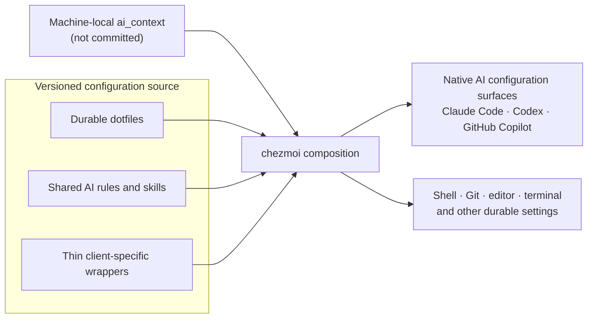
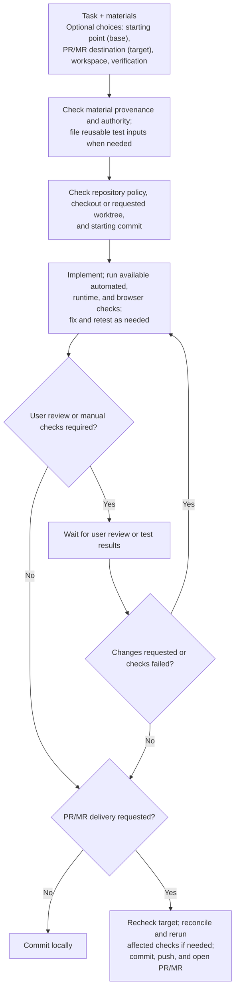

# My Personal Dotfiles and AI Configurations

**A versioned source of truth for the durable settings and shared AI guidance that shape my development environment.**

This is my personal setup, shared so other developers can inspect the choices and adapt what they need; it is not meant to be installed unchanged. The repository contains durable settings and shared AI guidance, but not application or account data such as credentials and session history.

## Why I built it

Machines and development tools change, so dotfile settings can drift across machines; AI guidance can also drift across AI clients such as Claude Code, Codex, and GitHub Copilot.

The design focuses on a few practical outcomes:

- **Repeatable setup:** bootstrap scripts install the tools I use; chezmoi applies the durable settings I choose to carry across machines.
- **Selective configuration:** I version the durable settings I want shared and leave changeable or unlisted preferences to each client. For example, this repository manages Claude Code's hooks and status line, while Claude Code keeps its model and effort choices.
- **Consistent AI guidance:** one canonical source for shared rules and skills reduces drift across clients.
- **Preview before applying:** Git shows source edits, and `chezmoi diff` previews their effect on this machine so I can catch unwanted changes before they reach my home directory.

## How it fits together

```mermaid
flowchart LR
    subgraph source["Versioned configuration source"]
        dotfiles["Durable dotfiles"]
        shared["Shared AI rules and skills"]
        adapters["Thin client-specific wrappers"]
    end
    profile["Machine-local ai_context<br/>(not committed)"] --> render["chezmoi composition"]
    dotfiles --> render
    shared --> render
    adapters --> render
    render --> ai["Native AI configuration surfaces<br/>Claude Code · Codex · GitHub Copilot"]
    render --> settings["Shell · Git · editor · terminal<br/>and other durable settings"]
```

Shared rules and portable skills use common sources; client-specific instructions, skills, and settings stay scoped to the clients that support them.

chezmoi renders the versioned source with the machine-local profile. I edit the readable source files here, review the rendered changes, then apply them to my home directory. Each client continues to own its sessions, credentials, and runtime state.

## Workflows worth exploring

| Goal | Start with | What it does |
| --- | --- | --- |
| Share AI guidance across clients | [Customization support guide](./docs/customization-support.md) | Reusable rules and skills reach supported Claude Code, Codex, and GitHub Copilot surfaces; client-specific behavior stays scoped to the clients that support it. |
| Take a request to a reviewable change | [`run-task-end-to-end`](./home/dot_agents/skills/run-task-end-to-end/SKILL.md) | Takes a natural-language implementation task through workspace checks, verification, and a local commit or requested PR/MR. |
| Move work to another AI session | [`task-handoff`](./home/dot_agents/skills/task-handoff/SKILL.md) | Summarizes the current checkout, decisions, checks, materials, and next action for the receiving session to verify. |

Claude Code, Codex, and GitHub Copilot can invoke this skill with slash syntax. Put the task and any optional choices after the skill name:

- `/run-task-end-to-end Implement the attached keyboard shortcut spec; base=main target=main workspace=worktree verification=balanced`

`base` names the starting branch or commit. If omitted, a supplied `target` also supplies the starting point unless repository policy says otherwise; `target` names the PR/MR destination and requests that delivery. If neither is supplied, the skill uses and records the active checkout or client worktree's starting commit. It never infers a publication target. `workspace` selects the current checkout or a worktree, and `verification` selects the review policy. State these choices in plain language or as optional `key=value` hints. The skill follows repository policy and uses a suitable existing or client-created branch, or derives a name from the change type and summary when a new branch is needed. Add `branch=` only to request a specific name. For planning or code review, ask the agent directly.

The skill follows this path:

```mermaid
flowchart TB
    request["Task + materials<br/>Optional choices: starting point (base),<br/>PR/MR destination (target), workspace, verification"] --> materials["Check material provenance and authority;<br/>file reusable test inputs when needed"]
    materials --> workspace["Check repository policy, checkout or requested worktree,<br/>and starting commit"]
    workspace --> work["Implement; run available automated,<br/>runtime, and browser checks;<br/>fix and retest as needed"]
    work --> gate{"User review or manual checks required?"}
    gate -->|Yes| user["Wait for user review or test results"]
    gate -->|No| delivery{"PR/MR delivery requested?"}
    user --> feedback{"Changes requested or checks failed?"}
    feedback -->|Yes| work
    feedback -->|No| delivery
    delivery -->|No| local["Commit locally"]
    delivery -->|Yes| publish["Recheck target; reconcile and rerun<br/>affected checks if needed;<br/>commit, push, and open PR/MR"]
```

If the target base has moved, the skill pauses for a merge or rebase choice and reruns affected checks before publication.

If another session needs to continue the task, use [`task-handoff`](./home/dot_agents/skills/task-handoff/SKILL.md) to capture the current state when transferring the work.

## Day-to-day conveniences and safeguards

These are the details I rely on to make agent sessions easier to follow and their changes easier to trust.

| Feature | What it does | Inspect |
| --- | --- | --- |
| Claude Code statusline (Bash and PowerShell) | A terminal-width-aware display shows the model and effort, an optional session name, project path and Git state, context use, and 5-hour or 7-day usage percentages with reset times when available. | [Bash](./home/dot_claude/claude-session-statusline.sh), [PowerShell](./home/dot_claude/claude-session-statusline.ps1), and [settings source](./home/.chezmoitemplates/claude/settings-durable.json). |
| Desktop notifications (Windows and macOS) | Shared scripts alert me when Claude Code or Codex finishes a turn, when a Claude subagent finishes or needs input, and when either client needs tool approval. Client hooks are configured for local terminal and VS Code sessions. | [Windows script](./home/dot_local/share/show-agent-notification.ps1), [macOS script](./home/dot_local/share/show-agent-notification-macos.sh), [Claude settings](./home/.chezmoitemplates/claude/settings-durable.json), and [Codex hooks](./home/dot_codex/hooks.json.tmpl). |
| Local validation | The hook renders the staged source snapshot in a temporary directory without applying it. Its checks cover source identity, skill and shared-rule parity, statusline parity, and Markdown links; focused suites cover profile behavior, diagnostics, Git configuration, and company branch policy. | [Pre-commit hook](./scripts/git-hooks/pre-commit), [Bash test runner](./scripts/tests/run-git-bash-tests.ps1), and [setup guide](./docs/setup.md). |
| Personal or work AI setup | A machine-local `ai_context` lets me use the same repository for personal and work AI setups. It selects the corresponding agent guidance and defaults without committing the machine's choice. | [`ai-profile` skill](./home/dot_agents/skills/ai-profile/SKILL.md) and [profile setup](./docs/chezmoi-workflow.md#machine-local-ai-context). |
| Project material storage and indexing | Stable references, reusable test inputs, and handoff notes have separate homes under `~/Documents/`. For tasks using several materials, link them from an issue, PR/MR, or status note. | [Project material rules](./home/.chezmoitemplates/core.md#project-material) and [ADR-0053](./docs/decisions/0053-native-first-ai-workflows.md). |
| Security and verification safeguards | Shared rules cover trust-boundary validation, output escaping, parameterized SQL, and secret hygiene. They also require agents to verify the checkout and material provenance and report only checks they actually ran, designed to reduce common security mistakes and unsupported completion claims. | [Shared core rules](./home/.chezmoitemplates/core.md) and [ADR-0024](./docs/decisions/0024-instruction-provenance-and-material-filing.md). |

**Statusline example.** The model and usage figures show one past session.

## Where things live

| Path | What you will find |
| --- | --- |
| [`home/`](./home/) | The desired configuration state managed by chezmoi. |
| [`home/.chezmoitemplates/`](./home/.chezmoitemplates/) | Reusable settings, instruction bodies, and templates. |
| [`home/dot_agents/skills/`](./home/dot_agents/skills/) | Shared and client-gated AI skill sources. |
| `home/dot_<client>/` | Client-specific configuration and thin wrappers that connect shared guidance. |
| [`scripts/`](./scripts/) | Bootstrap, diagnostics, and validation tools. |
| [`docs/`](./docs/) | Setup steps, the customization source map, operating guides, and architecture decision records (ADRs). |

## Start here

- [Set up a machine](./docs/setup.md)
- [Understand how managed settings are edited and applied](./docs/chezmoi-workflow.md)
- [Find where an AI client setting or skill comes from](./docs/customization-support.md)
- [Review current architecture decisions](./docs/decisions/README.md)

Before applying anything to your home directory, review the setup guide and run `chezmoi diff` for your machine.
