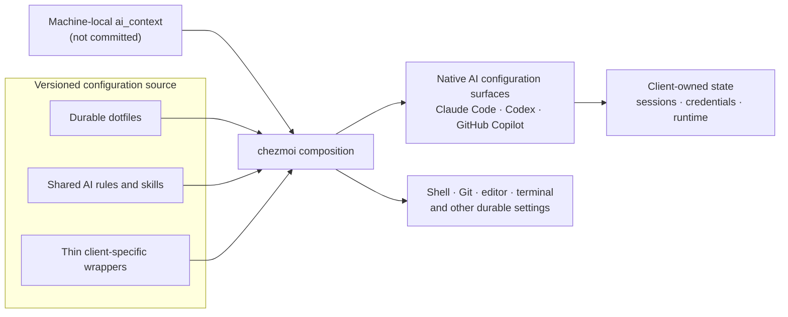
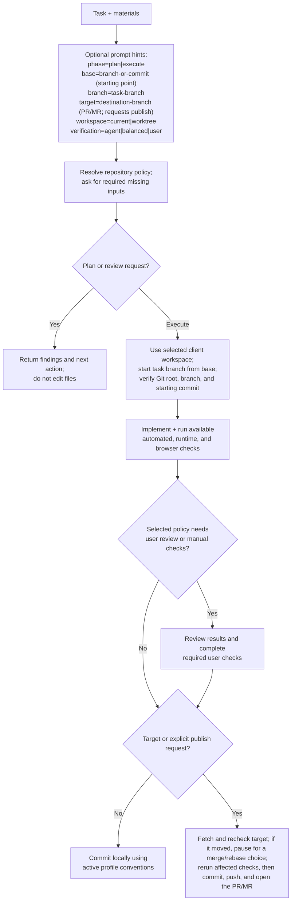

# My Personal Dotfiles and AI Configurations

**A versioned source of truth for the durable settings and shared AI guidance that shape my development environment.**

I built this repository to make my setup reproducible across machines and to keep the guidance I give coding agents consistent as I move between clients. The repository uses chezmoi to manage the configuration I choose to keep: I edit readable source files here, review the rendered changes, then apply them to my home directory.

This is my working personal setup, kept public so other developers can inspect the choices and adapt individual pieces. It is not a universal preset: application-owned state and credentials remain local, and machine-specific profile choices are not committed.

## Why I built it

Developer settings tend to drift as machines and tools change. AI instructions can drift too when the same rule is copied into several client-specific files. This repository gives durable configuration one reviewable home while letting each application keep its own native behavior.

The design focuses on a few practical outcomes:

- **Repeatable setup:** bootstrap and chezmoi source files make durable preferences easier to reproduce on a new machine.
- **Consistent AI guidance:** one canonical source for shared rules and skills reduces drift across client-specific files.
- **Clear ownership:** templates identify what this repository manages and preserve application-owned values where possible.
- **Reviewable changes:** Git keeps source edits inspectable, and `chezmoi diff` previews machine-specific targets before applying them.

## How it fits together

```mermaid
flowchart LR
    subgraph source["Versioned configuration source"]
        dotfiles["Durable dotfiles"]
        shared["Shared AI rules and skills"]
        adapters["Thin client-specific wrappers"]
    end
    profile["Machine-local ai_context<br/>(not committed)"] --> render["chezmoi composition"]
    dotfiles --> render
    shared --> render
    adapters --> render
    render --> ai["Native AI configuration surfaces<br/>Claude Code · Codex · GitHub Copilot"]
    ai --> local["Client-owned state<br/>sessions · credentials · runtime"]
    render --> settings["Shell · Git · editor · terminal<br/>and other durable settings"]
```

Git tracks the authored settings and shared guidance. chezmoi combines that source with a machine-local profile, then renders files to the paths applications read. Shared rules and skills keep one source, while thin wrappers connect them to supported client surfaces. Claude Code, Codex, and GitHub Copilot keep their own sessions, credentials, and runtime state.

## Workflows worth exploring

| Goal | Start with | What it does |
| --- | --- | --- |
| Share AI guidance across clients | [Customization support guide](./docs/customization-support.md) | Reusable rules and skills reach supported Claude Code, Codex, and GitHub Copilot surfaces; client-specific behavior stays scoped to the clients that support it. |
| Take a request to a reviewable change | [`run-task-end-to-end`](./home/.chezmoitemplates/skills/run-task-end-to-end/SKILL.md) | Accepts a natural-language task, materials, and optional `phase=plan|execute`, `base`, `target`, `branch`, `workspace=current|worktree`, and `verification=agent|balanced|user` hints. Plan or review returns findings without file edits. Execution verifies the selected checkout, runs available automated and applicable runtime/browser checks, and uses the verification choice to set user-review and manual-test gates before creating a profile-aware commit. A target or explicit publish request triggers destination-base checks; if it moved, the workflow pauses for a merge/rebase decision, reruns affected checks, then pushes and opens the requested pull request or merge request (PR/MR). |
| Move work to another AI session | [`task-handoff`](./home/.chezmoitemplates/skills/task-handoff/SKILL.md) | Produces a pasteable summary of the checkout, changes, decisions, checks, blockers, materials, and next action. It marks receiver verification pending and includes a checklist; only the receiving session can verify the claims. |
| Reproduce selected settings on another machine | [`home/`](./home/) | Keeps durable settings in chezmoi source files that you can review with `chezmoi diff` before applying. |

For example, invoke `run-task-end-to-end` with a task and known choices: `Implement the attached keyboard-shortcut spec; phase=execute base=main branch=feat/keyboard-shortcuts target=main workspace=worktree verification=balanced`. Here, `base` is the starting branch or commit, `branch` is the task branch, and `target` is the PR/MR destination that requests publishing. If `target` is supplied without `base`, it also supplies the starting point unless repository policy says otherwise. If `branch` is omitted, repository policy determines whether to derive it or ask for a required value. Use `phase=plan` to get findings and a recommended next action without file edits.

The task workflow follows this path:

```mermaid
flowchart TB
    request["Task + materials"] --> hints["Optional prompt hints:<br/>phase=plan|execute<br/>base=branch-or-commit (starting point)<br/>branch=task-branch<br/>target=destination-branch (PR/MR; requests publish)<br/>workspace=current|worktree<br/>verification=agent|balanced|user"]
    hints --> resolve["Resolve repository policy;<br/>ask for required missing inputs"]
    resolve --> phase{"Plan or review request?"}
    phase -->|Yes| plan["Return findings and next action;<br/>do not edit files"]
    phase -->|Execute| workspace["Use selected client workspace;<br/>start task branch from base;<br/>verify Git root, branch, and starting commit"]
    workspace --> work["Implement + run available<br/>automated, runtime, and browser checks"]
    work --> gate{"Selected policy needs<br/>user review or manual checks?"}
    gate -->|Yes| review["Review results and complete<br/>required user checks"]
    gate -->|No| delivery{"Target or explicit publish request?"}
    review --> delivery
    delivery -->|No| local["Commit locally using<br/>active profile conventions"]
    delivery -->|Yes| publish["Fetch and recheck target; if it moved, pause for a merge/rebase choice;<br/>rerun affected checks, then commit, push, and open the PR/MR"]
```

## Day-to-day conveniences and safeguards

These are the details I rely on to make agent sessions easier to follow and their changes easier to trust.

| Feature | What it does | Inspect |
| --- | --- | --- |
| Claude Code statusline (Bash and PowerShell) | A terminal-width-aware display shows the model and effort, an optional session name, project path and Git state, context use, and 5-hour or 7-day usage percentages with reset times when available. | [Bash](./home/dot_claude/claude-session-statusline.sh), [PowerShell](./home/dot_claude/claude-session-statusline.ps1), and [settings source](./home/.chezmoitemplates/claude/settings-durable.json). |
| Desktop notifications (Windows and macOS) | Shared scripts alert me when Claude Code needs input or an agent or subagent finishes, and when a Codex session ends. Each client has its own hook configuration. | [Windows script](./home/dot_local/share/show-agent-notification.ps1), [macOS script](./home/dot_local/share/show-agent-notification-macos.sh), [Claude settings](./home/.chezmoitemplates/claude/settings-durable.json), and [Codex hooks](./home/dot_codex/hooks.json.tmpl). |
| Local validation | The hook renders the staged source snapshot in a temporary directory without applying it. Its checks cover source identity, skill and shared-rule parity, statusline parity, and Markdown links; focused suites cover profile behavior, workflow deletion, Git configuration, and company branch policy. | [Pre-commit hook](./scripts/git-hooks/pre-commit), [Bash test runner](./scripts/tests/run-git-bash-tests.ps1), and [setup guide](./docs/setup.md). |
| Personal or work AI setup | A machine-local `ai_context` lets me use the same repository for personal and work AI setups. It selects the corresponding agent guidance and defaults without committing the machine's choice. | [`ai-profile` skill](./home/dot_agents/skills/ai-profile/SKILL.md) and [profile setup](./docs/chezmoi-workflow.md#machine-local-ai-context). |
| File and artifact hygiene | Specs and references, reusable test inputs, and updateable handoffs have separate homes under `~/Documents/`. For tasks spanning several items, an issue, PR/MR, or one status note links them. Agents check material provenance before use. | [Project material rules](./home/.chezmoitemplates/core.md#project-material) and [ADR-0053](./docs/decisions/0053-native-first-ai-workflows.md). |
| Defensive engineering and evidence-first safeguards | Shared rules cover trust-boundary validation, output escaping, parameterized SQL, and secret hygiene. They also require agents to verify the checkout and material provenance and report only checks they actually ran, designed to reduce common security mistakes and unsupported completion claims. | [Shared core rules](./home/.chezmoitemplates/core.md) and [ADR-0024](./docs/decisions/0024-instruction-provenance-and-material-filing.md). |

**Statusline example.** The model and usage figures show one past session.

## Where things live

| Path | What you will find |
| --- | --- |
| [`home/`](./home/) | The desired configuration state managed by chezmoi. |
| [`home/.chezmoitemplates/`](./home/.chezmoitemplates/) | Reusable settings, instruction bodies, and templates. |
| [`home/dot_agents/skills/`](./home/dot_agents/skills/) | Shared and client-gated AI skill sources. |
| `home/dot_<client>/` | Native client entry points and thin wrappers that connect shared guidance. |
| [`scripts/`](./scripts/) | Bootstrap, diagnostics, and validation tools. |
| [`docs/`](./docs/) | Setup steps, the customization source map, operating guides, and architecture decision records (ADRs). |

These are examples you can inspect and adapt individually. To try the full setup, read the [setup guide](./docs/setup.md) first; it explains the machine changes and review steps.

## Start here

- [Set up a machine](./docs/setup.md)
- [Understand how managed settings are edited and applied](./docs/chezmoi-workflow.md)
- [Find where an AI client setting or skill comes from](./docs/customization-support.md)
- [Review current architecture decisions](./docs/decisions/README.md)

Before applying anything to your home directory, review the setup guide and run `chezmoi diff` for your machine.
