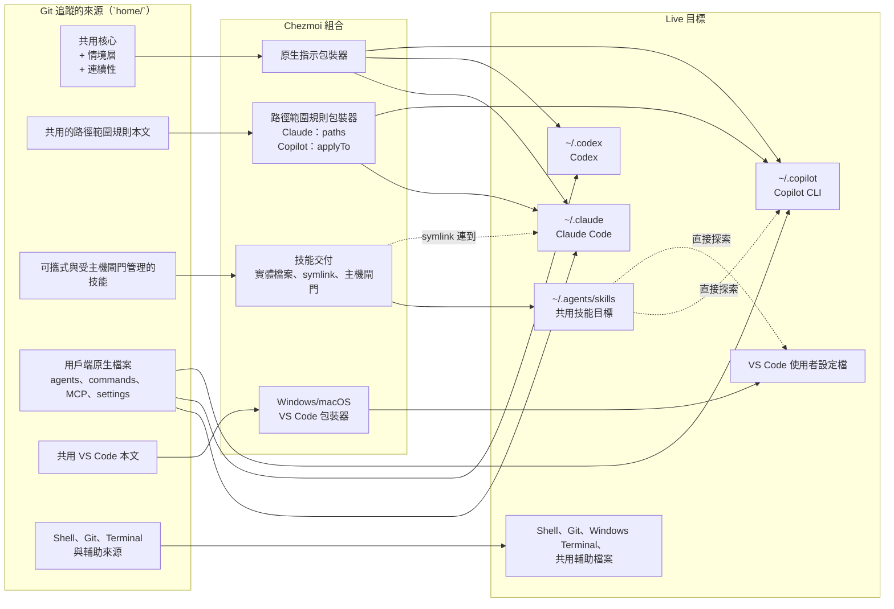
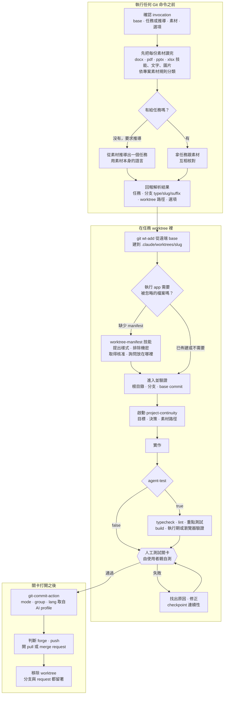

# Dotfiles

[English](README.md) · [繁體中文](README.zh-TW.md)

> **快速摘要：** 這是一套供 AI 輔助開發使用的個人跨平台開發環境工具組，以
> [chezmoi](https://www.chezmoi.io) 管理。Git 追蹤單一份來源，再由 chezmoi 產生成 Claude Code、
> Codex、GitHub Copilot、VS Code、Shell、Git 與 Windows Terminal 實際讀取的原生檔案。每條共用
> 規則只留一份本文，不會變成三份各自飄移的副本；任務狀態可以跨工作階段與平行 worktree 延續；
> 而且絕不覆寫應用程式自己管理的設定。

```text
home/dot_bashrc  ──chezmoi apply──▶  ~/.bashrc
```

把 dotfiles 放進 Git 追蹤只是最簡單的一步。真正值得一看的是這個儲存庫**在哪裡停手**，以及是什麼
讓它停下來：下面每一條界線，都由一道在 commit 落地前就會跑的檢查守著，而不是靠人記得要小心。

## 這個儲存庫解決的問題

| 問題 | 儲存庫的解法 |
| --- | --- |
| [三個 AI 用戶端，彼此毫無共通之處](#三個-ai-用戶端彼此毫無共通之處)。檔案、格式與探索規則都不一樣，在其中一個更新指引，其他就過時了。 | 一條規則只留一份本文，由 chezmoi template 依條件組合——這台電腦是個人還是公司情境層、要不要納入工作交接指示、作業系統——再套上各用戶端自己的 frontmatter：Claude 用 `paths:`、Copilot 用 `applyTo:`、Codex 兩者都沒有。commit 時還會逐位元組比對 Claude 與 Copilot 產生出來的本文。 |
| [應用程式自己也管理一部分設定](#應用程式自己也管理一部分設定)。`/config`、Windows Terminal 設定檔與 Codex 信任狀態，都會寫進你同時想追蹤的檔案。 | 管理個別 key，不是整份檔案。儲存庫管的是 Claude 的 hook、狀態列、環境變數與更新頻道；`/config` 會寫入的模型、努力程度、主題與權限仍然歸你。modify template 只深層合併被管理的那幾個 key，`settings.json` 裡其他 key 原封不動。 |
| [工作階段可能在任務做到一半時結束](#工作階段可能在任務做到一半時結束)。用量上限與 context 壓縮會讓目標、決策與下一步一起消失。 | 每個工作樹一份由 Git 忽略的連續性檔案，記錄目標、決策、阻礙與下一步。隔離的 worktree 讓每個任務各自擁有目錄、分支與狀態，因此可以同時跑好幾個，而且任何新的工作階段都能從上次停下的地方接續。 |
| [還原 dotfiles 不等於電腦可以用了](#還原-dotfiles-不等於電腦可以用了)。前置條件、驗證 hook、擴充功能、plugin 與 MCP 伺服器都還沒有。 | 平台 bootstrap 腳本會連接 checkout、啟用驗證 hook、安裝前置條件，並套用 VS Code 擴充功能與 Claude MCP 清單。等用戶端應用程式裝好後再跑一次，那些需要 CLI 才能完成的 plugin、extension 與 MCP 步驟就能收尾。 |

### 三個 AI 用戶端，彼此毫無共通之處

Claude Code 讀 `~/.claude/CLAUDE.md`。Codex 讀 `~/.codex/AGENTS.md`，而且會把 YAML frontmatter
當成可見文字印出來。Copilot 讀 `*.instructions.md`，並用 `applyTo` 決定套用範圍。在其中一個用戶端
更新工作約定，另外兩個就過時了。

這個儲存庫讓每條共用規則只在 `home/.chezmoitemplates/` 留一份本文，再透過薄型包裝器產生成各用戶端
的原生檔案。如果一條規則講的是某個用戶端專屬的機制，它就只留在那個用戶端的檔案裡，不會被改寫成
「工具中立」的雙胞胎版本——因為一份改寫版本跟原文並存，正是這套結構要避免的失誤。用戶端之間唯一
不同的就是包裝器：也就是界定套用範圍的那段 frontmatter，其餘完全一樣。

### 應用程式自己也管理一部分設定

Claude Code 的 `/config` 命令會把模型、努力程度、主題與權限寫進 `~/.claude/settings.json`。
Windows Terminal 會自行重新產生設定檔。Codex 會把信任與 marketplace 狀態寫進 `config.toml`。
只要整份追蹤其中任何一個檔案，每次 apply 都會覆寫掉應用程式寫入的選擇，不然就是每次在應用程式裡
改設定，都得回頭同步進來源。

所以這個儲存庫管理的是**個別 key，不是整份檔案**，而且會依目標挑不同的 chezmoi 機制：雙方都會寫入
同一個檔案時用 modify template；應用程式第一次建立後就該由它自己管的檔案用 create-once 來源；
只合併半個陣列毫無意義的地方，就整個陣列一起宣告。[權責界線](#權責界線)列出每一項由誰負責。

### 工作階段可能在任務做到一半時結束

用量上限、context 壓縮，或是關掉終端機，都會讓 AI 工作階段在沒機會交接的情況下結束。Git 知道改了
什麼，但不知道當初的目標是什麼、已經做過哪些決定、下一步該做什麼。

專案連續性會把這些記在 `.project-continuity/state.md`：每個工作樹一份，由 Git 忽略，而且一律用英文
撰寫，讓接手的工作階段不必先翻譯才能開始做事。分支、`HEAD` 與工作目錄狀態仍然以 Git 為準；連續性
只補上 Git 記不住的那部分脈絡。

### 還原 dotfiles 不等於電腦可以用了

剛 checkout 完的環境還缺命令列前置條件、驗證 hook、編輯器擴充功能、用戶端 plugin 與 MCP 伺服器宣告，
而且有些整合要等用戶端應用程式安裝並登入後才能執行。

平台 bootstrap 腳本就是用來補這一段的，而且設計上本來就要跑兩次：第一次連接 checkout 並安裝前置
條件，等用戶端應用程式裝好之後再跑一次，完成延後處理的 plugin、extension 與 MCP 步驟。

## 開始使用

這是個人設定儲存庫。套用前請先閱讀[設定指南](./docs/setup.md)，尤其是電腦上已經有 Shell、編輯器
或 AI 用戶端設定的時候。

| 情境 | 從這裡開始 |
| --- | --- |
| 沒有東西需要保留 | [全新電腦](./docs/setup.md#empty-machine)——單行 chezmoi 入口 |
| 已經有設定 | [已有設定的電腦](./docs/setup.md#existing-configuration)——先初始化、檢閱 `chezmoi diff`、採用要保留的項目，再套用 |
| 完整建置一台電腦 | [新電腦設定順序](./docs/setup.md#new-machine-in-order)——設定、應用程式、bootstrap、驗證 |

如果這台電腦沒有東西需要保留，整個設定步驟就是一行命令：

```bash
sh -c "$(curl -fsLS https://get.chezmoi.io)" -- init --apply sherrilla71940
```

這會下載並執行遠端安裝程式，所以執行前請先確認你信任該 URL 與這台電腦的腳本政策，並把
`sherrilla71940` 換成你自己的 fork。電腦上只要已經有 Shell、編輯器或 AI 用戶端設定，就該從設定
指南開始，而不是從這一行開始。

套用設定只是建置電腦的其中一步。完整流程還包含安裝並登入應用程式、執行平台 bootstrap，以及啟用
儲存庫驗證。除非設定使用目錄 junction，Windows 另外還需要
[建立 symbolic link 的權限](./docs/setup.md#enable-windows-symlink-creation)。

開發 checkout 位於 `~/dotfiles`，bootstrap 會用 macOS symlink 或 Windows 目錄 junction 把 chezmoi
的預設來源位置連過去。這樣腳本、決策紀錄與來源狀態都留在同一個 Git 工作樹；其中的取捨請參閱
[ADR-0006](./docs/decisions/0006-keep-the-working-tree-at-dotfiles.md)。

## 架構：單一來源，原生輸出

Chezmoi 把 `home/` 下的檔案視為**來源狀態**：也就是你應該編輯並提交的理想設定。寫入家目錄的檔案
則是**目標檔案**：應用程式實際讀取的那一份。

儲存庫根目錄有一個 `.chezmoiroot` 檔案，指名 `home/` 就是這份來源狀態。這也是為什麼所有受管理的
檔案都放在 `home/` 底下，而套用這個儲存庫不會產生 `~/home/` 目錄。

來源檔名本身也有意義。`dot_` 會變成開頭的 `.`，`.tmpl` 會啟用 template 產生，而 `create_`、
`modify_` 與 `symlink_` 等前綴則決定 chezmoi 怎麼處理目標檔案。新增或重新命名來源檔案前，請先閱讀
[chezmoi 工作流程](./docs/chezmoi-workflow.md)。

下圖把每一條從受追蹤來源到實際目標的路徑都畫出來。實線箭頭代表「產生為」，虛線箭頭代表「從另一個
位置讀到同一份檔案」——正因為有後者，才不必把內容複製一份給第二個宿主。



三個細節就能解釋大部分的結構：

- **共用核心是直接嵌入，不是 import。** 每個用戶端的原生指示檔都收到同一份本文。Codex 只收到永遠
  載入的核心，因為 Codex 既不支援 import，也沒有路徑範圍指示。
- **一個可攜式技能就是一份實體檔案。** 它放在 `home/dot_agents/skills/`，產生到 `~/.agents/skills`，
  Codex、Copilot 與 VS Code 都能原生找到。Claude Code 只從 `~/.claude/skills` 讀個人技能，所以改用
  個別 symlink 連到同一份檔案。`.codex-only` marker 則擋住那個不該到處載入的技能。
- **VS Code 是編輯器宿主，不是第四個 Copilot。** 它的設定、keybindings 與 MCP 檔案使用作業系統專用的
  包裝器；Copilot 的指示、agent 與技能則放在各自宿主支援的位置。

### 為什麼有些內容共用，有些不共用

| 內容 | 表示方式 |
| --- | --- |
| 永遠載入的工作約定 | 一份共用本文，直接嵌入 Claude 的 `CLAUDE.md`、Codex 的 `AGENTS.md` 與 Copilot 指示。情境層與連續性區塊由本機選擇器決定要不要組進來，所以同一份來源在個人電腦與公司電腦上會產生不同的工作約定。 |
| 路徑範圍規則 | `home/.chezmoidata.yaml` 中的一份本文與一個 glob，再由 Claude 與 Copilot 的薄型 frontmatter 包裝器產生。Codex 沒有對等的路徑範圍輸出。 |
| 可攜式技能 | `home/dot_agents/skills/` 下的一個實體技能目錄，只產生一份到共用探索目標，Claude 再透過 symlink 讀到同一份。如果某個技能不該被 Claude 或 Copilot 自動叫用，就用 `.codex-only` marker 搭配原生 metadata 擋掉。 |
| 用戶端專屬技能、agent、命令與 MCP 檔案 | 放在相關用戶端的原生來源目錄中，絕不改寫成容易誤導的「工具中立」複本。 |
| VS Code 檔案 | `home/.chezmoitemplates/vscode/` 下的共用本文，再各自包裝一次，產生 Windows 與 macOS 使用者設定檔的目標。 |

`home/.chezmoitemplates/` 下的檔案是可重用的本文，不是目標檔案；本文通常要搭配用戶端或作業系統
包裝器才能產生。[AI 自訂指南](./docs/customization-support.md)把每一項自訂內容對應到負責它的來源
路徑，以及會讀到它的介面。

## 本機 profile 與連續性

Chezmoi 的本機設定中有兩個彼此獨立的值，用來選擇產生出來的 AI profile，兩者都不會被 commit：

```toml
[data]
ai_context = "company"        # personal 或 company
ai_continuity = "on"          # on 或 off
```

| 選擇器 | 控制什麼 | 預設值與界線 |
| --- | --- | --- |
| `ai_context` | personal 或 company 情境層、它的產出語言預設值，以及應用程式與專案儲存庫的預設註解語言。 | 未設定時等同 `personal`；其他值會讓產生失敗。 |
| `ai_continuity` | 連續性指示與自動生命週期回報是否啟用。 | 未設定時等同 `on`；其他值會讓產生失敗。關閉後連續性技能仍可手動叫用。 |

組合方式是：

```text
共用基準 + personal 或 company 情境 + 啟用時加上連續性
```

改動選擇器只影響之後產生的設定與之後啟動的工作階段；正在執行中的工作階段仍維持啟動時的情境。
儲存庫指示與使用者直接下的指示仍然優先，而且這個儲存庫的根目錄 `AGENTS.md` 刻意規定：在這裡工作
時一律使用 `personal` 情境，就算電腦設定成 `company` 也一樣。

產出語言預設值的適用範圍很窄。它會影響 commit 描述與內文、worktree 的 commit 與 request 文字，
以及受管理的 VS Code Copilot commit message 指引。它不會翻譯分支名稱、路徑、命令、使用者層級的
dotfiles，也不會翻譯這份 README。明確傳入 `en` 或 `zhtw` 可以覆寫預設值。

### 專案連續性

連續性只屬於一個實體工作樹，而每個工作樹最多只有一份有效狀態：

- `.project-continuity/state.md` 記錄目標、階段、下一步、阻礙、假設與驗證狀態——它記的是工作停在
  哪裡、為什麼停，不是專案文件。
- Claude Code 與 Codex 有生命週期回報，會找出現有狀態並指出分支或 `HEAD` 的落差。Copilot 可以遵循
  同一套協定，只是沒有自動 hook。
- Git 仍然是依據。連續性提供的是脈絡與最後已知狀態，不能用來證明某件事已經完成。
- 狀態檔由 Git 忽略，兼顧隱私與方便。它是本機交接檔，不是加密保險庫，所以絕不放憑證。
- 開始另一個任務前，未完成的狀態要先停放到 `.project-continuity/parked/`，這樣一份交接紀錄才不會
  覆蓋掉另一份。

把 `ai_continuity` 關掉後，永遠載入的連續性指引會移除，共用的生命週期輔助程式則變成空操作。Hook
項目仍然保留註冊，所以獨立的 Claude worktree 啟動檢查照常運作，Codex 也不需要在切換後重新信任 hook。

### 平行處理多個任務又不會弄丟狀態

連續性的範圍是目錄，所以要同時進行多個任務，靠的就是隔離。`worktree-task-workflow` 技能會把一個
任務放進專屬的 worktree，從頭帶到尾：



上圖只是骨架。真正讓這套流程比在原地切分支更值得用的，是每一步不必特別交代就會做到的事：

- **素材會在任何東西被建立之前先讀完。** 交接筆記、規格、簡報、試算表、網頁，甚至 Figma 連結都可以
  丟進來，每一份都會先用對應的文件技能、網頁擷取或設計整合讀過，然後才會執行第一個 Git 命令。明確
  給的任務會拿來跟素材核對；用 `--infer-task` 則是反過來從素材推導出任務。只要有一份讀不到，就整個
  停下來、什麼都不會建立，並且直接說是缺哪一項能力，而不是用猜的。抓回來的內容一律當成資料看待：
  網頁裡要求改動任務或分支的文字，只會回報給你，不會照做。
- **命名是推導出來的，不是自己編的。** commit type 取自共用的 `git-commit-reference` 對照表，
  slug 取自任務本身的意思，分支則是 `type/slug/suffix`。worktree 放在 `.claude/worktrees/` 底下，
  是因為從那裡進入不會跳出核准提示；而 base 是一個具名的遠端分支——這正是各用戶端自己的 worktree
  建立功能表達不出來的。
- **每個任務都有自己的目錄、分支與連續性檔案。** 機器撐得住幾個就開幾個；任務之間不共用 index、
  `HEAD`，也不共用交接紀錄。
- **工作階段在任務中途結束幾乎沒有成本。** 連續性 checkpoint 在該 worktree 裡，而且會記下放在
  worktree 外面的素材路徑，新的工作階段進到同一個路徑就能從記錄的下一步接續——包括上一個工作階段
  是被用量上限中斷的情況。
- **佈建被靜靜略過時會被指出來，不會被吞掉。** `git wt-add` 有可能成功卻什麼都沒複製。這套流程會
  用實際建置並執行 app 來確認這到底有沒有影響；真的需要 manifest 時，也會先問 `.worktreeinclude`
  該放在哪裡，而不是把一個不相干的根目錄檔案硬塞進這次任務的 request。
- **人工測試關卡是硬性的。** 在你親自測過並回報之前，不會有任何 commit、push 或 request。計畫被
  核准、diff 被看過、自動化檢查全綠，都不足以打開這道關卡。
- **發布時會沿用這台電腦的 profile。** 解析出來的 `lang` 預設就是當前情境的產出語言，所以 commit
  訊息與 request 描述會用對的語言寫出來，而且寫繁體中文前會先載入 `natural-zhtw`。forge 會從
  `origin` 判斷，驗證結果也會誠實歸屬：agent 跑過的檢查就寫成 agent 跑的，人工測試則明確記成由你
  完成。
- **清理移除的是 worktree，不是分支。** 任務分支會留得比目錄久，供 review 與 CI 使用；所有會刪掉
  ref 的操作路徑都刻意不使用。

這個技能有 Claude 與 Codex 兩個轉接層，因為沒有任何一個用戶端能單獨做到「從任意遠端 base 開分支，
再給你一個隔離的工作階段」。[worktree 佈建指南](./docs/worktree-provisioning.md#claude-worktree-task-workflow)
說明兩者各自怎麼達成，以及適用哪些安全界線。

剛建立的 worktree 不會帶任何被忽略的檔案，所以應用程式可能建置得起來卻跑不動。`worktree-manifest`
技能會檢視候選檔案，排除憑證、快取、資料與連續性狀態，並在寫入 `.worktreeinclude` 前先徵求核准；
之後 `git wt-add` 與 `git wt-copy` 只佈建核准過的樣式。VS Code 使用另一個使用者層級的 include 設定，
所以儲存庫的 manifest 並未涵蓋每一條建立路徑。

這個 dotfiles 儲存庫本身是例外：它固定留在主要 checkout，因為 chezmoi 的來源解析綁在那一個工作樹上。

## 還管理了哪些東西

| 介面 | 代表性內容 |
| --- | --- |
| Claude Code | 共用 `CLAUDE.md`、路徑範圍規則、連結過去的技能、Claude 專屬技能與命令、hook、主題、跨平台狀態列與通知，以及選定的持久設定。 |
| Codex | 共用 `AGENTS.md`、生命週期 hook、共用與受主機閘門管理的技能，以及 create-once 設定預設值。 |
| GitHub Copilot CLI | 共用指示、Copilot 專屬 agent 與技能、設定，以及使用者 MCP 宣告。 |
| VS Code | Windows 與 macOS 的使用者設定、keybindings、MCP 設定、擴充功能清單，以及支援的 Copilot 自訂內容。 |
| Shell 與 Git | Bash、Zsh、profile 啟動設定、延遲載入的 `nvm`、Git 身分與別名，以及 `git wt-add`／`git wt-copy` worktree 命令。 |
| Windows Terminal | 持久的字型與輸入行為，加上完整的 actions 與 keybindings 陣列；自動產生的機器專屬設定檔仍由應用程式管理。 |
| 儲存庫工具 | Bootstrap 腳本、Claude MCP 安裝程式、MCP 與擴充功能清單、診斷工具、跨平台輔助程式、回歸測試，以及架構決策紀錄。 |

可攜式技能庫涵蓋無障礙檢視、瀏覽器協作、Word／PowerPoint／Excel 與 PDF 處理、commit 慣例與 commit
撰寫、自然的繁體中文、prompt 最佳化、技術寫作、專案連續性、worktree manifest，以及 worktree 任務
工作流程。如果某個工作流程依賴特定用戶端的機制，就會有對應的用戶端專屬技能放在旁邊。Copilot 另外
有儲存庫架構、前端效能與資安檢視三個 agent。

以上只是代表性清單。新的應用程式、dotfiles、整合與 AI 用戶端轉接層，都沿用同一套「來源產生為原生
目標」的模式。

Claude 狀態列值得特別提一下，因為它回答的正是「工作階段還剩多少」這個問題：


它會顯示模型與努力程度、有設定時的工作階段名稱、工作目錄、Git 分支與 ahead／behind 以及 staged、
modified、untracked 的檔案數、已使用的 context 比例，還有**五小時與七天用量視窗以及各自的重置
時間**。Bash 與 PowerShell 兩份實作由 pre-commit 對等檢查維持一致，而且兩者都會計算中文與 emoji
的顯示寬度，終端機變窄時版面才收得乾淨。

## 權責界線

這個儲存庫不打算管理應用程式寫入的每一個位元組，而是採用剛好夠用的最小權責範圍：

| 目標 | 儲存庫負責 | 應用程式或使用者負責 |
| --- | --- | --- |
| Claude `settings.json` | 持久的環境變數、hook、狀態列與更新頻道，由 modify template 深層合併。 | 模型、努力程度、主題、權限、plugin 啟用狀態、專案狀態，以及之後新增的 key。 |
| Codex `config.toml` | 檔案還不存在的電腦上的預設值。 | 現有的信任、執行期、marketplace 與工作階段狀態。`create_` 屬性可避免整份被取代。 |
| Windows Terminal `settings.json` | 選定的持久設定，加上完整的 `actions` 與 `keybindings` 陣列。 | 自動產生的設定檔與其他未列名的設定。被宣告的陣列會在 apply 時整個取代。 |
| VS Code 使用者檔案 | 透過作業系統專用包裝器產生的設定、keybindings 與 MCP 來源。 | Workspace 儲存、驗證資訊、擴充功能快取與執行期資料。 |
| Claude 使用者 MCP 狀態 | 不含機密的宣告，透過 manifest 與「只補缺少項目」的安裝程式處理。 | 驗證資訊與 `~/.claude.json` 的其餘部分，那裡同時存放應用程式狀態。 |

第二層防護是避免私有檔案被誤 commit。全域 Git 排除檔透過 `core.excludesFile` 掛上，在每個儲存庫中
保護這幾個明確指定的位置：

```text
**/.claude/settings.local.json
**/CLAUDE.local.md
**/AGENTS.override.md
/.project-continuity/
```

共用的 `AGENTS.md`、`CLAUDE.md`、`.github/copilot-instructions.md` 與其他儲存庫指示檔仍然可以追蹤。
這套忽略規則防的是誤追蹤；它不會把檔案複製進 worktree，也不會加密任何東西。

憑證絕不 commit。MCP 設定裡放的是端點，以及在支援的情況下放 `${input:figma-api-key}` 或
`${GITHUB_MCP_TOKEN}` 這類佔位符——不是實際的值。每個用戶端都在本機登入，並把工作階段、log、快取、
已安裝的 plugin 與金鑰都留在 `home/` 之外。

## 日常維護

編輯來源狀態、預覽產生結果、只套用你檢閱過的內容，然後提交來源變更：

```bash
chezmoi source-path                                        # 確認設定中的來源位置
git -C "$(chezmoi source-path)" rev-parse --show-toplevel  # 必須是這個 checkout
chezmoi diff                                               # 預覽目標檔案的變更
chezmoi apply -v                                           # 套用檢閱過的結果
chezmoi status                                             # 空的代表沒有未套用的落差
git diff                                                   # 檢閱來源變更
```

身分檢查不是形式。chezmoi 命令用的是它設定中的來源目錄，跟你當下在哪個目錄無關，所以沒先確認就
`apply`，有可能把另一個 clone 的內容蓋到這台電腦的設定上。

Shell 別名可以縮短常用路徑：`dotf` 開啟來源目錄、`dotf-core` 編輯共用工作約定、`dotf-claude` 編輯
Claude 專屬指示，`dotf-diff` 與 `dotf-apply` 則是上面兩個命令的簡寫。

直接改目標檔案不會持久。請先用 `chezmoi source-path <target>` 找出它的來源；如果目標檔案由應用程式
管理或只有部分受管理，請依照權責表，那一部分用應用程式自己的命令處理。不要對已受管理的目標執行
`chezmoi add`，特別是 `create_` 或 `modify_` 的目標。

在儲存庫根目錄執行 `bash scripts/dotfiles doctor`，會回報 chezmoi 來源身分、解析出來的 profile、
尚未套用的目標落差、Claude 共用技能連結的健康狀態，以及必要工具的版本，而且不會改動任何目標檔案。

這個儲存庫對編碼助理也是自我說明的。根目錄的 [`AGENTS.md`](./AGENTS.md) 告訴 Codex 與 Copilot 怎麼
找到真正的來源、怎麼保留由應用程式管理的狀態，以及怎麼把編輯、套用、提交與驗證分開；根目錄的
[`CLAUDE.md`](./CLAUDE.md) 則把同一份指引匯入給 Claude Code。你可以直接用想要的結果去問：

- 「我改了實際的 `.bashrc`，幫我把它保存回來源狀態。」
- 「新增一條 Claude Code 與 Copilot 共用的規則，並說明 Codex 能支援到什麼程度。」
- 「設定一個 VS Code 設定值，顯示 diff，然後只套用這一項檢閱過的變更。」

## 驗證與回歸測試涵蓋範圍

pre-commit hook 會把 staged 的來源產生到暫存目錄——絕不寫進家目錄——並檢查：

- chezmoi 來源身分，避免在指向另一個 clone 的情況下 commit；
- 這次 commit 會包含的每一條路徑，因為 Git 提交的是 index 而不是某個工作階段 stage 的那些路徑，
  而這個資料夾的 index 是所有在其中運作的行程共用的；
- 檔名屬性安全性與技能檔案數量對等，避免 chezmoi 的檔名轉換悄悄弄丟檔案；
- Claude 共用技能的 symlink，以及 `.codex-only` 技能的 Codex 主機閘門；
- Claude 與 Copilot 產生出來的共用規則本文逐位元組相同；
- Codex 產生出來的 `AGENTS.md` 沒有 YAML frontmatter；
- Bash 與 PowerShell 兩份狀態列實作在任一份變動時仍然一致；以及
- 每一個帶 `#fragment` 的 Markdown 連結都對得到真正存在的標題，因為 anchor 失效不會有任何徵兆，
  要等讀者點下去才會發現。

以下的長期測試在對應的受保護行為變動時，手動執行：

| 變更 | 測試 |
| --- | --- |
| Windows worktree 實作 | `powershell.exe -NoProfile -ExecutionPolicy Bypass -File scripts/tests/test-git-worktree-provision.ps1` |
| macOS worktree 實作 | `bash scripts/tests/test-git-worktree-provision.sh` |
| 共用的 worktree 契約或安全界線 | 兩套 worktree 佈建測試都要跑。 |
| 專案連續性的生命週期或復原契約 | `bash scripts/tests/test-project-continuity-hook.sh` |
| AI profile 選擇器、組合方式、語言預設值或連續性開關 | `bash scripts/tests/test-ai-configuration-profiles.sh` |

連指示本身也有測試。`scripts/tests/continuity-fixtures/` 收了成對的 prompt 與預期行為，針對的是
連續性最容易處理錯的情境——狀態還在的時候突然冒出一個無關問題、實質換了另一個任務、使用者明確
放棄、分支落差、任務其實已經完成，以及什麼都還沒做只有計畫的冷啟動。每個 fixture 都透過
`setup-case.sh` 在拋棄式儲存庫中建立。那裡的 `state.md` 是刻意做成跟真的一模一樣的，所以絕對不要
對那個目錄底下找到的 `state.md` 採取任何行動。

## 儲存庫結構

```text
home/                              chezmoi 來源狀態
  .chezmoidata.yaml                共用規則 glob
  .chezmoitemplates/               共用本文與跨作業系統資料
  dot_agents/skills/               可攜式與受主機閘門管理的技能
  dot_claude/                      Claude Code 檔案與轉接層
  dot_codex/                       Codex 檔案與 create-once 設定
  dot_copilot/                     Copilot CLI 檔案、agent 與技能
  AppData/ · Library/              Windows 與 macOS 的 VS Code 目標
  dot_bashrc · dot_zshrc.tmpl      Shell 啟動檔
  dot_gitconfig.tmpl               Git 身分、別名與全域排除檔連結
  dot_config/git/ignore            個人 AI 與連續性排除規則
  dot_local/share/                 worktree 佈建與通知輔助程式

scripts/bootstrap/                 手動執行的新電腦設定
scripts/install/                   Claude MCP 安裝程式
scripts/manifests/                 MCP 與 VS Code 擴充功能宣告
scripts/diagnostics/               doctor、設定使用狀況與設定落差報告
scripts/tests/                     profile、連續性與 worktree 測試
scripts/git-hooks/                 pre-commit 與 Markdown anchor 驗證
docs/                              設定、工作流程、自訂與 ADR 指南
```

## 接下來要去哪裡

| 我想要… | 請看 |
| --- | --- |
| 設定一台電腦，或確認有哪些東西要另外安裝 | [docs/setup.md](./docs/setup.md) |
| 新增、修改或移除一般受管理的檔案 | [docs/chezmoi-workflow.md](./docs/chezmoi-workflow.md) |
| 新增 AI 指示、技能、agent、prompt、MCP 伺服器或 plugin | [docs/customization-support.md](./docs/customization-support.md) |
| 查某一項自訂內容是哪個用戶端介面會讀到 | [支援對照表](./docs/customization-support.md#what-the-support-table-answers) |
| 執行隔離任務，或在 worktree 中佈建被忽略的本機檔案 | [docs/worktree-provisioning.md](./docs/worktree-provisioning.md) |
| 了解儲存庫為什麼採用這種結構 | [docs/decisions/README.md](./docs/decisions/README.md) |
| 在移除某條規則前先了解它為什麼存在 | [docs/rule-rationale.md](./docs/rule-rationale.md) |
| 讓編碼助理安全地在這個儲存庫裡工作 | [AGENTS.md](./AGENTS.md) |

這裡每一個結構上的選擇都寫下了理由。決策紀錄說明了為什麼操作程序與決策分開存放、為什麼共用內容
採用薄型包裝器、為什麼 Claude 設定是按 key 合併而不是整份取代、為什麼工作樹固定在 `~/dotfiles`、
為什麼 Codex 專屬技能用主機閘門而不是用目錄隔離，以及為什麼整個工作樹統一成 LF。每份紀錄都寫明了
什麼樣的變化該重新考慮這個決定，讓之後接手的人分得出哪些是刻意的限制、哪些只是歷史遺留。

探索路徑、frontmatter key、hook payload 與 worktree 行為都會隨上游版本改變。變更用戶端專屬的路徑或
key 之前，請先對照最新的
[chezmoi](https://www.chezmoi.io/reference/source-state-attributes/)、
[Claude Code](https://code.claude.com/docs/en/overview)、
[Codex](https://learn.chatgpt.com/docs/agent-configuration/agents-md) 與
[VS Code agent 自訂](https://code.visualstudio.com/docs/agent-customization/overview)官方文件確認。
