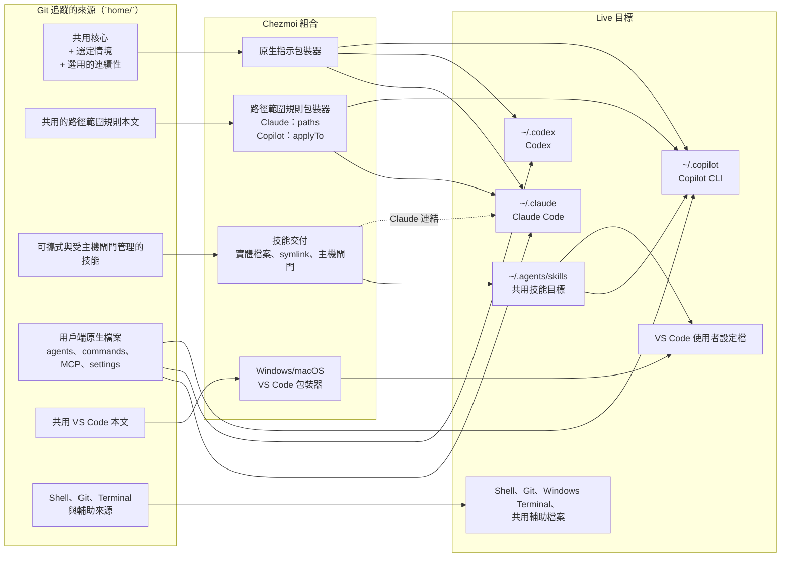

# Dotfiles

[English](README.md) · [繁體中文](README.zh-TW.md)

> **快速摘要：** 這是一套供 AI 輔助開發與開發工具設定使用的個人跨平台開發環境工具組，透過
> [chezmoi](https://www.chezmoi.io) 管理。Git 追蹤 `home/` 下的理想來源狀態，chezmoi 再把它產生為
> 工具組中各工具與應用程式使用的原生目標檔案。目前 AI 用戶端轉接層支援 Claude Code、Codex 與
> GitHub Copilot；儲存庫也管理編輯器、Shell、Git、終端機與其他開發工具設定。加入新的用戶端與
> dotfiles 後，來源與轉接層還能繼續擴充。

## 這個儲存庫解決的問題

AI 輔助的開發環境涵蓋許多應用程式與平台，因此本工具組使用 Git 與 chezmoi，讓使用者層級的設定
可以重現。下表整理 AI 用戶端、應用程式自行管理的設定、專案連續性、平行 worktree 與電腦設定
所遇到的常見問題。原生 AI 用戶端轉接層目前涵蓋 Claude Code、Codex 與 GitHub Copilot；這是目前
的整合範圍，不代表未來的用戶端、dotfiles 或開發工具受到限制：

| 問題 | 儲存庫的解法 |
| --- | --- |
| Claude Code、Codex 與 GitHub Copilot 使用不同的檔案、格式、探索規則與指示範圍。在其中一個用戶端更新指引後，其他用戶端可能變得過時，或把用戶端專屬行為暴露給錯誤的主機。 | 在 Git 中追蹤屬於儲存庫的使用者層級、跨專案 AI 設定：可重用的指示與可攜式技能集中在一份共用來源；用戶端專屬的命令、agent、hook、刻意管理的設定與轉接層，則保留在各自用戶端的原生來源。使用 chezmoi template 條件式且動態地將這些來源產生為各用戶端的原生家目錄檔案；薄型轉接層、主機閘門、連結與 pre-commit 對等檢查，在不複製共用內容的前提下處理用戶端差異。 |
| AI 工作階段中斷或經過壓縮後，可能遺失任務目標、決策與下一步；平行 Git worktree 也可能缺少執行專案所需、但被忽略的本機檔案。 | 使用專案連續性——每個工作目錄一份私有、由 Git 忽略的任務交接紀錄。它記錄目標、決策、阻礙與下一步，但不取代儲存庫事實。Git 仍是分支、`HEAD` 與工作目錄狀態的依據；切換任務前，先將未完成的狀態停放到 `.project-continuity/parked/`。Worktree 工作流程會為平行任務建立隔離的目錄；如果缺少本機檔案，manifest 技能會先取得核准，再由 `git wt-add` 與 `git wt-copy` 安全地佈建 `.worktreeinclude` 中核准的項目。 |
| 開發工具會自行管理一部分偏好設定與執行期狀態。例如 Claude Code 的 `/config` 命令可以變更模型、努力程度、主題或權限，Windows Terminal 也可以變更自己的設定檔與偏好；如果追蹤整份設定檔，就會覆寫這些選擇，或迫使每次應用程式變更都回頭同步到來源。個人覆寫與連續性狀態也應留在本機，而共用且持久的儲存庫設定則應保持可見並可追蹤。 | Git 只追蹤刻意由儲存庫管理的設定；chezmoi 的 merge、create-once 與 selective template 會套用這些設定，不取代整份現有檔案：管理 Claude hook、狀態列、環境、更新頻道與選定的持久終端機設定；將模型、努力程度、主題、權限與其他應用程式自行管理的選擇留在本機；Codex 與其他工具也採用相同的選擇性管理方式。使用 Git 的全域排除規則，為精確指定的私有檔案提供安全網，例如 `CLAUDE.local.md`、`AGENTS.override.md`、`.claude/settings.local.json` 與 `.project-continuity/`；同時讓共用的 `AGENTS.md`、`CLAUDE.md` 與儲存庫指示檔保持可追蹤。 |
| 只還原 dotfiles 並不足以建立可用的開發環境：新電腦可能仍缺少命令列前置條件、驗證 hook、編輯器擴充功能、用戶端 plugin 或 MCP 伺服器宣告，而且有些整合必須等用戶端應用程式安裝後才能執行。 | 執行平台專用的 `scripts/bootstrap/bootstrap-windows.ps1` 或 `scripts/bootstrap/bootstrap-macos.sh` 輔助程式，連接 checkout、啟用驗證、安裝或設定支援工具並套用 manifest。安裝用戶端應用程式後再執行一次，讓延後處理的 plugin、extension 與 MCP 步驟完成。 |

## 開始使用

這是個人設定儲存庫。套用前請先閱讀[設定指南](./docs/setup.md)，尤其是電腦上已經有 Shell、
編輯器或 AI 用戶端設定時。

### 全新電腦

只有在不需要保留既有設定時，才使用這個單行入口。完成[設定前置條件](./docs/setup.md#common-prerequisites)
後，從 macOS 或 Git Bash 執行：

```bash
sh -c "$(curl -fsLS https://get.chezmoi.io)" -- init --apply sherrilla71940
```

這會下載並執行遠端安裝程式。執行前請確認你信任該 URL 與這個腳本政策。除非設定使用目錄 junction，
Windows 也需要[建立 symbolic link](./docs/setup.md#enable-windows-symlink-creation)。

### 已有設定的電腦

先初始化但不要套用，確認 chezmoi 指向這個儲存庫，並檢閱產生的變更：

```bash
chezmoi init sherrilla71940
git -C "$(chezmoi source-path)" rev-parse --show-toplevel
chezmoi diff
```

`git` 命令的輸出必須是這個 checkout。套用前，先採用你想保留的設定；[既有設定指南](./docs/setup.md#existing-configuration)
說明一般檔案與 template 檔案各自的保留方式。需要使用 fork 時，將 `sherrilla71940` 替換成 fork URL。

以上任一路徑都只是設定步驟。完整設定還需要安裝並登入應用程式、執行平台 bootstrap、啟用儲存庫驗證，
並在應用程式 CLI 可用後再次執行 bootstrap，讓 plugin、extension 與 MCP 步驟完成。請使用詳細的[新電腦設定順序](./docs/setup.md#new-machine-in-order)。

開發 checkout 通常位於 `~/dotfiles`。Bootstrap 會用 macOS symlink 或 Windows 目錄 junction，把 chezmoi
的預設來源位置連到這個 checkout。這樣儲存庫腳本、決策紀錄與來源狀態會留在同一個 Git 工作樹；其中的取捨請參閱
[ADR-0006](./docs/decisions/0006-keep-the-working-tree-at-dotfiles.md)。

## 架構：單一來源，原生輸出

Chezmoi 將 `home/` 下的檔案視為**來源狀態**：也就是你應該編輯並提交的理想設定。寫入家目錄的檔案則是
**目標檔案**：應用程式實際讀取的檔案。

```text
home/dot_bashrc  ──chezmoi apply──▶  ~/.bashrc
```

來源檔名本身也有意義。`dot_` 會變成開頭的 `.`，`.tmpl` 會啟用 template 產生，而 `create_`、`modify_`
與 `symlink_` 等前綴則控制 chezmoi 如何處理目標檔案。新增或重新命名來源檔案前，請先閱讀
[chezmoi 工作流程](./docs/chezmoi-workflow.md)。

下圖顯示目前的 AI 用戶端轉接層與最重要的邊界。圖中也把 Claude Code、Codex、GitHub Copilot 與 VS Code
使用者設定放在一起；Shell、Git、Windows Terminal 與輔助腳本則使用相同的來源到目標原則，不需要 AI 用戶端
轉接層。



三個細節可以解釋大部分的結構：

- 共用核心會直接嵌入每個用戶端的原生指示檔。Codex 會收到永遠載入的核心，但本儲存庫不會為 Claude 與
  Copilot 的路徑範圍規則建立 Codex 對等輸出。
- 可攜式技能是 `home/dot_agents/skills/` 下的實體檔案，會產生到 `~/.agents/skills`；Claude Code 會透過
  `~/.claude/skills` 下的個別 symlink 找到同一份檔案。`.codex-only` marker 與原生 metadata gate 會阻止
  不應自動使用的工作流程被 Claude 或 Copilot 使用。
- VS Code 是編輯器宿主，不是 Copilot CLI 設定的第四份副本。VS Code 的使用者設定、keybindings 與 MCP
  檔案使用作業系統專用的包裝器；Copilot 的指示、agent 與技能則依照各自宿主支援的位置放置。

### 為什麼有些內容共用，有些不共用

| 內容 | 表示方式 |
| --- | --- |
| 永遠載入的工作約定 | 一份共用本文，同時納入 Claude 的 `CLAUDE.md`、Codex 的 `AGENTS.md` 與 Copilot 指示。 |
| 路徑範圍規則 | `home/.chezmoidata.yaml` 中的一份本文與一個 glob，再由 Claude 與 Copilot 的薄型 frontmatter 包裝器產生。Codex 在這個設定中沒有對等的路徑範圍輸出。 |
| 可攜式技能 | `home/dot_agents/skills/` 下的一個實體技能目錄，搭配共用的探索目標與 Claude symlink。 |
| 用戶端專屬技能、agent、命令與 MCP 檔案 | 放在相關用戶端的原生來源目錄中，不會被改寫成容易誤導的「工具中立」複本。 |
| VS Code 檔案 | `home/.chezmoitemplates/vscode/` 下的共用本文，再各自包裝一次，產生 Windows 與 macOS 使用者設定檔的目標。 |

`home/.chezmoitemplates/` 下的檔案是可重用的本文，不是直接目標。本文通常需要搭配用戶端或作業系統包裝器
才能正確產生。[AI 自訂指南](./docs/customization-support.md)說明每一項自訂內容由哪個來源路徑負責。

## 本機 profile 與工作階段連續性

Chezmoi 的本機設定中有兩個彼此獨立的值，用來控制產生的 AI profile：

```toml
[data]
ai_context = "company"        # personal 或 company
ai_continuity = "on"           # on 或 off
```

| 選擇器 | 控制內容 | 預設值與界線 |
| --- | --- | --- |
| `ai_context` | 個人或公司情境層、該情境的產出物語言預設值，以及應用程式與專案儲存庫的預設註解語言。 | 遺漏時使用 `personal`；其他值會使產生失敗。 |
| `ai_continuity` | 是否啟用連續性指示，以及自動生命週期回報與狀態維護。 | 遺漏時使用 `on`；其他值會使產生失敗。即使關閉，仍可明確使用連續性技能。 |

組合方式是：

```text
共用基線 + 個人或公司情境 + 啟用時的連續性
```

選擇器只在本機生效、整台電腦共用，而且不會提交。變更只會影響新產生的設定與新啟動的工作階段；
已經執行中的工作階段會保留啟動時載入的情境。儲存庫指示與使用者直接指示仍然優先。本儲存庫根目錄的
`AGENTS.md` 刻意要求在此工作時使用有效的 `personal` 情境，即使電腦選擇的是 `company` 也一樣。

產出物語言預設值的適用範圍很窄。它會影響支援的提交描述與內文、worktree 提交與 request 文字，以及
受管理的 VS Code Copilot 提交訊息指示；不會翻譯 branch 名稱、路徑、命令、使用者層級 dotfiles 或本 README。
明確傳入 `en` 或 `zhtw` 時會覆寫預設值。

### 專案連續性

啟用後，專案連續性會把交接狀態保留在目前的實體工作樹中：

- `.project-continuity/state.md` 記錄目標、階段、下一步、阻礙、假設與驗證狀態。
- Claude Code 與 Codex 會收到生命週期回報，能辨識現有狀態並偵測分支或 `HEAD` 漂移。Copilot 可以使用
  共用的狀態協定，但本儲存庫沒有為 Copilot 新增自動生命週期 hook。
- Git 才是分支、`HEAD` 與工作樹實際狀態的依據。連續性檔案提供上下文，但不取代 Git 歷史或對話記錄。
- 狀態會被 Git 忽略，兼顧隱私與便利。它是本機交接檔案，不是加密的秘密儲存區。

關閉 `ai_continuity` 後，常駐載入的連續性指示會移除，共用生命週期輔助程式會變成 no-op。Hook 項目仍會
保留，因此獨立的 Claude worktree 啟動檢查仍可使用；Codex 也不需要因切換設定而重新核准 hook 信任。

### 隔離的 worktree 與平行任務

專案連續性屬於一個實體工作樹。對允許使用 worktree 的儲存庫，worktree 工作流程會為每個任務建立或進入
隔離的 worktree，再把該任務的交接狀態記錄在那裡。不同任務可以平行進行，不會混用狀態。本 dotfiles 儲存庫
刻意留在主要 checkout，因為 chezmoi 的來源解析與它綁定。

如果新的 worktree 需要被忽略的專案本機檔案，worktree manifest 技能會檢查候選檔案，排除憑證、快取、資料
與連續性狀態，並在建立或擴充 `.worktreeinclude` 前請使用者核准符合條件的 pattern。接著由 `git wt-add`
與 `git wt-copy` 只佈建已核准的檔案。VS Code 使用獨立的使用者層級 include 設定，因此儲存庫 manifest
不涵蓋每一種 worktree 建立路徑。用戶端之間的差異請閱讀[worktree 佈建指南](./docs/worktree-provisioning.md)。

## 其他受管理的內容

| 範圍 | 代表性內容 |
| --- | --- |
| Claude Code | 共用 `CLAUDE.md`、路徑範圍規則、連結技能、Claude 專屬命令與技能、hook、跨平台狀態列與通知、主題，以及選定的持久設定。 |
| Codex | 共用 `AGENTS.md`、生命週期 hook、共用與主機閘門技能，以及 create-once 設定預設值。 |
| GitHub Copilot CLI | 共用指示、Copilot 專屬 agent 與技能、設定，以及使用者 MCP 宣告。 |
| VS Code | Windows 與 macOS 使用者設定、keybindings、MCP 設定、extension manifest，以及受支援的 Copilot 自訂內容。 |
| Shell 與 Git | Bash、Zsh、profile 啟動設定、Git 身分與 aliases，包括 worktree 命令。 |
| Windows Terminal | 持久的字型與輸入行為、actions 與 keybindings；產生的機器專屬 profile 仍由應用程式管理。 |
| 儲存庫工具 | Bootstrap 腳本、Claude MCP 安裝程式、manifest、診斷工具、跨平台輔助程式、回歸測試套件與架構決策紀錄。 |

內含的工作流程函式庫涵蓋無障礙檢視、瀏覽器協作、文件與簡報產生、試算表、PDF、提交慣例、台灣繁體中文、
prompt 最佳化、技術寫作、專案連續性與 worktree 佈建。Copilot 也有專注於儲存庫架構、前端效能與安全性檢視
的 agent。MCP 與 extension manifest 提供可重複的宣告；驗證資訊與下載的快取則留在本機。

這份清單只是代表性內容，不是完整清單。隨著工具組成長，新的應用程式設定、dotfiles、整合與 AI 用戶端
轉接層都可以遵循相同的來源到原生目標模型。

## 權責與隱私界線

儲存庫不會試圖管理應用程式寫入的每一個位元組，而是採用最小但實用的管理範圍：

| 目標檔案 | 儲存庫管理 | 應用程式或使用者管理 |
| --- | --- | --- |
| Claude `settings.json` | 由 modify template 合併的持久環境、hook、狀態列與更新頻道設定。 | 模型、努力程度、主題選擇、權限、plugin 啟用狀態、專案狀態與未來新增的鍵。 |
| Codex `config.toml` | 檔案不存在的電腦所使用的預設值。 | 現有的信任、執行期、marketplace、工作階段與其他混合狀態。`create_` 來源屬性避免整份取代。 |
| Windows Terminal `settings.json` | 選定的持久值，以及完整的 `actions` 與 `keybindings` 陣列。 | 產生的 profile 與其他未命名設定。被宣告擁有的陣列在套用時會整組取代。 |
| VS Code 使用者檔案 | 透過作業系統專用包裝器產生的受追蹤設定、keybindings 與 MCP 來源檔案。 | Workspace 儲存資料、驗證資訊、extension 快取與其他執行期資料。 |
| Claude 使用者 MCP 狀態 | 透過 manifest 與 add-missing 安裝程式提供的非秘密宣告。 | 驗證資訊，以及 `~/.claude.json` 的其餘內容；該檔案也包含應用程式狀態。 |

全域 Git exclude 檔案透過 `core.excludesFile` 連接，保護下列精確的本機範圍：

```text
**/.claude/settings.local.json
**/CLAUDE.local.md
**/AGENTS.override.md
/.project-continuity/
```

共用的 `AGENTS.md`、`CLAUDE.md`、`.github/copilot-instructions.md` 與其他儲存庫指示仍可追蹤。忽略規則
只防止意外追蹤，不會把檔案複製到 worktree，也不會把它們加密。

永遠不要提交憑證。MCP 設定包含端點，以及在支援時使用的 prompt placeholder，例如 `${input:figma-api-key}`
或 `${GITHUB_MCP_TOKEN}`，而不是秘密值本身。請在各用戶端本機完成驗證，並將工作階段、記錄、快取、已安裝的
plugin 與金鑰排除在 `home/` 之外。

## 日常維護

編輯來源狀態、預覽產生結果，只套用已檢閱的變更，再提交來源變更：

```bash
chezmoi source-path                                        # 找出已設定的來源
git -C "$(chezmoi source-path)" rev-parse --show-toplevel  # 必須是此 checkout
chezmoi diff                                               # 預覽即時目標的變更
chezmoi apply -v                                           # 套用已檢閱的產生結果
chezmoi status                                             # 空白表示沒有尚未套用的漂移
git diff                                                   # 檢閱來源變更
```

直接編輯 live 目標不具持久性。先執行 `chezmoi source-path <target>` 找到來源；如果目標由應用程式管理或
只被部分管理，請依照權責表處理，並使用應用程式自己的命令修改那一部分。不要對已經受管理的目標執行
`chezmoi add`，尤其是 `create_` 或 `modify_` 目標。

從儲存庫根目錄執行 `bash scripts/dotfiles doctor`，可以在不變更目標的情況下回報 chezmoi 來源識別、解析後的
profile、尚未套用的目標漂移、Claude 共用技能連結健康狀態與必要工具版本。

本儲存庫也能讓程式設計助手自行理解工作方式。根目錄的 [`AGENTS.md`](./AGENTS.md) 告訴 Codex 與 Copilot
如何找到真實來源、保留應用程式管理的狀態，以及區分編輯、套用、提交與驗證。根目錄的 [`CLAUDE.md`](./CLAUDE.md)
會為 Claude Code 匯入相同指引。你可以向任何支援的助手描述結果，例如：

- 「我修改了 live 的 `.bashrc`，請幫我把它保留到來源狀態。」
- 「新增 Claude Code 與 Copilot 共用的規則，並說明 Codex 支援哪些內容。」
- 「設定 VS Code，顯示差異，然後只套用已檢閱的變更。」

## 驗證與回歸測試涵蓋範圍

Pre-commit hook 會把已暫存的來源產生到暫存目錄，並檢查：

- chezmoi 來源識別與檔名屬性安全性；
- 技能檔案數量對等性、Claude 共用技能連結與 Codex 主機閘門；
- Claude 與 Copilot 之間的共用規則本文是否一致；
- Codex 產生的 `AGENTS.md` 是否沒有 YAML frontmatter；
- Bash 與 PowerShell 狀態列實作的對等性（任一方變更時）；以及
- 帶有 `#fragment` 錨點的 Markdown 連結是否指向實際存在的標題。

受保護行為發生變更時，請手動執行下列長期回歸測試：

| 變更 | 測試 |
| --- | --- |
| Windows worktree 實作 | `powershell.exe -NoProfile -ExecutionPolicy Bypass -File scripts/tests/test-git-worktree-provision.ps1` |
| macOS worktree 實作 | `bash scripts/tests/test-git-worktree-provision.sh` |
| 共用 worktree 契約或安全界線 | 執行兩套 worktree 佈建測試。 |
| 專案連續性生命週期或復原契約 | `bash scripts/tests/test-project-continuity-hook.sh` |
| AI profile 選擇器、組合、語言預設值或連續性切換 | `bash scripts/tests/test-ai-configuration-profiles.sh` |

Pre-commit hook 維持為快速的來源產生與結構檢查；回歸測試套件則會深入測試一次性儲存庫與跨平台行為。

## 儲存庫結構

```text
home/                              chezmoi 來源狀態
  .chezmoidata.yaml                共用規則 glob
  .chezmoitemplates/               共用本文與作業系統中立資料
  dot_agents/skills/               可攜式與受主機閘門管理的技能
  dot_claude/                      Claude Code 檔案與轉接層
  dot_codex/                       Codex 檔案與 create-once 設定
  dot_copilot/                     Copilot CLI 檔案、agent 與技能
  AppData/ · Library/              Windows 與 macOS VS Code 目標
  dot_bashrc · dot_zshrc.tmpl      Shell 啟動檔
  dot_gitconfig.tmpl               Git 身分、aliases 與全域排除連結
  dot_config/git/ignore            個人 AI 與連續性排除規則

scripts/bootstrap/                 手動執行的新電腦設定
scripts/install/                   Claude MCP 安裝程式
scripts/manifests/                 MCP 與 VS Code extension 宣告
scripts/diagnostics/               doctor 與 Claude 設定報告
scripts/tests/                     profile、連續性與 worktree 測試套件
scripts/git-hooks/                 pre-commit 與 Markdown 錨點驗證
docs/                              設定、工作流程、自訂與 ADR 指南
```

## 接下來要去哪裡

| 我想要…… | 請閱讀 |
| --- | --- |
| 設定電腦，或確認哪些內容必須另外安裝 | [docs/setup.md](./docs/setup.md) |
| 新增、修改或移除一般受管理檔案 | [docs/chezmoi-workflow.md](./docs/chezmoi-workflow.md) |
| 新增 AI 指示、技能、agent、prompt、MCP 伺服器或 plugin | [docs/customization-support.md](./docs/customization-support.md) |
| 在 Git worktree 中佈建被忽略的本機檔案 | [docs/worktree-provisioning.md](./docs/worktree-provisioning.md) |
| 了解儲存庫為什麼採用目前的結構 | [docs/decisions/README.md](./docs/decisions/README.md) |
| 移除規則前，先了解它為什麼存在 | [docs/rule-rationale.md](./docs/rule-rationale.md) |
| 讓程式設計助手在本儲存庫中安全工作 | [AGENTS.md](./AGENTS.md) |

設定探索路徑、frontmatter、hook payload 與 worktree 行為都可能隨上游版本更新。修改用戶端專用路徑或鍵值前，
請先對照最新版的 [chezmoi 文件](https://www.chezmoi.io/reference/source-state-attributes/)、
[Claude Code 文件](https://code.claude.com/docs/en/overview)、
[Codex 文件](https://learn.chatgpt.com/docs/agent-configuration/agents-md)，以及
[VS Code agent 自訂文件](https://code.visualstudio.com/docs/agent-customization/overview)確認版本敏感的細節。
