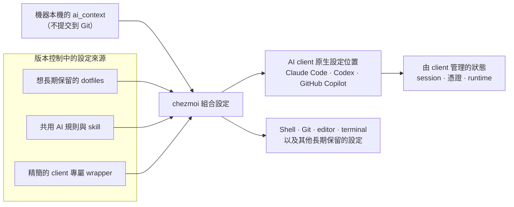
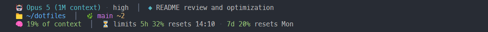

# 我的個人 Dotfiles 與 AI 設定

**把我希望長期保留的開發環境設定與共用 AI 指引，整理成一份可版本控管、方便檢視的來源。**

我建立這個 repository，讓換電腦時能還原自己的設定，也讓不同 AI client 使用的共用指引維持一致。這裡使用 chezmoi 管理我選擇納入版本控制的設定：我在這裡修改來源檔、檢查產生的設定，再套用到家目錄。

這是我實際使用並公開分享的個人設定，方便其他開發者了解這些取捨、挑選需要的部分自行調整。它不是通用預設：應用程式自行管理的狀態與憑證留在本機，機器專屬的 profile 選擇不會提交。

## 為什麼建立這個 repository

電腦和工具一換，設定就容易走樣；把同一條 AI 指引複製到不同 client，也容易各改各的。

這套設計想解決幾個實際問題：

- **重現設定：** 透過 bootstrap 和 chezmoi 來源檔，在新電腦上還原常用設定。
- **維持 AI 指引一致：** 共用規則與 skill 保留一份來源，減少複製到不同 client 設定後逐漸走樣。
- **清楚界定管理範圍：** template 說明 repository 管理哪些設定，並盡可能保留應用程式自行維護的值。
- **讓變更容易檢查：** Git 讓來源檔的修改清楚可見，`chezmoi diff` 則能在套用前預覽這台機器的目標設定。

## 專案如何運作

```mermaid
flowchart LR
    subgraph source["版本控制中的設定來源"]
        dotfiles["想長期保留的 dotfiles"]
        shared["共用 AI 規則與 skill"]
        adapters["精簡的 client 專屬 wrapper"]
    end
    profile["機器本機的 ai_context<br/>（不提交到 Git）"] --> render["chezmoi 組合設定"]
    dotfiles --> render
    shared --> render
    adapters --> render
    render --> ai["AI client 原生設定位置<br/>Claude Code · Codex · GitHub Copilot"]
    ai --> local["由 client 管理的狀態<br/>session · 憑證 · runtime"]
    render --> settings["Shell · Git · editor · terminal<br/>以及其他長期保留的設定"]
```

chezmoi 會依這台機器的 profile，產生各工具需要的設定檔。各 client 仍自行管理 session、憑證與執行時狀態。

## 值得先看的流程

| 想做什麼 | 從哪裡開始 | 它會怎麼做 |
| --- | --- | --- |
| 在不同 client 共用 AI 指引 | [AI 設定支援對照](./docs/customization-support.md) | 共用規則與 skill 會送到 Claude Code、Codex 和 GitHub Copilot 支援的設定位置；client 專屬行為只套用在支援它的 client。 |
| 把需求帶到可檢查的變更 | [`run-task-end-to-end`](./home/.chezmoitemplates/skills/run-task-end-to-end/SKILL.md) | 用自然語言交代任務，skill 會確認工作目錄、完成實作與驗證，並依要求交付成果。也可以只請它規劃或檢查，不修改檔案。 |
| 把工作交給另一個 AI session | [`task-handoff`](./home/.chezmoitemplates/skills/task-handoff/SKILL.md) | 整理目前的 checkout、決策、檢查結果、材料和下一步，供接手的 session 核對。 |

例如：「用 `run-task-end-to-end` 實作附上的快捷鍵規格並驗證。」需要指定任務起點、worktree 或發布目標時，再補上這些資訊即可。一般任務可以沿用目前合適的 checkout，或由 client 選擇 worktree 的起點。

## 日常使用的小便利與防護

這些設計讓我更容易掌握 AI session 狀態，也能確認變更是否真的通過檢查：

| 功能 | 用途 | 查看實作 |
| --- | --- | --- |
| Claude Code 狀態列（Bash 與 PowerShell） | 狀態列會依終端機寬度調整版面，顯示模型與推理強度、可選的 session 名稱、專案路徑與 Git 狀態、context 使用量，以及資料可用時的 5 小時或 7 天用量百分比與重設時間。 | [Bash](./home/dot_claude/claude-session-statusline.sh)、[PowerShell](./home/dot_claude/claude-session-statusline.ps1) 和[設定來源](./home/.chezmoitemplates/claude/settings-durable.json)。 |
| 桌面通知（Windows 與 macOS） | Claude Code 等待使用者回應，或 agent、subagent 完成時會提醒；Codex session 結束時也會提醒。Windows 和 macOS 各有一支通知腳本，兩個 client 也各自設定 hook。 | [Windows 腳本](./home/dot_local/share/show-agent-notification.ps1)、[macOS 腳本](./home/dot_local/share/show-agent-notification-macos.sh)、[Claude 設定](./home/.chezmoitemplates/claude/settings-durable.json)和 [Codex hooks](./home/dot_codex/hooks.json.tmpl)。 |
| 本機驗證 | hook 會把已暫存的 chezmoi 來源快照渲染到暫存目錄，不會套用到家目錄。檢查項目包括 chezmoi 來源目錄是否指向這個 repository、skill 和共用規則的一致性、Bash／PowerShell 狀態列輸出，以及 Markdown 連結；其他測試涵蓋 profile 行為、診斷工具、Git 設定和公司 branch policy。 | [Pre-commit hook](./scripts/git-hooks/pre-commit)、[Bash 測試入口](./scripts/tests/run-git-bash-tests.ps1) 與[設定指南](./docs/setup.md)。 |
| 個人與工作用 AI 設定 | 機器本機的 `ai_context` 讓同一份設定來源能用於個人或工作環境，套用各自的 AI 指引與預設值。這台機器選用哪一套，不會提交到 Git。 | [`ai-profile` skill](./home/dot_agents/skills/ai-profile/SKILL.md) 與[profile 設定方式](./docs/chezmoi-workflow.md#machine-local-ai-context)。 |
| 檔案與材料整理 | 規格與參考資料、可重複使用的測試資料，以及交接紀錄分別放在 `~/Documents/` 下的不同目錄。任務如果用到多份資料，就在 issue、PR／MR 或一份狀態筆記中連結；使用外部材料前先確認來源。 | [專案材料規則](./home/.chezmoitemplates/core.md#project-material)與 [ADR-0053](./docs/decisions/0053-native-first-ai-workflows.md)。 |
| AI 協作防護與證據檢查 | 共用核心規則要求在信任邊界驗證輸入、保留輸出編碼、使用參數化 SQL，並避免把機密寫入或提交到 Git；也要求代理確認 checkout 和材料來源，且只回報實際執行過的檢查，目的是減少常見安全錯誤和未經驗證的完成宣稱。 | [共用核心規則](./home/.chezmoitemplates/core.md) 與 [ADR-0024](./docs/decisions/0024-instruction-provenance-and-material-filing.md)。 |

**狀態列範例。** 圖中的模型與用量是當時的數值。

## 檔案放在哪裡

| 路徑 | 內容 |
| --- | --- |
| [`home/`](./home/) | chezmoi 管理的目標設定來源。 |
| [`home/.chezmoitemplates/`](./home/.chezmoitemplates/) | 可重用的設定、指引本文和範本。 |
| [`home/dot_agents/skills/`](./home/dot_agents/skills/) | 共用 skill，以及依 client 限制的 skill 來源。 |
| `home/dot_<client>/` | 各 client 的原生入口，以及接上共用指引的精簡 wrapper。 |
| [`scripts/`](./scripts/) | bootstrap、診斷和驗證工具。 |
| [`docs/`](./docs/) | 設定步驟、AI 設定來源與支援對照、操作指南和架構決策紀錄。 |

## 從這裡開始

- [設定一台新電腦](./docs/setup.md)
- [了解如何修改與套用受管理的設定](./docs/chezmoi-workflow.md)
- [查找 AI client 設定或 skill 的來源](./docs/customization-support.md)
- [查看目前有效的架構決策](./docs/decisions/README.md)

若要套用到自己的家目錄，請先讀設定指南，並針對自己的機器執行 `chezmoi diff` 檢查變更。
