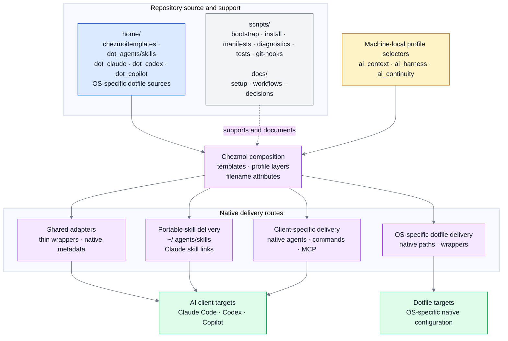
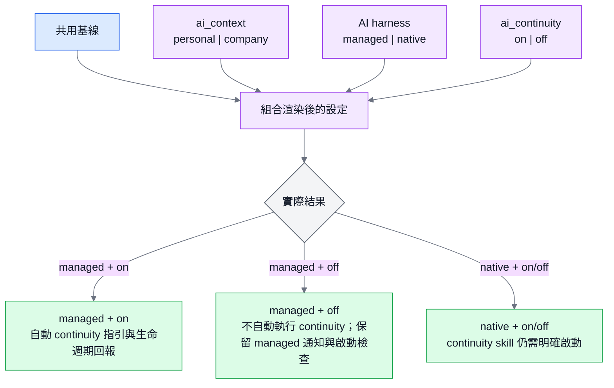
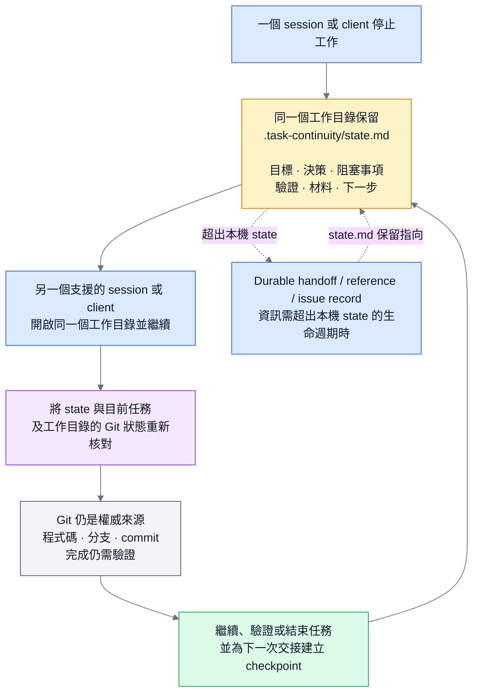
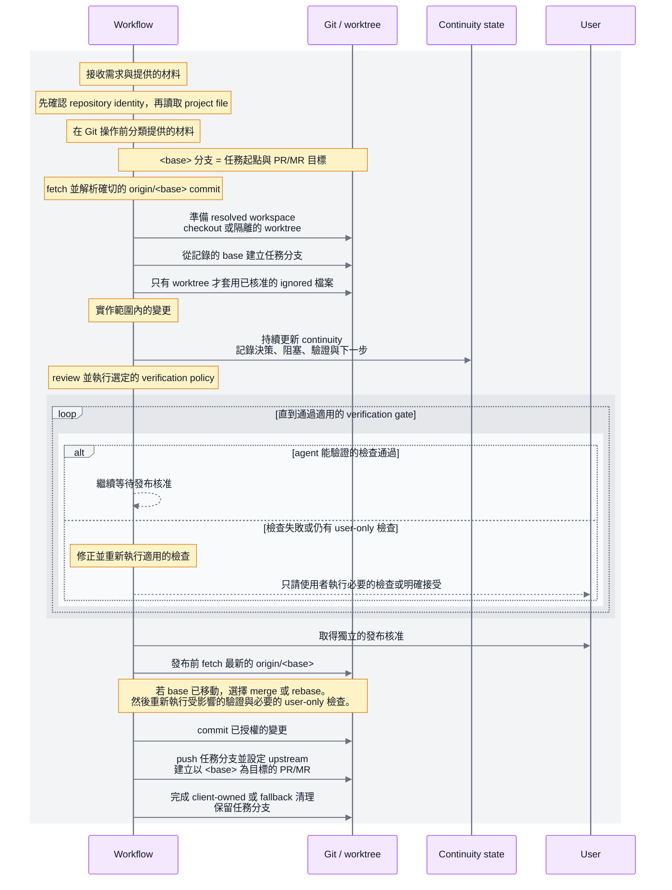

# 跨平台個人開發環境與代理式工作流程

[English](README.md) · [繁體中文](README.zh-TW.md)

這個 Git repository 集中管理我的跨平台開發環境，是整套設定的單一來源。[Chezmoi](https://www.chezmoi.io/) 會把 `home/` 下的受管理 source
渲染成各支援工具與作業系統使用的原生檔案。共用的 AI 指示與可重用工作流程只保留一份 source body；只屬於特定
client 的行為則留在該 client 的原生介面。儲存庫只管理我刻意交給它負責的持久設定，應用程式自己的偏好、認證、
session state 與 runtime 資料則留在本機。

**快速導覽：**

* [工作流程會自動處理什麼](#工作流程會自動處理什麼)
* [系統總覽](#系統總覽)
* [Profile 與 AI harness 模式](#profile-與-ai-harness-模式)
* [Task continuity](#task-continuity)
* [`run-task-end-to-end`](#run-task-end-to-end)
* [權責與隱私界線](#權責與隱私界線)
* [驗證與回歸測試涵蓋範圍](#驗證與回歸測試涵蓋範圍)
* [接下來可以去哪裡](#接下來可以去哪裡)

> ⚠️ **個人設定提醒：** 這個儲存庫包含我的個人偏好，不是通用的預設設定。既有機器請先查看
> `chezmoi diff`，只套用你確定要變更的 target。只有在覆寫這些個人設定沒有問題的機器上，才適合
> 大範圍套用這個儲存庫。

## 工作流程會自動處理什麼

| 沒有這套工作流程時，我需要                                      | 使用這套工作流程後，系統會                                                                                                                                 |
| -------------------------------------------------- | --------------------------------------------------------------------------------------------------------------------------------------------- |
| 在新的 session 繼續工作時，重新整理或說明任務脈絡                      | **保留跨 session 的任務脈絡。** 為每個工作目錄保留 continuity state，記錄目標、階段、決策、假設、阻塞事項、驗證狀態、任務識別資訊與下一步，讓另一個 session 或支援的 AI client 能將這些狀態與目前工作目錄及 Git 重新核對後繼續任務 |
| 追蹤每項任務分別需要哪些規格、截圖、試算表、測試輸入、handoff 與其他材料           | **整理材料並建立與任務的關聯。** 將穩定的任務材料、可重複使用的測試材料與 durable handoff 和暫時性的任務狀態分開，同時記錄材料的路徑與來源                                                              |
| 每次想平行處理同一個 repository 的另一項任務時，另外建立並準備 worktree 與分支 | **準備隔離的任務 workspace。** 解析 base 與任務分支、建立或選擇 workspace、將已核准的 ignored／本機檔案配置到 worktree，並讓每項任務的分支、工作目錄與 continuity state 彼此獨立                     |
| 為同時執行的多個任務環境選擇並記住不同的 runtime port，避免 port 衝突       | **處理 runtime 隔離。** 使用專案提供的 runtime 設定自動分配不同的 port，讓隔離的 worktree 能同時執行並測試各自的應用程式 instance，而不會發生 port 衝突                                        |
| 判斷哪些項目 agent 可以自行驗證、哪些仍需要我檢查，以及失敗後哪些檢查必須重跑         | **協調驗證流程。** 依選定的 verification policy 執行可行的自動化、runtime、瀏覽器與互動式檢查；失敗時進入修正與重測循環，只在確實需要時要求我執行檢查或確認結果                                              |
| 協調從實作完成到可以交付 review 的整個流程                          | **協調發布流程。** 將驗證與發布核准分開，發布前重新取得並整合最新的 target base，必要時重跑受影響的驗證，之後再 commit、push、建立 review request，並執行保留分支的清理                                     |

## 系統總覽

這張圖同時呈現設定架構與 repository map。`home/` 是 chezmoi source state；`scripts/` 放置
setup、診斷、installer 與驗證工具；`docs/` 則放操作指南與 decision records。本機 profile
selector 會先進入 Chezmoi 組合，再分流到 shared adapter、portable skill delivery、
client-specific delivery 與 OS-specific dotfile delivery。完整的 source-to-client 對應請看
[customization support guide](./docs/customization-support.md)。

```mermaid
%%{init: {"theme": "base", "themeVariables": {"primaryTextColor": "#111827", "nodeTextColor": "#111827", "textColor": "#111827", "lineColor": "#6b7280"}, "flowchart": {"useMaxWidth": true}}}%%
flowchart TB
    selectors["Machine-local profile selectors<br/>ai_context · ai_harness · ai_continuity"]:::choice

    subgraph repository["Repository source and support"]
        home["home/<br/>.chezmoitemplates · dot_agents/skills<br/>dot_claude · dot_codex · dot_copilot<br/>OS-specific dotfile sources"]:::source
        support["scripts/<br/>bootstrap · install · manifests · diagnostics · tests · git-hooks<br/><br/>docs/<br/>setup · workflows · decisions"]:::support
    end

    compose["Chezmoi composition<br/>templates · profile layers<br/>filename attributes"]:::process

    subgraph routes["Native delivery routes"]
        sharedRoute["Shared adapters<br/>thin wrappers · native metadata"]:::process
        portableRoute["Portable skill delivery<br/>~/.agents/skills<br/>Claude skill links"]:::process
        clientRoute["Client-specific delivery<br/>native agents · commands · MCP"]:::process
        osRoute["OS-specific dotfile delivery<br/>native paths · wrappers"]:::process
    end

    aiTargets["AI client targets<br/>Claude Code · Codex · Copilot"]:::target
    developerTargets["Dotfile targets<br/>OS-specific native configuration"]:::target
    home --> compose
    selectors --> compose
    support -. "supports and documents" .-> compose
    compose --> sharedRoute --> aiTargets
    compose --> portableRoute --> aiTargets
    compose --> clientRoute --> aiTargets
    compose --> osRoute --> developerTargets

    classDef source fill:#dbeafe,stroke:#2563eb,color:#111827
    classDef choice fill:#fef3c7,stroke:#d97706,color:#111827
    classDef process fill:#f3e8ff,stroke:#9333ea,color:#111827
    classDef target fill:#dcfce7,stroke:#16a34a,color:#111827
    classDef support fill:#f3f4f6,stroke:#4b5563,color:#111827
```

`home/` 是 source state，渲染到 home 目錄的檔案則是 targets。這裡同時放一般的 chezmoi source file
與 template；`.chezmoitemplates/` 中的可重用內容會由各 client 的薄 wrapper 組合。可攜式 skill 維持單一
共用來源，必要時再透過 link 或 symlink 交付到 client 的原生 discovery 路徑；client 專屬 source 則留在
各自的原生目錄。修改受管理的設定前，先用 `chezmoi diff` 預覽。詳細的 source filename 與 target ownership 規則請看
[chezmoi 工作流程](./docs/chezmoi-workflow.md)；client delivery matrix 請看
[customization support guide](./docs/customization-support.md)。

## Profile 與 AI harness 模式

三個本機 selector 會共同決定渲染出的 client 設定；這些 selector 不會 commit 進儲存庫。

```mermaid
%%{init: {"theme": "base", "themeVariables": {"primaryTextColor": "#111827", "nodeTextColor": "#111827", "textColor": "#111827", "lineColor": "#6b7280"}, "flowchart": {"useMaxWidth": true}}}%%
flowchart TB
    baseline["共用基線"]:::base
    context["ai_context<br/>personal | company"]:::choice
    harness["AI harness<br/>managed | native"]:::choice
    continuity["ai_continuity<br/>on | off"]:::choice
    compose["組合渲染後的設定"]:::process
    effective{"實際結果"}:::check
    managedOn["managed + on<br/>自動 continuity 指引與生命週期回報"]:::result
    managedOff["managed + off<br/>不自動執行 continuity；保留 managed 通知與啟動檢查"]:::result
    native["native + on/off<br/>continuity skill 仍需明確啟動"]:::result

    baseline --> compose
    context --> compose
    harness --> compose
    continuity --> compose
    compose --> effective
    effective -->|"managed + on"| managedOn
    effective -->|"managed + off"| managedOff
    effective -->|"native + on/off"| native

    classDef base fill:#dbeafe,stroke:#2563eb,color:#111827
    classDef choice fill:#f3e8ff,stroke:#9333ea,color:#111827
    classDef process fill:#f3e8ff,stroke:#9333ea,color:#111827
    classDef check fill:#f3f4f6,stroke:#4b5563,color:#111827
    classDef result fill:#dcfce7,stroke:#16a34a,color:#111827
    class baseline base
    class context,harness,continuity choice
    class compose process
    class effective check
    class managedOn,managedOff,native result
    style baseline color:#111827
    style context color:#111827
    style harness color:#111827
    style continuity color:#111827
    style compose color:#111827
    style effective color:#111827
    style managedOn color:#111827
    style managedOff color:#111827
    style native color:#111827
```

| Selector | 作用 | 預設值與界線 |
| --- | --- | --- |
| `ai_context` | 選擇 personal 或 company context，以及對應的語言預設值。 | 未設定時是 `personal`；其他值會讓 render 失敗。 |
| `ai_continuity` | 設定 managed 模式下的 continuity 偏好。 | 未設定時是 `on`；`off` 會移除自動 continuity 指引與回報。任務層級的 `continuity=on|off` 可以覆寫它。 |
| `ai_harness` | 選擇 managed 或 native AI harness。 | 未設定時是 `managed`；只有在沒有 `ai_harness` 時，`ai_workflow` 才會作為 legacy alias 接受。 |

**AI harness** 是包覆在 AI client 外的指示、skill、生命週期與交付層。Managed 模式加入儲存庫提供的
生命週期指引與回報；native 模式保留共用內容與 client-native 交付，同時讓生命週期動作維持明確啟動。
Profile 變更會影響之後重新 render 的設定與新啟動的 session。

完整組合規則請看 [chezmoi 工作流程的 AI profile 章節](./docs/chezmoi-workflow.md#machine-local-ai-profile-selectors)
與 [AI customization support 指南](./docs/customization-support.md#ai-profile-dimensions)。

## Task continuity

Continuity 屬於一個工作目錄，包括 primary checkout 與 linked worktree。它是暫時性的交接狀態，
不是專案文件，也不是工作完成的證明。每個工作目錄最多只有一個 active task 與一個
`.task-continuity/state.md`；新建立的 worktree 不會帶入其他 worktree 的 continuity state。

```mermaid
%%{init: {"theme": "base", "themeVariables": {"primaryTextColor": "#111827", "nodeTextColor": "#111827", "textColor": "#111827", "lineColor": "#6b7280"}, "flowchart": {"useMaxWidth": true}}}%%
flowchart TD
    stop["一個 session 或 client 停止工作"]:::handoff
    persist["同一個工作目錄保留<br/>.task-continuity/state.md<br/><br/>目標 · 決策 · 阻塞事項<br/>驗證 · 材料 · 下一步"]:::state
    resume["另一個支援的 session 或 client<br/>開啟同一個工作目錄並繼續"]:::handoff
    reconcile["將 state 與目前任務<br/>及工作目錄的 Git 狀態重新核對"]:::check
    git["Git 仍是權威來源<br/>程式碼 · 分支 · commit<br/>完成仍需驗證"]:::authority
    continue["繼續、驗證或結束任務<br/>並為下一次交接建立 checkpoint"]:::work
    durable["Durable handoff / reference / issue record<br/>資訊需超出本機 state 的生命週期時"]:::handoff

    stop --> persist --> resume --> reconcile --> git --> continue --> persist
    persist -. "超出本機 state" .-> durable
    durable -. "state.md 保留指向" .-> persist

    classDef handoff fill:#dbeafe,stroke:#2563eb,color:#111827
    classDef state fill:#fef3c7,stroke:#d97706,color:#111827
    classDef check fill:#f3e8ff,stroke:#9333ea,color:#111827
    classDef authority fill:#f3f4f6,stroke:#4b5563,color:#111827
    classDef work fill:#dcfce7,stroke:#16a34a,color:#111827
    style stop color:#111827
    style persist color:#111827
    style resume color:#111827
    style reconcile color:#111827
    style git color:#111827
    style continue color:#111827
    style durable color:#111827
```

Continuity 會記錄目前的目標、階段、決策、阻塞事項、驗證狀態、下一步，以及指向 durable material 的連結。
Git 仍是程式碼、分支、commit 與測試結果的權威來源。穩定的參考輸入放在 `task-materials`，可重複使用的測試
輸入放在 `test-materials`，可持續更新的協作紀錄放在 `handoffs`；`.task-continuity` 只保留暫時性的任務狀態與指向這些紀錄的連結。

同一個工作目錄要開始另一個任務前，原本未完成的任務必須先完成、park 或放棄。流程不會默默覆寫 active state。
已完成的 active state 可以保留識別資訊，移到 `.task-continuity/parked/`，讓新任務在 continuity 開啟時直接建立
新的 active state；這不需要先確認刪除，也不需要改用 `continuity=off`。刪除 parked state 仍是另外一個需要確認的動作。

新的 state 會保留任務與 Git 識別資訊，包括任務分支、base branch、不變的 base commit，以及相容用的
`Started from` commit。請由 [task-continuity skill](./home/dot_agents/skills/task-continuity/SKILL.md) 處理遷移、parking、
branch-aware discovery、reconcile 與 cleanup；[worktree provisioning guide](./docs/worktree-provisioning.md#how-each-worktree-receives-ignored-files)
則說明 worktree 的界線。State 會被 Git 忽略、沒有加密，不能放入憑證。

## `run-task-end-to-end`

[`run-task-end-to-end`](./home/dot_agents/skills/run-task-end-to-end/SKILL.md) skill 是受管理任務的生命週期協調器。
它把 workspace 的選擇與準備、task continuity、已核准的本機檔案配置、可選的 runtime 隔離、策略化驗證、
發布核准，以及最後的分支交接，串成一套明確的工作流程。其他 skill 與專案 descriptor 各自負責專門範圍；
`run-task-end-to-end` 負責安排執行順序，並維持共用的任務狀態。

需要依序處理、可以安全使用目前 checkout 的任務，使用 `workspace=checkout`；只要兩個任務需要各自的未提交
變更、分支、runtime port 或程序，就使用 `workspace=worktree`。Workspace 必須由 argument 或 prompt 明確指定；
如果無法解析，流程會在執行前先詢問，並回報解析來源。

兩種 workspace 共用同一套生命週期：解析 base 與 policy、準備 workspace、建立任務分支、實作、review、
驗證／修正／重測、取得獨立的發布核准、重新確認並整合 base，最後 commit、push、建立 MR/PR，再進行
交接或清理。只有 worktree workspace 會配置 ignored 檔案。獨立 runtime 是選用功能：必須搭配 consuming
project 的 descriptor 與 `runtime=auto`，並通過 health/process-ownership check 後，才能宣稱 runtime 已隔離。

```mermaid
%%{init: {"theme": "base", "themeVariables": {"primaryTextColor": "#111827", "textColor": "#111827", "lineColor": "#6b7280", "actorBkg": "#f3e8ff", "actorBorder": "#9333ea", "actorTextColor": "#111827", "actorLineColor": "#6b7280", "signalColor": "#6b7280", "signalTextColor": "#111827", "labelBoxBkgColor": "#f3f4f6", "labelBoxBorderColor": "#6b7280", "labelTextColor": "#111827", "loopTextColor": "#111827", "noteBkgColor": "#fef3c7", "noteBorderColor": "#d97706", "noteTextColor": "#111827"}}}%%
sequenceDiagram
    rect rgb(243, 244, 246)
    participant W as Workflow
    participant G as Git / worktree
    participant C as Continuity state
    participant U as User

    Note over W: 接收需求與提供的材料
    Note over W: 先確認 repository identity，再讀取 project file
    Note over W: 在 Git 操作前分類提供的材料
    Note over W,G: <base> 分支 = 任務起點與 PR/MR 目標
    Note over W: fetch 並解析確切的 origin/<base> commit
    W->>G: 準備 resolved workspace<br/>checkout 或隔離的 worktree
    W->>G: 從記錄的 base 建立任務分支
    W->>G: 只有 worktree 才套用已核准的 ignored 檔案
    Note over W: 實作範圍內的變更
    W->>C: 持續更新 continuity<br/>記錄決策、阻塞、驗證與下一步
    Note over W: review 並執行選定的 verification policy
    rect rgb(229, 231, 235)
    loop 直到通過適用的 verification gate
        rect rgb(249, 250, 251)
        alt agent 能驗證的檢查通過
            W-->>W: 繼續等待發布核准
        else 檢查失敗或仍有 user-only 檢查
            Note over W: 修正並重新執行適用的檢查
            W-->>U: 只請使用者執行必要的檢查或明確接受
        end
        end
    end
    end
    W->>U: 取得獨立的發布核准
    W->>G: 發布前 fetch 最新的 origin/<base>
    Note over W,G: 若 base 已移動，選擇 merge 或 rebase。<br/>然後重新執行受影響的驗證與必要的 user-only 檢查。
    W->>G: commit 已授權的變更
    W->>G: push 任務分支並設定 upstream<br/>建立以 <base> 為目標的 PR/MR
    W->>G: 完成 client-owned 或 fallback 清理<br/>保留任務分支
    end
```

詳細的 [worktree provisioning guide](./docs/worktree-provisioning.md#workflow-sequence) 會說明流程背後的
佈建檢查、原生 client 路徑、runtime 隔離、驗證、發布與清理契約。兩種 workspace 都會固定任務的 selected
base 並建立任務分支；checkout workspace 留在目前的實體 checkout，只有 worktree 會配置已核准的 ignored
檔案並支援選用的 runtime 隔離。不同任務各自保留 workspace、分支與 continuity state；client 交接則重新開啟
同一個工作目錄。

### Invocation styles

Claude Code 與 Codex 都使用 `/run-task-end-to-end`。這套工作流程支援三種呼叫方式：

- **Guided：** 不帶參數啟動，讓流程詢問任務、workspace、base、verification policy、continuity
  policy，以及依情境真正必要的其他輸入。預設值是 `verification=agent` 與 `continuity=auto`。
- **Prompted：** 接著輸入自然語言，例如 `/run-task-end-to-end Use a worktree from feature/example
  and implement the attached specification.` 流程只解析明確表達的值，其餘選項才會再詢問。
- **Explicit：** 提供結構化參數來精確控制，例如
  `/run-task-end-to-end workspace=worktree base=feature/example task="Implement the example feature"`。

也可以只提供部分結構化參數。例如 `/run-task-end-to-end workspace=worktree task="實作範例功能"` 會保留
已明確提供的 workspace 與 task，只詢問剩下必要的 base。Prompt 解析的值會標示為 `prompt`；透過問題
確認的值則標示為 `confirmation`。

特定 repository policy 可能要求額外的任務或分支資訊。工作流程會明確要求必要值，不會從分支名稱或任務
文字自行推斷；任何專案專屬的例外，都必須先在 repository instructions 中宣告。舊的 workflow 入口
`task-workflow` 與 `worktree-task-workflow` 仍保留給既有 prompt 與 client history 使用。

## 權責與隱私界線

對於應用程式擁有的設定，儲存庫只管理刻意指定的持久性 key 或結構。容易變動的偏好、認證、
歷史紀錄、cache、session/runtime state，以及應用程式未來新增的值，除非刻意納入儲存庫管理，
否則都留在本機。完整的 ownership 與套用流程請看 [setup guide](./docs/setup.md)。

| Surface | 由儲存庫管理 | 由 Application 或使用者管理 |
| --- | --- | --- |
| Claude settings | Durable environment、hook、status line 與 update-channel 值。 | Model、permission、plugin、project state 與未來新增的 key。 |
| Codex config | 只有在檔案不存在時提供預設值。 | Trust、runtime、marketplace 與 session state。 |
| Windows Terminal 與 VS Code | 選定的 durable 設定、keybinding 與 MCP source。 | Generated profile、workspace storage、authentication、cache 與 runtime data。 |
| Claude user MCP state | 非機密宣告。 | Authentication 與其餘的 `~/.claude.json`。 |

全域 Git exclude file 會保護私人 client 檔案與 continuity state，避免它們被意外追蹤：

~~~text
**/.claude/settings.local.json
**/CLAUDE.local.md
**/AGENTS.override.md
/.task-continuity/
~~~

這個 ignore policy 不會把檔案複製到 worktree，也不會加密檔案。MCP 設定可以包含
`\${input:figma-api-key}` 或 `\${GITHUB_MCP_TOKEN}` 這類 placeholder，但不能放入它們的值。
請在各 client 本機完成 authentication，並把憑證留在 `home/` 之外。

## 驗證與回歸測試涵蓋範圍

這個儲存庫使用本機自動化測試套件、策略化的驗證流程，以及獨立的發布核准 gate。儲存庫沒有設定 CI
workflow，因此本機測試通過不代表 CI 已執行。完整的驗證流程請看 [setup guide](./docs/setup.md)。

Pre-commit hook 會將 staged source render 到暫存目錄，不會寫入 home 目錄，並檢查 source identity、
filename 安全性、skill parity、client adapter、共用 rule body、status-line parity 與 Markdown link。

受保護的行為變更時，執行對應的 focused suite：

| 範圍 | 本機檢查 |
| --- | --- |
| Worktree provisioning | `test-git-worktree-provision.ps1` 或 `test-git-worktree-provision.sh` |
| Continuity 與 task workflow | `test-task-continuity.sh`、`test-run-task-end-to-end.sh`、`test-run-task-invocation.sh` |
| Profile 與 workflow deletion | `test-ai-configuration-profiles.sh`、`test-workflow-delete.sh` |
| Runtime isolation | `test-worktree-runtime.py -v` |

在 Windows PowerShell 中，請透過 `.\scripts\tests\run-git-bash-tests.ps1` 執行 Bash 測試；
它會明確找到 Windows Git Bash。`scripts/tests/continuity-fixtures/` 下的 continuity fixture
是人工的 model-behavior probe，不是即時的自動 agent 測試。它們使用 throwaway repository
與刻意製造的 `state.md`，不要把 fixture 裡的 state 當成真實 working tree state。

## 接下來可以去哪裡

| 我想要… | 請閱讀 |
| --- | --- |
| 設定或更新這台機器 | [docs/setup.md](./docs/setup.md) |
| 新增、修改或移除受管理檔案 | [docs/chezmoi-workflow.md](./docs/chezmoi-workflow.md) |
| 新增 instruction、skill、agent、prompt、MCP server 或 plugin | [docs/customization-support.md](./docs/customization-support.md) |
| 查詢哪個 client surface 會讀取某項 customization | [support table](./docs/customization-support.md#what-the-support-table-answers) |
| 執行隔離任務或配置 ignored 本機檔案 | [docs/worktree-provisioning.md](./docs/worktree-provisioning.md) |
| 在不同 worktree 同時執行多個應用程式 | [docs/worktree-runtime.md](./docs/worktree-runtime.md) |
| 安全刪除可重用 workflow source | [docs/workflow-deletion.md](./docs/workflow-deletion.md) |
| 了解這個儲存庫為什麼採用這種結構 | [docs/decisions/README.md](./docs/decisions/README.md) |
| 在移除規則前了解它存在的原因 | [docs/rule-rationale.md](./docs/rule-rationale.md) |
| 讓 coding assistant 安全地在這個儲存庫工作 | [AGENTS.md](./AGENTS.md) |

每個結構性選擇都有書面理由。要改變儲存庫級機制、ownership boundary 或 client
integration 前，先讀相關 ADR。Discovery path、frontmatter key、hook payload 與 worktree
行為都可能隨 upstream release 改變；修改 client-specific path 或 key 前，請先查看目前的
[chezmoi](https://www.chezmoi.io/reference/source-state-attributes/)、
[Claude Code](https://code.claude.com/docs/en/overview)、
[Codex](https://learn.chatgpt.com/docs/agent-configuration/agents-md) 與
[VS Code agent customization](https://code.visualstudio.com/docs/agent-customization/overview)
官方文件。
