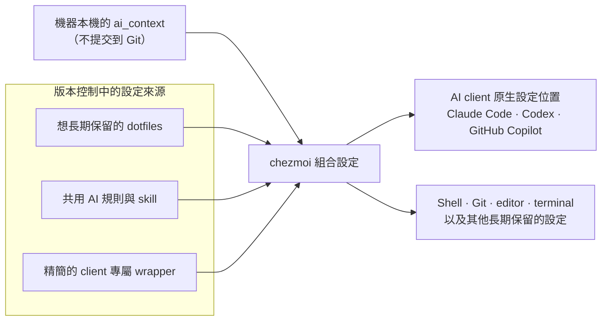
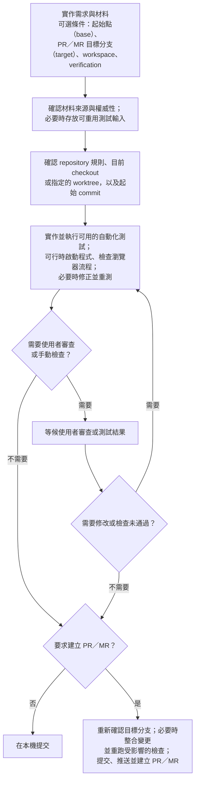

# 我的個人 Dotfiles 與 AI 設定

**個人開發環境設定與共用 AI 指引的版本控制來源。**

這是我分享出來的個人設定，方便其他開發者了解其中的取捨，再挑選需要的部分自行調整；不適合不經修改就直接套用。repository 收錄長期保留的設定與共用 AI 指引，不包含憑證、session 記錄等應用程式或帳戶資料。

## 為什麼建立這個 repository

電腦和開發工具一換，dotfiles 設定就容易在不同機器間走樣；AI 指引在不同 AI client 間也容易走樣，例如 Claude Code、Codex 和 GitHub Copilot。

設計時主要考量以下幾點：

- **重現設定：** bootstrap 腳本安裝我使用的工具，chezmoi 套用我選擇帶到不同機器的長期設定。
- **選擇性管理設定：** 我只將希望在不同機器保持一致的長期設定納入版本控制；容易變動或未列入 repository 的偏好則交由各 client 管理。例如，repository 管理 Claude Code 的 hooks 和狀態列，模型與推理強度則由 Claude Code 自行管理。
- **維持 AI 指引一致：** 共用規則與 skill 維持單一來源，減少不同 client 間的內容走樣。
- **預覽後再套用：** Git 可檢視來源檔的修改，`chezmoi diff` 預覽這台機器會套用的結果，讓我能先發現非預期變更。

## 專案如何運作

```mermaid
flowchart LR
    subgraph source["版本控制中的設定來源"]
        dotfiles["想長期保留的 dotfiles"]
        shared["共用 AI 規則與 skill"]
        adapters["精簡的 client 專屬 wrapper"]
    end
    profile["機器本機的 ai_context<br/>（不提交到 Git）"] --> render["chezmoi 組合設定"]
    dotfiles --> render
    shared --> render
    adapters --> render
    render --> ai["AI client 原生設定位置<br/>Claude Code · Codex · GitHub Copilot"]
    render --> settings["Shell · Git · editor · terminal<br/>以及其他長期保留的設定"]
```

共用規則與可跨 client 使用的 skill 由共用來源維護；client 專屬的指引、skill 與設定，則只套用到支援它們的 client。

chezmoi 會依這台機器的 profile，產生各工具需要的設定檔。我在 repository 中編輯可讀的來源檔，檢查產生的設定，再將確認過的變更套用到家目錄。各 client 仍自行管理 session、憑證與執行時狀態。

## 工作流程與文件

| 想做什麼 | 從哪裡開始 | 它會怎麼做 |
| --- | --- | --- |
| 在不同 client 共用 AI 指引 | [AI 設定支援對照](./docs/customization-support.md) | 共用規則與 skill 會送到 Claude Code、Codex 和 GitHub Copilot 支援的設定位置；client 專屬行為只套用在支援它的 client。 |
| 實作、驗證與交付 | [`run-task-end-to-end`](./home/dot_agents/skills/run-task-end-to-end/SKILL.md) | 用自然語言交代實作任務後，skill 會確認工作目錄、實作並驗證，最後在本機提交，或依要求建立 PR／MR。 |
| 把工作交給另一個 AI session | [`task-handoff`](./home/dot_agents/skills/task-handoff/SKILL.md) | 整理目前的 checkout、決策、檢查結果、材料和下一步，供接手的 session 核對。 |

Claude Code、Codex 和 GitHub Copilot 都可以用斜線語法呼叫這個 skill，再接上任務和需要指定的選項：

- `/run-task-end-to-end 實作附上的快捷鍵規格；base=main target=main workspace=worktree verification=balanced`

`base` 是開始工作的分支或 commit。若未指定，且有 `target`，除非 repository 規則另有要求，skill 也會以 `target` 作為起始點；`target` 指定 PR／MR 目標分支，並要求以該方式交付。兩者都未指定時，skill 會使用並記錄目前 checkout 或 client worktree 的起始 commit；skill 不會自行推測發布目標。`workspace` 選擇目前 checkout 或 worktree，`verification` 選擇審查方式。這些選擇可用自然語言描述，也可寫成可選的 `key=value` 提示。skill 會遵循 repository 規則，沿用合適的現有分支或 client 建立的分支；需要新分支名稱時，則依變更類型和任務摘要命名。只有要指定名稱時，才加上 `branch=`。若只想規劃或檢查程式，直接請 AI 協助即可。

整個流程如下：

```mermaid
flowchart TB
    request["實作需求與材料<br/>可選條件：起始點（base）、<br/>PR／MR 目標分支（target）、workspace、verification"] --> materials["確認材料來源與權威性；<br/>必要時存放可重用測試輸入"]
    materials --> workspace["確認 repository 規則、目前 checkout<br/>或指定的 worktree，以及起始 commit"]
    workspace --> work["實作並執行可用的自動化測試；<br/>可行時啟動程式、檢查瀏覽器流程；<br/>必要時修正並重測"]
    work --> gate{"需要使用者審查<br/>或手動檢查？"}
    gate -->|需要| user["等候使用者審查或測試結果"]
    gate -->|不需要| delivery{"要求建立 PR／MR？"}
    user --> feedback{"需要修改或檢查未通過？"}
    feedback -->|需要| work
    feedback -->|不需要| delivery
    delivery -->|否| local["在本機提交"]
    delivery -->|是| publish["重新確認目標分支；必要時整合變更<br/>並重跑受影響的檢查；<br/>提交、推送並建立 PR／MR"]
```

若目標分支已前進，skill 會先等你選擇合併或 rebase，再重跑受影響的檢查，才繼續發布。

若要把工作交給另一個 AI session 繼續，請在交接時使用 [`task-handoff`](./home/dot_agents/skills/task-handoff/SKILL.md) 記錄目前狀態。

## 功能與防護措施

以下整理各項功能的用途與實作位置：

| 功能 | 用途 | 查看實作 |
| --- | --- | --- |
| Claude Code 狀態列（Bash 與 PowerShell） | 狀態列會依終端機寬度調整版面，顯示模型與推理強度、可選的 session 名稱、專案路徑與 Git 狀態、context 使用量，以及資料可用時的 5 小時或 7 天用量百分比與重設時間。 | [Bash](./home/dot_claude/claude-session-statusline.sh)、[PowerShell](./home/dot_claude/claude-session-statusline.ps1) 和[設定來源](./home/.chezmoitemplates/claude/settings-durable.json)。 |
| 桌面通知（Windows 與 macOS） | Claude Code 或 Codex 回覆完畢、Claude 的 subagent 完成工作或等待回應，以及任一 client 等待工具授權時，共用腳本會發出通知。各自的 hook 設定適用於本機終端機與 VS Code session。 | [Windows 腳本](./home/dot_local/share/show-agent-notification.ps1)、[macOS 腳本](./home/dot_local/share/show-agent-notification-macos.sh)、[Claude 設定](./home/.chezmoitemplates/claude/settings-durable.json)和 [Codex hooks](./home/dot_codex/hooks.json.tmpl)。 |
| 本機驗證 | hook 會把已暫存的 chezmoi 來源快照渲染到暫存目錄，不會套用到家目錄。檢查項目包括 chezmoi 來源目錄是否指向這個 repository、skill 和共用規則的一致性、Bash／PowerShell 狀態列輸出，以及 Markdown 連結；其他測試涵蓋 profile 行為、診斷工具、Git 設定和公司 branch policy。 | [Pre-commit hook](./scripts/git-hooks/pre-commit)、[Bash 測試入口](./scripts/tests/run-git-bash-tests.ps1) 與[設定指南](./docs/setup.md)。 |
| 個人與工作用 AI 設定 | 機器本機的 `ai_context` 讓同一份設定來源能用於個人或工作環境，套用各自的 AI 指引與預設值。這台機器選用哪一套，不會提交到 Git。 | [`ai-profile` skill](./home/dot_agents/skills/ai-profile/SKILL.md) 與[profile 設定方式](./docs/chezmoi-workflow.md#machine-local-ai-context)。 |
| 專案材料存放與索引 | 穩定參考資料、可重複使用的測試輸入和交接紀錄分別存放在 `~/Documents/` 下的不同位置。任務涉及多份材料時，從 issue、PR／MR 或狀態筆記連結它們。 | [專案材料規則](./home/.chezmoitemplates/core.md#project-material)與 [ADR-0053](./docs/decisions/0053-native-first-ai-workflows.md)。 |
| 安全與驗證防護 | 共用核心規則要求在信任邊界驗證輸入、保留輸出編碼、使用參數化 SQL，並避免把機密寫入或提交到 Git；也要求代理確認 checkout 和材料來源，且只回報實際執行過的檢查。 | [共用核心規則](./home/.chezmoitemplates/core.md) 與 [ADR-0024](./docs/decisions/0024-instruction-provenance-and-material-filing.md)。 |

**狀態列範例。** 圖中的模型與用量是當時的數值。

## 檔案放在哪裡

| 路徑 | 內容 |
| --- | --- |
| [`home/`](./home/) | chezmoi 管理的目標設定來源。 |
| [`home/.chezmoitemplates/`](./home/.chezmoitemplates/) | 可重用的設定、指引本文和範本。 |
| [`home/dot_agents/skills/`](./home/dot_agents/skills/) | 共用 skill，以及依 client 限制的 skill 來源。 |
| `home/dot_<client>/` | 各 client 專屬的設定，以及接上共用指引的精簡 wrapper。 |
| [`scripts/`](./scripts/) | bootstrap、診斷和驗證工具。 |
| [`docs/`](./docs/) | 設定步驟、AI 設定來源與支援對照、操作指南和架構決策紀錄。 |

## 從這裡開始

- [設定一台新電腦](./docs/setup.md)
- [了解如何修改與套用受管理的設定](./docs/chezmoi-workflow.md)
- [查找 AI client 設定或 skill 的來源](./docs/customization-support.md)
- [查看目前有效的架構決策](./docs/decisions/README.md)

若要套用到自己的家目錄，請先讀設定指南，並針對自己的機器執行 `chezmoi diff` 檢查變更。
